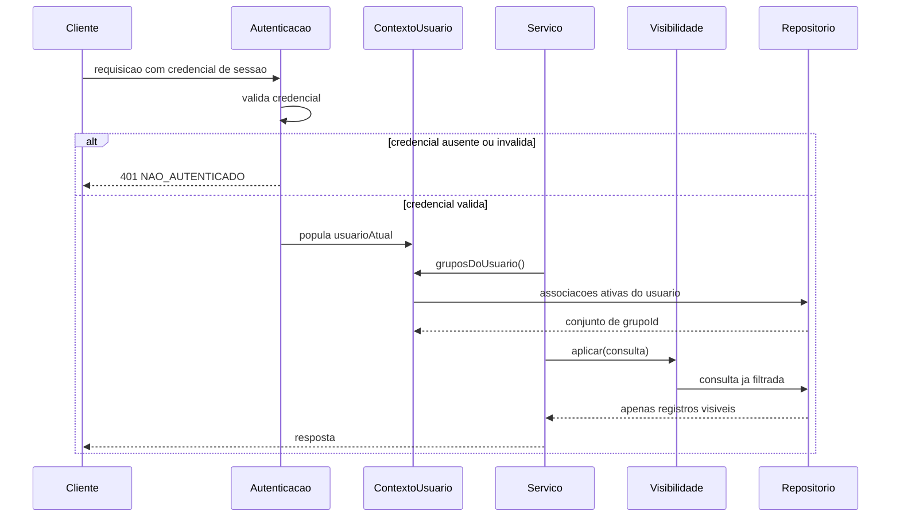
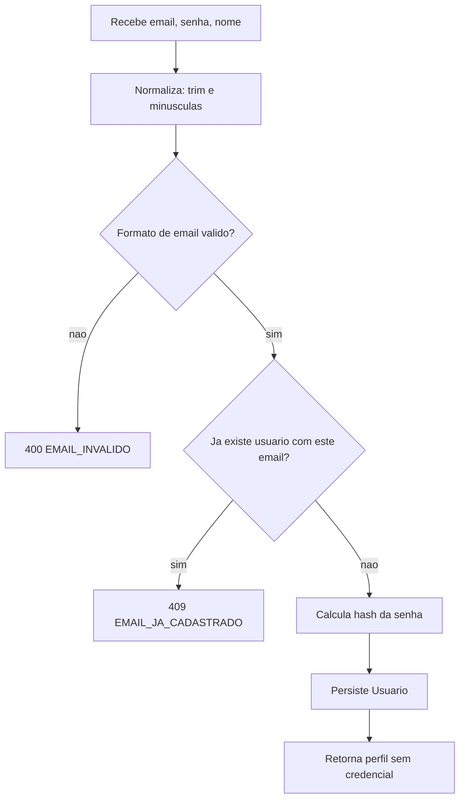
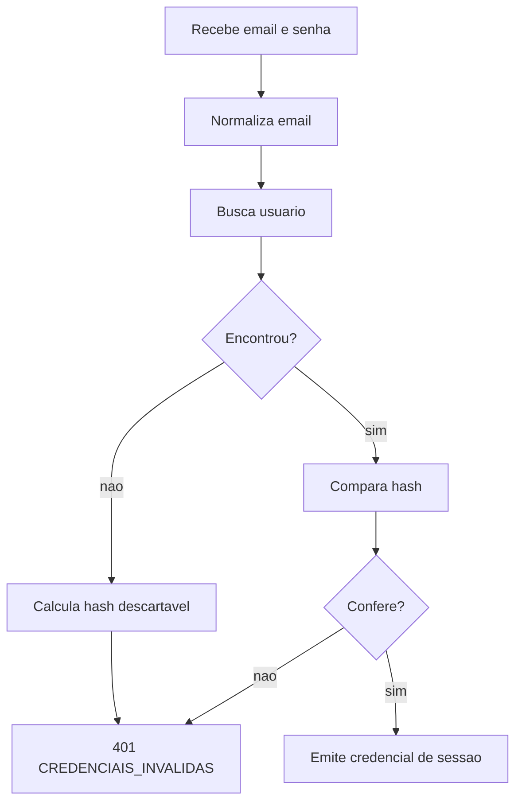
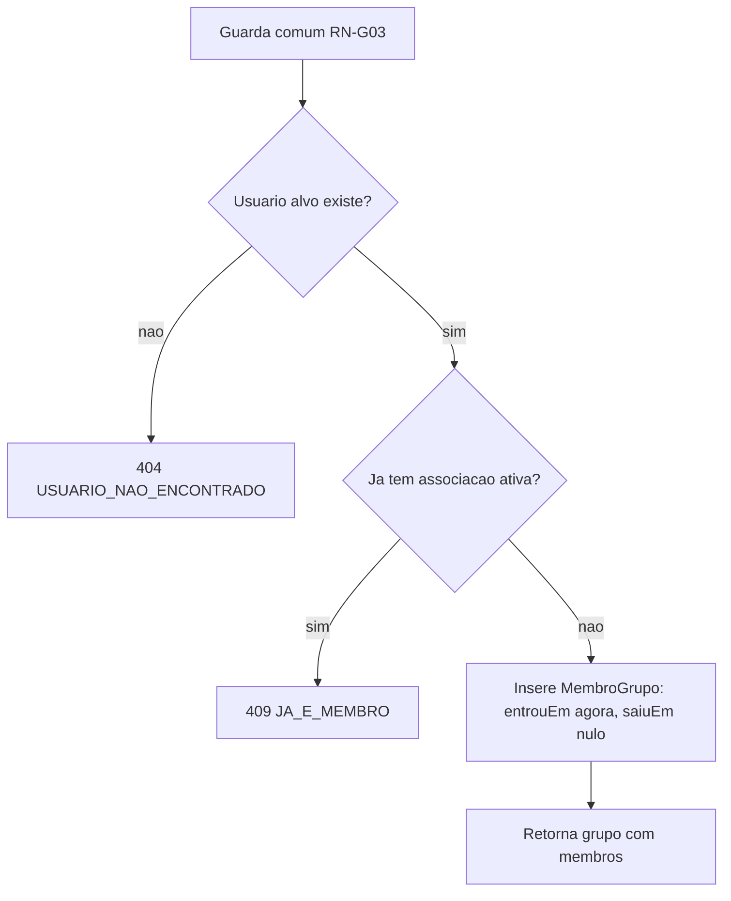
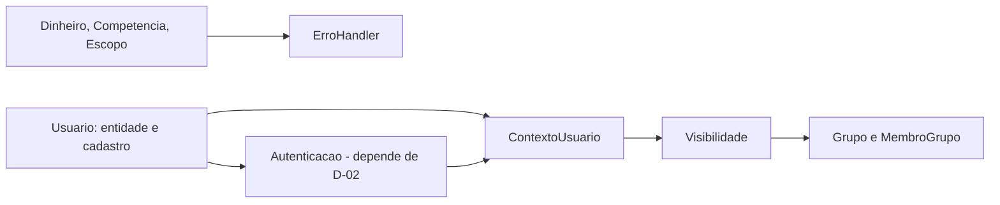

# Modelo de Lógica de Negócio — U1 Fundação

Fluxos e algoritmos das operações da unidade. Referencia as regras de `business-rules.md` pelo
identificador.

---

## 1. Como uma requisição autenticada se resolve

Toda operação sobre dado financeiro do sistema atravessa a mesma sequência. É o esqueleto que U2, U3
e U4 herdam.



O ponto que importa: `Servico` **não** consegue chamar `Repositorio` sem passar por `Visibilidade`.
Não é convenção — é a forma da interface (RN-V01).

---

## 2. `usuario`

### 2.1 Cadastrar — `cadastrar(email, senha, nome)`



A verificação de duplicidade em E é uma leitura, e duas requisições simultâneas podem passar as
duas. A restrição de unicidade no banco é quem realmente garante RN-U01 — a violação é capturada e
convertida em `EMAIL_JA_CADASTRADO`, não vaza como erro de banco.

> Padrão que se repete em RN-G05: **verificar para dar boa mensagem, restringir no banco para dar
> garantia**. Só a verificação é uma corrida; só a restrição é uma mensagem ruim.

### 2.2 Autenticar

O *mecanismo* de emissão da credencial de sessão é D-02, aberta, e sai na NFR Requirements. O
*comportamento* já está fechado:



O ramo E não é desperdício: iguala o tempo de resposta dos dois casos de falha, sem o qual RN-U04 é
respeitada na mensagem e violada no relógio.

### 2.3 Consultar e atualizar perfil

Ambas operam sobre `contexto.usuarioAtual()` — sem parâmetro de identificador (RN-U06). `atualizar`
só toca `nome` (RN-U07).

---

## 3. `grupo`

### 3.1 Guarda comum

Toda operação de grupo, exceto `criar` e `listarMeusGrupos`, começa pela mesma verificação:

```
associacaoAtiva(usuarioAtual, grupoId) existe?
    nao -> 404 GRUPO_NAO_ENCONTRADO      (RN-G03)
```

404 e não 403, deliberadamente: 403 confirmaria a existência do grupo.

### 3.2 Criar — `criar(nome)`

Valida o nome (RN-G01), persiste o `Grupo` e **cria a associação ativa de quem criou** na mesma
transação. Sem isso, o grupo nasceria inacessível ao próprio criador, por força de RN-G03.

> É a única operação em que grupo e associação nascem juntos. Não é privilégio de criador (RN-G02) —
> é só que alguém precisa estar dentro para que o grupo seja alcançável.

### 3.3 Adicionar membro — `adicionarMembro(grupoId, usuarioId)`



Se houver associação **encerrada**, o ramo D passa: uma linha nova é inserida ao lado da antiga
(RN-G07). O índice único parcial só considera `saiuEm IS NULL`, então não há conflito.

### 3.4 Remover membro e sair

São a mesma operação com alvo diferente: `removerMembro(grupoId, usuarioId)` e `sair(grupoId)`, este
com alvo fixo em `usuarioAtual`.

```
associacao := associacaoAtiva(alvo, grupoId)
    ausente -> 404
    presente -> associacao.saiuEm := agora        (RN-G06)
```

Nada é apagado. Os lançamentos de que o alvo é dono permanecem e continuam somando no total do grupo
(H-08). Qualquer membro pode remover qualquer outro, inclusive quem o adicionou (RN-G02).

Se era o último membro, o grupo fica vazio e permanece (RN-G08) — com a consequência registrada em
`business-rules.md` §5.

### 3.5 Listar meus grupos

Grupos com associação **ativa** de `usuarioAtual`. Lista vazia é resultado válido e esperado:
participar de grupo é opcional (H-05).

---

## 4. `Dinheiro.dividirEm` — o algoritmo

Única função de U1 com aritmética não trivial. Não tem consumidor aqui; é usada no parcelamento, em
U3.

```
dividirEm(n):
    exige n >= 1
    base    := truncar(valor / n, 2 casas)
    partes  := lista com n copias de base
    residuo := valor - (base * n)
    partes[n-1] := partes[n-1] + residuo
    retorna partes
```

Trabalha em centavos inteiros, não em decimal fracionário. `HALF_UP` (D-43) governa a construção de
`Dinheiro`, mas **não** aparece aqui: a divisão trunca e devolve o resto por diferença, o que torna
a soma exata por construção em vez de por sorte de arredondamento.

Exemplo — `R$ 100,00` em 3:

```
base    = 33,33
partes  = [33,33  33,33  33,33]   soma = 99,99
residuo = 0,01
partes  = [33,33  33,33  33,34]   soma = 100,00
```

**Por que o resíduo vai na última**: precisa ir em *alguma*, e a última é a mais defensável em
parcelamento — quem paga a primeira parcela vê o valor "redondo" anunciado. A alternativa de
distribuir de um em um pelas primeiras é igualmente correta aritmeticamente; a escolha é de produto,
e está registrada para não ser revisitada por acidente.

---

## 5. Ordem de implementação sugerida

Dependência interna da unidade:



`Dinheiro` e `Competencia` são independentes de tudo e podem ser os primeiros — são também os únicos
alvos de property-based testing da unidade, e fechá-los cedo dá o gerador pronto para U2 e U3.

`Visibilidade` depende de `ContextoUsuario`, que depende da autenticação, que depende de D-02. Se a
NFR Requirements demorar, dá para avançar com uma implementação de `ContextoUsuario` alimentada por
teste, sem bloquear `Grupo`.

---

## 6. O que esta unidade deixa em aberto

| Item | Destino |
|---|---|
| D-02 — mecanismo de sessão (JWT, cookie, OAuth2) | NFR Requirements de U1, próxima stage |
| Troca de e-mail e troca de senha | Sem requisito; fora do escopo até que exista um |
| Recuperação de grupo abandonado | Requisito novo, se o produto pedir — ver `business-rules.md` §5 |
