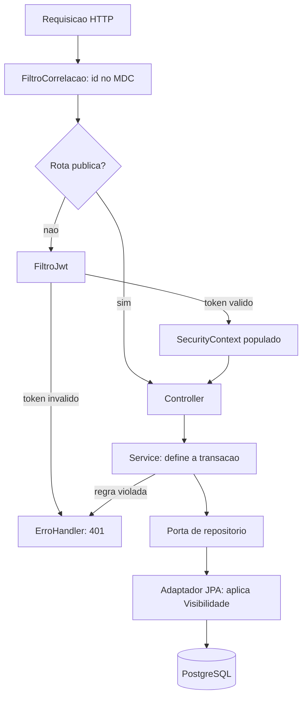

# Componentes Lógicos — U1 Fundação

O que existe, onde vive e por que não existe mais nada.

---

## 1. Componentes de infraestrutura

Todos **in-process**. Nenhuma fila, cache distribuído, circuit breaker ou serviço auxiliar.

| Componente | Natureza | Estado | Justificativa |
|---|---|---|---|
| `FiltroCorrelacao` | Filtro servlet, primeiro da cadeia | Nenhum | Id por requisição no MDC (D-53) |
| `FiltroJwt` | Filtro servlet | Nenhum | Valida assinatura e validade; popula o `SecurityContext` |
| `ContextoUsuario` | Bean de escopo de requisição | Memoriza os grupos na requisição | Fonte única de RF-03 |
| `RegistroDeTentativas` | Bean singleton | **Mapa em memória, com expiração** | Bloqueio de NFR-U1-03 |
| `ErroHandler` | `@RestControllerAdvice` | Nenhum | Formato único de erro (RNF-09) |
| `CodificadorDeSenha` | Bean singleton | Nenhum | BCrypt força 12 (D-48) |
| `EmissorDeToken` | Bean singleton | Nenhum | Assina e valida; segredo do Parameter Store |

`RegistroDeTentativas` é **o único componente com estado** de toda a unidade, e é justamente o que
quebra com uma segunda instância — está registrado em `nfr-design-patterns.md` §4.

---

## 2. Componentes que deliberadamente não existem

| Não existe | Por quê |
|---|---|
| Cache (Redis, Caffeine) | Nada em U1 tem custo de leitura que justifique. `gruposDoUsuario()` já é memorizado por requisição, que é o escopo certo — cachear além disso significaria não refletir a saída de um grupo até o cache expirar |
| Fila / mensageria | Nenhuma operação de U1 é assíncrona. Cadastro, login e gestão de grupo são síncronos por natureza |
| Circuit breaker | Sem chamada a serviço externo. Não há circuito a abrir |
| Store de sessão | JWT stateless (D-02) existe exatamente para não ter |
| Store de refresh token | D-50 dispensou refresh |
| Serviço de e-mail | Não há confirmação de cadastro nem recuperação de senha em RF-01 a RF-10. Se surgir, é requisito novo |
| Auditoria de acesso | Nenhum requisito pede. `criadoEm` cobre o que RF-01 a RF-10 exigem |

> Esta tabela é a parte mais útil do documento. A ausência de um componente é uma decisão tão real
> quanto a presença, e sem registro ela é indistinguível de esquecimento — alguém em U3 vai propor
> um cache, e a resposta precisa estar escrita.

---

## 3. Como os componentes se compõem numa requisição

O ponto que o diagrama torna visível: **não há seta do Service direto para o banco**. Passa sempre
pela porta, e a porta não tem operação sem filtro (D-52).

---

## 4. Fronteiras transacionais

A transação começa e termina na **camada de aplicação** — nunca no controller, nunca no repositório.

| Operação | Escopo |
|---|---|
| `cadastrar` | Uma transação: verifica duplicidade, calcula hash, persiste |
| `criar` grupo | Uma transação: cria `Grupo` **e** a associação de quem criou. Sem isso o grupo nasceria inacessível |
| `adicionarMembro` | Uma transação |
| `sair` / `removerMembro` | Uma transação: apenas marca `saiuEm` |
| Consultas | `readOnly = true` |

`open-in-view: false` já está ligado, então não há transação estendida até a serialização da
resposta. Consequência assumida: acesso preguiçoso fora da transação falha em vez de disparar
consulta escondida.

---

## 5. Componentes externos consumidos

| Externo | Uso | Falha significa |
|---|---|---|
| PostgreSQL (RDS) | Persistência | Aplicação não sobe, ou responde 503 |
| AWS Parameter Store | `JWT_SECRET` e credenciais, lidos **no boot** | Instância sobe sem `.env` — foi o que aconteceu no primeiro provisionamento de `dev` |

O segundo tem histórico: `write-env.sh` passou a rodar a cada deploy justamente para que a leitura
do Parameter Store deixe de depender de um boot que deu certo.

Nenhum outro serviço externo. Nenhuma chamada de saída da aplicação além do banco.
