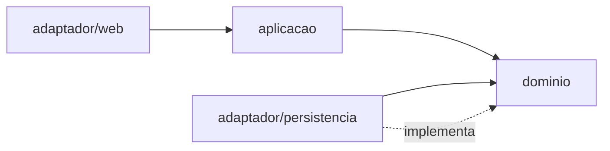
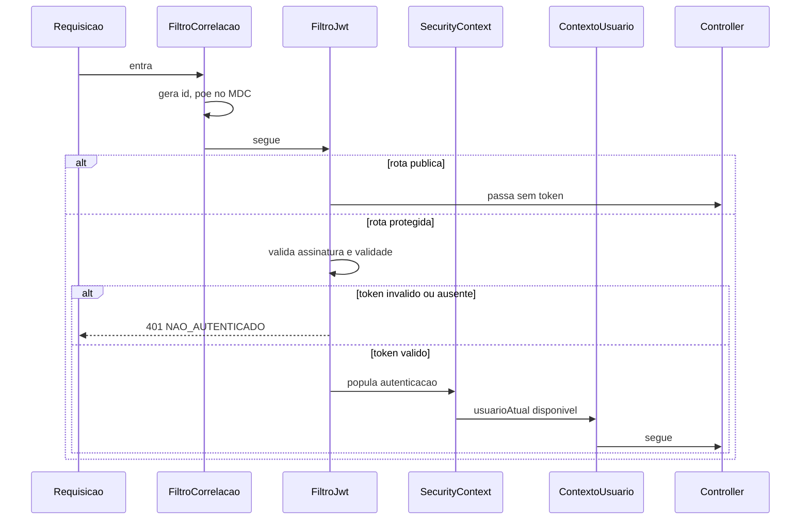

# Padrões de Design Não-Funcional — U1 Fundação

Como os 14 NFRs viram estrutura. Sem código de implementação — isso é da Code Generation.

---

## 1. Arquitetura hexagonal por feature (D-51, D-03)

Cada pacote de feature tem o mesmo formato interno:

```
com.rafaelmatheus.financialcontrol
├── common/
│   ├── dominio/          Dinheiro, Competencia, Escopo
│   ├── seguranca/        ContextoUsuario, filtro JWT, bloqueio
│   └── web/              ErroHandler, id de correlacao
├── usuario/
│   ├── dominio/          Usuario, UsuarioRepositorio (PORTA)
│   ├── aplicacao/        UsuarioService — orquestra, define transacao
│   └── adaptador/
│       ├── web/          UsuarioController, DTOs
│       └── persistencia/ UsuarioJpaEntity, UsuarioRepositorioJpa, mapeador
└── grupo/                mesma forma
```

**A regra de dependência**: `dominio` não importa nada de `adaptador`, nem de Spring, nem de JPA.
A seta aponta sempre para dentro.



O adaptador de persistência **implementa** uma interface que vive no domínio. É o que permite ao
domínio dizer "quero buscar um usuário" sem saber que existe um banco.

> **O custo, dito com todas as letras**: cada entidade tem duas representações — a de domínio e a
> `@Entity` — e um mapeador entre elas. Para `Usuario`, com 5 campos, isso é claramente cerimônia.
> A escolha foi consciente (Q2) e o benefício aparece em U3, onde `Fatura` e `Compra` têm regra de
> negócio de verdade e vão querer ser testadas sem subir banco.

---

## 2. Segurança

### 2.1 A imposição estrutural da `Visibilidade` (D-52) — o padrão central da unidade

A porta de repositório para entidades com dono **não expõe operação sem filtro**:

```
interface RepositorioComVisibilidade<T> {
    fun buscarVisivel(id: UUID): T?
    fun listarVisiveis(criterio: Criterio): List<T>
}
```

Não existe `findAll()`. Não existe `findById()`. O adaptador JPA aplica o predicado de RN-V01 antes
de qualquer consulta chegar ao banco.

**Por que isso é diferente de "lembrar de filtrar"**: quem escrever uma consulta nova sem o filtro
não produz um bug — produz um erro de compilação, porque o método que ele quis chamar não existe.
A garantia sai do domínio da disciplina e entra no do compilador.

> A alternativa avaliada e recusada foi o `@Filter` do Hibernate. Ele cobre mais caminhos
> automaticamente, inclusive consultas derivadas de nome, e **falha em silêncio** se alguém esquecer
> de habilitar o filtro na sessão. Trocaria um erro impossível por um erro invisível — pior negócio
> numa unidade cuja razão de existir é o isolamento.

`UsuarioRepositorio` fica **fora** desse contrato: usuário não tem dono, e o cadastro precisa buscar
por e-mail antes de haver autenticação.

### 2.2 Cadeia de filtros



**Rotas públicas**: `POST /usuarios`, `POST /auth/login`, `/health`, `/actuator/health`.

As duas últimas não são detalhe: o healthcheck do container e o do nginx batem nelas sem credencial.
Exigir token ali derruba o deploy — e isso já foi verificado funcionando em `dev`.

### 2.3 `ContextoUsuario` como fonte única

Lê o `SecurityContext` e resolve os grupos do usuário. **Escopo de requisição**, com os grupos
resolvidos uma vez e reaproveitados — sem isso, cada consulta de uma requisição dispararia a mesma
busca de associações.

Considerando apenas associações ativas (`saiuEm == null`), é aqui que D-44 se materializa.

### 2.4 Bloqueio por força bruta (NFR-U1-03)

Contador em memória, por e-mail normalizado, com expiração. 5 falhas → 15 minutos.

**A sutileza que vale mais que o mecanismo**: a resposta do bloqueio é **idêntica** à de senha
errada — mesmo código, mesma mensagem, mesmo tempo. Responder "conta bloqueada" confirmaria que a
conta existe, desfazendo no caminho de erro a proteção que RN-U04 monta no caminho normal.

O bloqueio ainda calcula um hash descartável, pelo mesmo motivo de tempo constante.

### 2.5 Segredo de assinatura

Vem do Parameter Store, exportado como `JWT_SECRET`. Sem default no `application.yml`: um default
viraria o segredo de produção no dia em que a variável faltasse.

Girar o segredo invalida todos os tokens — é a **única revogação disponível**, dado que D-50
dispensou refresh e lista de bloqueio. Procedimento de emergência, não operação de rotina.

---

## 3. Resiliência — aplicabilidade parcial

Não há integração externa em U1. Nenhuma chamada de rede a serviço de terceiro, nenhuma fila,
nenhum webhook. **Retry, circuit breaker e bulkhead não têm objeto** e introduzi-los seria desenhar
contra RNF-12.

O único modo de falha real é o banco indisponível:

| Situação | Comportamento desenhado |
|---|---|
| RDS inacessível na subida | A aplicação **não sobe**; o healthcheck do container falha e o compose não promove o container |
| RDS cai com a aplicação no ar | Hikari devolve erro; o `ErroHandler` converte em `503`, sem vazar detalhe |
| Health check | Reflete o banco — `/actuator/health` já retorna `DOWN` se o `DataSource` falha |

Não há retry de conexão além do que o Hikari já faz. Reconexão automática existe; recuperação de
transação perdida, não — e transação perdida em operação de escrita deve mesmo falhar visivelmente.

---

## 4. Escalabilidade — não aplicável, com registro

RNF-12 exclui escala. Nada nesta unidade é desenhado para escalar horizontalmente.

**O que quebraria com uma segunda instância**, para que a busca seja curta no dia em que isso mudar:

| Componente | O que acontece |
|---|---|
| Contador de bloqueio | Cada instância conta as suas — 5 falhas viram 10 com duas instâncias |
| JWT stateless | **Nada.** Funciona igual; é o único que já está pronto |
| `ContextoUsuario` | Nada — escopo de requisição |

Ou seja: se um dia houver escala horizontal, o que se revisita é o bloqueio, não a autenticação.

---

## 5. Desempenho

Alvo p95 < 500 ms, exceto login.

| Ponto | Tratamento |
|---|---|
| BCrypt força 12 | ~250 ms **de propósito**. Não otimizar: é o que encarece o ataque offline |
| `gruposDoUsuario()` | Executa em toda requisição autenticada. Índice em `membro_grupo(usuario_id)` e resultado memorizado por requisição |
| Pool Hikari | 10 conexões, já configurado. Folgado |
| N+1 em `Grupo` com membros | `open-in-view: false` já está ligado, o que faz o N+1 falhar como erro em vez de acontecer em silêncio |

> `open-in-view: false` merece destaque: com ele ligado, acesso a coleção fora da transação estoura
> `LazyInitializationException` em vez de disparar consultas extras invisivelmente. Transforma um
> problema de desempenho difícil de notar num erro difícil de ignorar.

---

## 6. Observabilidade (D-53)

Texto simples, com id de correlação por requisição via MDC, gerado no primeiro filtro da cadeia.

**Nunca registrado** (NFR-U1-05): senha em qualquer forma, token, hash, corpo de requisição de
autenticação. `DEBUG` de Spring Security e de Hibernate permanece desligado em produção — ambos
registram parâmetros de consulta.

Sem coletor centralizado, a depuração é `docker logs` na instância. É por isso que JSON foi
recusado: otimizaria para uma ferramenta que não existe, ao custo da que é usada.
