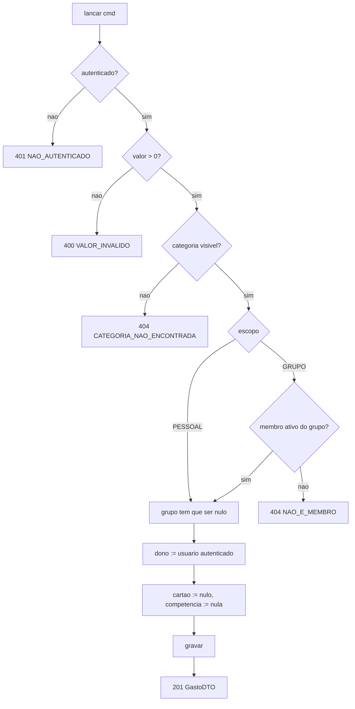
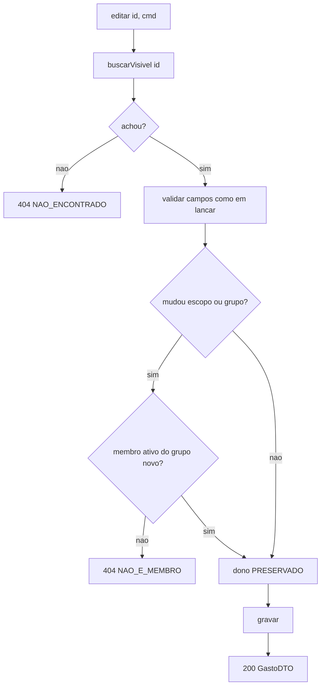
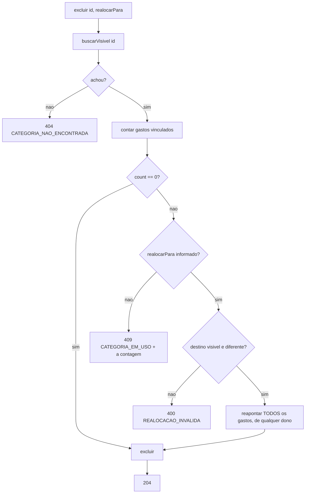
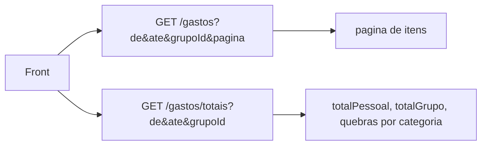
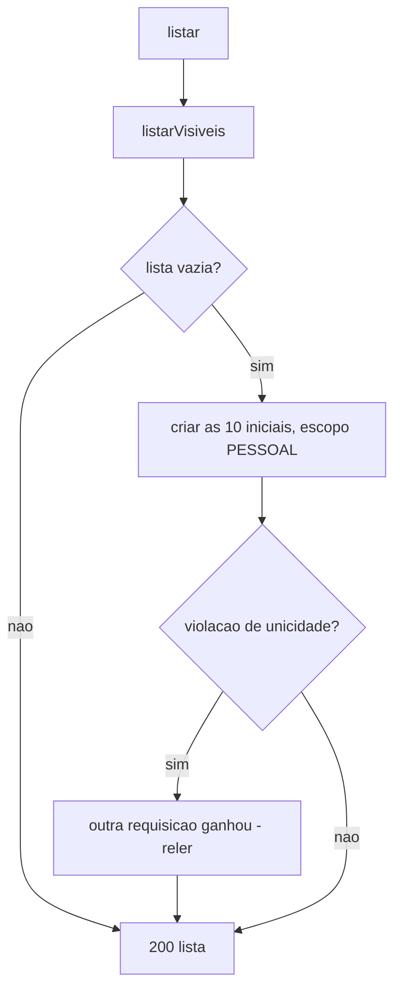

# Modelo de Lógica de Negócio — U2 Lançamentos

Fluxos e algoritmos, tecnologia-agnósticos. As regras citadas estão em `business-rules.md`; as
entidades, em `domain-entities.md`.

---

## 1. Operações da unidade

```kotlin
interface CategoriaService {
    fun criar(cmd: CriarCategoria): CategoriaDTO
    fun renomear(id: UUID, nome: String): CategoriaDTO
    fun excluir(id: UUID, realocarPara: UUID? = null)
    fun listar(): List<CategoriaDTO>     // cria as iniciais se nao houver nenhuma (RN-C08)
}

interface GastoService {
    fun lancar(cmd: LancarGasto): GastoDTO
    fun editar(id: UUID, cmd: EditarGasto): GastoDTO
    fun excluir(id: UUID)
    fun consultar(filtro: FiltroGasto, pagina: Paginacao): PaginaDeGastos
    fun totalizar(filtro: FiltroGasto): TotaisDeGastos      // operacao propria (D-57)
}
```

**Duas divergências da Application Design**, ambas deliberadas:

| Desenhado | Agora | Por quê |
|---|---|---|
| `CategoriaService.criarPadroes()` público | Efeito de `listar()` | D-56: as iniciais nascem sob demanda, não por chamada explícita. Um método público convidaria a chamá-lo duas vezes |
| `PaginaGastos` com os totais embutidos | `consultar` + `totalizar` separados | D-57 |

---

## 2. Fluxo — lançar um gasto



O passo `dono := usuário autenticado` **não é parâmetro**. Assim como `atualizarPerfil` em U1 não
aceita `usuarioId`, `lancar` não aceita `donoId`: a regra RN-L05 fica expressa na assinatura, onde
não há como esquecê-la.

---

## 3. Fluxo — editar um gasto



**`buscarVisivel` faz o trabalho de permissão sozinho.** Não há verificação separada de "é o dono?"
ou "é membro?", porque nesta unidade enxergar e poder editar são a mesma coisa (RN-L06). Uma
verificação a mais seria uma que pode divergir do predicado.

**A ausência mais importante do fluxo** é a de qualquer caminho que atribua `dono`. Editar não toca
o campo. Não é uma validação — é uma operação que não existe.

---

## 4. Fluxo — excluir categoria com realocação



**Tudo numa transação só.** Se a realocação afetasse metade dos gastos e a exclusão falhasse, ficaria
uma categoria viva com parte do histórico reclassificado — pior do que não ter tentado.

A contagem devolvida no `409` faz parte da regra (RN-C05): é o número com que o usuário decide se
realoca ou desiste.

O `RESTRICT` na chave estrangeira é a rede de segurança: mesmo que este fluxo falhe em contar, o
banco recusa a exclusão. Nenhum gasto perde a classificação por defeito de código.

---

## 5. Algoritmo — os dois totais (RF-97, D-28)

Dado um filtro `(de, ate, categoriaId?, grupoId, escopo?, donoId?)` e o usuário consultante `U`:

```
visiveis = gastos no periodo que satisfazem RN-V01 para U
           ou seja: dono == U  OU  (escopo == GRUPO E grupo in gruposAtivosDe(U))

totalPessoal = soma { g.valor | g in visiveis, g.dono == U }
totalGrupo   = soma { g.valor | g in visiveis, g.escopo == GRUPO, g.grupo == grupoId }

porCategoriaPessoal = agrupar por categoria { g | g in visiveis, g.dono == U }
porCategoriaGrupo   = agrupar por categoria { g | g in visiveis, g.escopo == GRUPO,
                                                  g.grupo == grupoId }
```

**As duas somas percorrem o mesmo conjunto com predicados diferentes**, e é por isso que um gasto
pode entrar nas duas. O exemplo de H-17, conferido contra o algoritmo:

| Lançamento | Dono | Escopo | Entra em `totalPessoal` do Rafael? | Entra em `totalGrupo`? |
|---|---|---|---|---|
| R$ 400 | Ana | GRUPO | não | **sim** |
| R$ 300 | Rafael | GRUPO | **sim** | **sim** |
| R$ 89 | Rafael | PESSOAL | **sim** | não |

`totalPessoal` do Rafael = 389,00 · `totalGrupo` = 700,00 · para a Ana, 400,00 e 700,00.
Confere com os dois cenários Gherkin da história.

**O que o algoritmo nunca produz**: `totalPessoal + totalGrupo`. Não há linha que os some, nem campo
que os contenha somados, nem "total geral" na resposta. RN-T04 é verificada por um teste que
inspeciona os DTOs de saída.

### 5.1 Por que os totais saem de operação própria



Cada resposta tem uma responsabilidade, e o front dispara as duas em paralelo. O total nunca depende
de qual página está aberta — que era a preocupação por trás da resposta a Q4.

**Divergência registrada**: o `openapi.yaml` da Application Design tem `PaginaGastos` com os totais
dentro. O contrato escrito à mão passou a ser referência de design; a fonte é o springdoc gerado do
código (D-06). Fica escrito aqui para que U3 não presuma a forma antiga.

---

## 6. Fluxo — primeira listagem de categorias (RN-C08)



O ramo da violação de unicidade não é zelo excessivo: duas requisições simultâneas de um usuário
novo — o front carregando duas telas ao mesmo tempo — chegam as duas com a lista vazia. O índice
único absorve a corrida e o perdedor relê. É o mesmo padrão de U1, e depende de a gravação usar
**flush imediato**, pela lição do defeito 1 de `cd310cb`.

---

## 7. O que atravessa a fronteira para U3

| Deixado pronto | Consumido por |
|---|---|
| `Gasto` com `cartao` e `competencia` nuláveis | Integração de gasto com cartão |
| `Categoria` com escopo | `Compra`, `ContaAPagar`, e o orçamento de U4 |
| Predicado de visibilidade **implementado e testado** | Todas as entidades de U3 e U4 |
| `totalizar` com os dois totais | Base do "realizado" do orçamento (J-02, ainda aberta) |

> **J-02 continua aberta** e é de U4: o realizado do orçamento conta o gasto de cartão pela data da
> compra ou pela competência da fatura? U2 não a resolve nem a prejudica — aqui todo gasto é à
> vista, e as duas datas coincidem.

---

## 8. Decisões registradas nesta stage

| ID | Decisão |
|---|---|
| D-54 | `Categoria` tem escopo PESSOAL ou GRUPO, simétrico ao do gasto |
| D-55 | Com o usuário em mais de um grupo, o filtro de grupo é obrigatório na consulta |
| D-56 | As categorias iniciais nascem na primeira listagem de quem não tem nenhuma |
| D-57 | Listagem paginada e totais em operação própria |
| D-58 | O escopo de um lançamento é alterável, com efeito retroativo sobre a visibilidade |
| D-59 | A realocação na exclusão de categoria alcança gastos de qualquer dono |
| D-60 | O escopo da categoria não precisa casar com o do lançamento |
| D-61 | Data de gasto é livre, inclusive futura |
| D-62 | Lançamentos de ex-membros permanecem no total do grupo |
