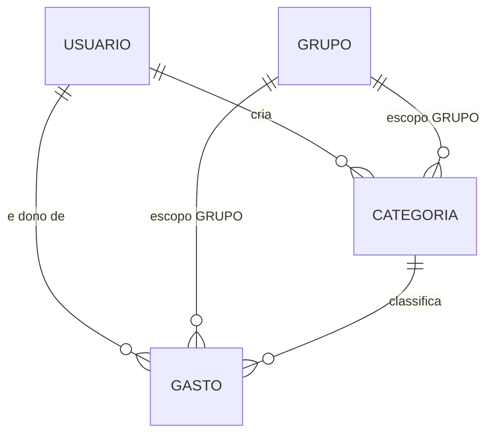

# Modelo de Domínio — U2 Lançamentos

Duas entidades. Tecnologia-agnóstico: nomes de tabela aparecem só na §5, e o mapeamento para JPA é
assunto da Code Generation.

**Herdado de U1 e usado sem alteração**: `Dinheiro`, `Escopo`, `Competencia`, `CriterioVisibilidade`,
`RepositorioComVisibilidade`.

---

## 1. `Categoria`

Raiz de agregado. Classificação de lançamentos.

| Atributo | Tipo | Obrigatório | Observação |
|---|---|---|---|
| `id` | UUID | sim | Gerado pela aplicação (D-32) |
| `nome` | texto | sim | Normalizado com `trim`; unicidade em §1.1 |
| `dono` | UUID de `Usuario` | sim | Quem criou. Nunca muda |
| `escopo` | `Escopo` | sim | PESSOAL ou GRUPO (D-54) |
| `grupo` | UUID de `Grupo` | **condicional** | Obrigatório quando `escopo == GRUPO`; proibido quando PESSOAL |
| `criadoEm` | instante | sim | Imutável |

**Invariantes**

1. `nome` não é vazio nem só espaços, após `trim`
2. `escopo == GRUPO` ⟺ `grupo != null` — a bicondicional vale nos dois sentidos
3. `dono` nunca muda, nem quando outro membro renomeia a categoria
4. A unicidade de §1.1 é respeitada

### 1.1 Unicidade do nome — a regra tem duas formas

| Escopo | O nome é único dentro de | Consequência |
|---|---|---|
| PESSOAL | `dono` | Rafael e Ana podem ter, cada um, sua "Mercado" pessoal |
| GRUPO | `grupo` | O grupo tem **uma** "Mercado", de quem quer que a tenha criado |

A segunda linha é a razão de existir de D-54. Se a unicidade fosse sempre por dono, Ana e Rafael
criariam duas categorias "Mercado" no mesmo grupo, com UUIDs diferentes — e o total por categoria do
grupo mostraria duas linhas com o mesmo rótulo. Exatamente o problema que a pergunta veio resolver.

> **A regra é uma só, escrita em duas colunas.** Na implementação, isso é um índice único parcial
> por escopo: um sobre `(dono, nome) WHERE escopo = 'PESSOAL'`, outro sobre `(grupo, nome) WHERE
> escopo = 'GRUPO'`. Como o índice único parcial de `membro_grupo` em U1, é PostgreSQL puro e
> **invisível ao `ddl-auto: validate`** — vive só na migration, e quem mexer nela precisa saber
> disso.

### 1.2 O que não é atributo

**Sem `cor`, sem `icone`, sem `ordem`.** São atributos de apresentação, e não há front-end neste
repositório nem requisito que os peça.

**Sem `ativa`/`arquivada`.** RF-37 resolve a exclusão de categoria em uso por bloqueio ou
realocação — não por desativação. Um terceiro estado criaria um caminho a mais em toda consulta.

**Sem `padrao: Boolean`** marcando as categorias iniciais de RF-38. Depois de criadas, elas são
categorias como quaisquer outras — H-35 diz isso com todas as letras: *"podem ser renomeadas ou
excluídas como quaisquer outras"*. Um campo que as distinguisse convidaria a tratá-las diferente.

---

## 2. `Gasto`

Raiz de agregado. Uma saída de dinheiro.

| Atributo | Tipo | Obrigatório | Observação |
|---|---|---|---|
| `id` | UUID | sim | |
| `descricao` | texto | sim | Livre |
| `valor` | `Dinheiro` | sim | **Estritamente positivo** |
| `data` | data | sim | Data do gasto, declarada pelo usuário. Futuro permitido (D-61) |
| `categoria` | UUID de `Categoria` | sim | Precisa ser visível ao lançador |
| `dono` | UUID de `Usuario` | sim | **Nunca muda** (RF-17) |
| `escopo` | `Escopo` | sim | PESSOAL ou GRUPO (RF-11) |
| `grupo` | UUID de `Grupo` | **condicional** | Obrigatório quando `escopo == GRUPO` |
| `cartao` | UUID de `Cartao` | **não — sempre nulo em U2** | Nasce aqui para não haver `ALTER TABLE` em U3 |
| `competencia` | `Competencia` | **não — sempre nulo em U2** | Idem |
| `criadoEm` | instante | sim | Imutável |

**Invariantes**

1. `valor > 0` — zero e negativo são rejeitados (H-15)
2. `categoria != null` — não existe gasto sem classificação (H-15)
3. `escopo == GRUPO` ⟺ `grupo != null`
4. `dono` é imutável desde a criação — nenhuma operação o altera
5. Em U2, `cartao` e `competencia` são sempre nulos

### 2.1 `dono` é o eixo da unidade

O atributo parece administrativo e não é. Ele é o que separa as duas grandezas de RF-97:

- `totalPessoal` soma os gastos em que `dono == consultante` — **de qualquer escopo**
- `totalGrupo` soma os gastos de `escopo == GRUPO` daquele grupo — **de qualquer dono**

Um gasto de escopo GRUPO cujo dono é Ana entra **nos dois**: no total pessoal da Ana e no total do
grupo. Não é dupla contagem, porque os dois números nunca se somam (D-28). São respostas a
perguntas diferentes — "quanto eu gastei" e "quanto a casa gastou".

> **Por que `dono` e não `autor`**: a revisão 8 dos requisitos mudou o conceito de *quem registrou*
> para *quem registrou e a quem o valor pertence*. O nome do campo carrega a mudança. Um campo
> chamado `autor` convidaria alguém a criar depois um `pagador` — e a reintroduzir o rateio que D-27
> removeu.

### 2.2 Os dois campos que nascem nulos

`cartao` e `competencia` existem na entidade desde U2 e são sempre nulos até U3. A decisão vem da
Units Generation: dividir o componente `gasto` entre as duas unidades sem pagar um `ALTER TABLE`
numa tabela que já terá dados.

O custo é este: por uma unidade inteira, dois campos ficam no modelo sem que nenhuma regra os leia.
Quem ler a entidade em U2 vai encontrá-los sem explicação se ela não estiver escrita — por isso está.

### 2.3 O que não é atributo

**Sem `formaPagamento`.** RF-19 fala em "à vista ou cartão de crédito", mas um enum seria uma
segunda fonte de verdade para o que `cartao == null` já responde. Duas fontes que podem divergir.

**Sem `parcelas`.** Gasto parcelado é `Compra`, entidade de U3.

**Sem `atualizadoEm` nem `atualizadoPor`.** Não há requisito de auditoria, e H-13 é explícita em que
a edição por outro membro **não** deixa marca no dono. Registrar quem editou seria dado que ninguém
pediu, sobre uma operação que o requisito quer indistinta.

---

## 3. Relações

`Usuario`, `Grupo` e `MembroGrupo` são de U1 e não mudam. U2 acrescenta duas tabelas e nenhuma
alteração nas de U1 — o que também significa que **a migration `V2` não toca em nada já entregue**.

---

## 4. Categorias iniciais (RF-38, D-56)

Conjunto criado na primeira listagem de quem ainda não tem nenhuma categoria, com escopo PESSOAL:

`Alimentação` · `Mercado` · `Moradia` · `Transporte` · `Saúde` · `Educação` · `Lazer` ·
`Vestuário` · `Serviços` · `Outros`

**Dez, e a última é `Outros`.** O conjunto precisa cobrir o gasto que o usuário quer lançar no
primeiro minuto, senão ele cria uma categoria antes de conseguir usar o sistema — e H-35 existe
justamente para poupá-lo disso. `Outros` é o escape que garante que sempre há uma opção aplicável.

**Consequência de D-56, aceita e registrada**: quem apagar todas as categorias vê as dez
ressurgirem na listagem seguinte. A alternativa — uma marca de "já recebeu as iniciais" no usuário —
foi recusada por ser estado permanente a mais para um caso de borda, e por exigir alterar a entidade
`Usuario`, de uma unidade já fechada.

---

## 5. Persistência

Duas tabelas novas. Nada de U1 é alterado.

| Tabela | Chave | Restrições |
|---|---|---|
| `categoria` | `id` | FK `dono` → `usuario`; FK `grupo` → `grupo` (nulável); **índice único parcial** `(dono, nome) WHERE escopo='PESSOAL'`; **índice único parcial** `(grupo, nome) WHERE escopo='GRUPO'`; `CHECK` da bicondicional escopo↔grupo |
| `gasto` | `id` | FK `dono` → `usuario`; FK `categoria` → `categoria` (**`RESTRICT`**); FK `grupo` → `grupo` (nulável); `CHECK (valor > 0)`; `CHECK` da bicondicional escopo↔grupo |

**Índices de consulta**: `gasto(dono, data)` e `gasto(grupo, data)` — são exatamente os dois
predicados de RN-V01, e é por eles que toda consulta desta unidade passa.

> **A FK `categoria` é `RESTRICT`, não `CASCADE`.** Se fosse cascata, excluir uma categoria apagaria
> silenciosamente os gastos — o oposto exato de RF-37, cuja razão de existir é *não perder a
> classificação do histórico*. O banco vira a última linha de defesa da regra: mesmo que o serviço
> falhe em verificar, o `RESTRICT` recusa. Mesmo padrão de U1: verificar para dar mensagem,
> restringir no banco para garantir.

> **`CHECK (valor > 0)` no banco**, apesar de `Dinheiro` já recusar valor não positivo na construção.
> A duplicação é deliberada: a invariante monetária é a que menos pode falhar, e uma migration futura
> ou uma carga de dados fora da aplicação não passa pelo construtor.
