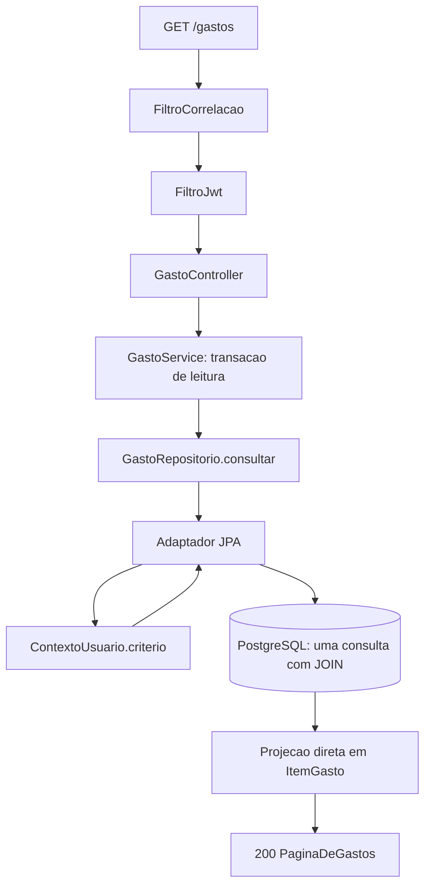

# Componentes Lógicos — U2 Lançamentos

O que U2 acrescenta, o que continua não existindo, e por quê.

**Continua valendo integralmente** a tabela de componentes de U1: `FiltroCorrelacao`, `FiltroJwt`,
`ContextoUsuario`, `RegistroDeTentativas`, `ErroHandler`, `CodificadorDeSenha`, `EmissorDeToken`.
Nenhum deles é alterado por esta unidade.

---

## 1. Componentes novos

Todos **in-process**, todos **sem estado**.

| Componente | Natureza | Estado | Papel |
|---|---|---|---|
| `CategoriaService` | Bean singleton | Nenhum | Orquestra e define a fronteira transacional de `categoria` |
| `GastoService` | Bean singleton | Nenhum | Idem para `gasto`, inclusive a transação da realocação |
| `GastoRepositorio` | Porta (interface no domínio) | — | Contrato de consulta com filtro obrigatório (D-63) |
| `CategoriaRepositorio` | Porta | — | Idem |
| Adaptadores JPA das duas portas | Bean singleton | Nenhum | Único lugar que conhece o critério **e** o SQL |
| Projeções de leitura | Tipos de dado | — | `PaginaDeGastos`, `TotaisDeGastos`, `ItemGasto` (D-65) |
| `TesteDeArquitetura` | Teste, não componente de runtime | — | Reprova o build quando uma entidade com dono escapa (D-66) |

**Zero componentes com estado.** O único do sistema segue sendo o `RegistroDeTentativas` de U1 — a
frase é a mesma da NFR Design anterior e continua verdadeira, o que é o ponto de repeti-la.

---

## 2. O que deliberadamente continua não existindo

Estende a tabela de U1. As linhas de lá valem aqui sem repetição; estas são as que **U2 tornou
tentadoras** e mesmo assim não entraram.

| Não existe | Por quê |
|---|---|
| **Cache de consulta ou de totais** | O total é a resposta a "quanto gastei", e uma resposta em cache é uma resposta possivelmente errada sobre dinheiro. Um `SUM` sobre alguns milhares de linhas indexadas custa menos que a invalidação custaria a manter |
| **Tabela de totais materializada** | Foi a alternativa apresentada em Q4 da Functional Design e recusada: criaria uma segunda fonte de verdade para o mesmo número, e cada filtro novo exigiria uma linha nova de agregado |
| **Busca textual / índice invertido** | RF-21 lista os filtros: datas, categoria, grupo, escopo e dono. Nenhum deles é texto livre. Buscar por descrição não é requisito |
| **Exportação, relatório, gráfico** | Não há requisito, e não há front-end neste repositório. O contrato entrega os números; desenhá-los é do consumidor |
| **Soft delete nos gastos** | RF-20 diz excluir. Marcar como apagado criaria um estado a mais em toda consulta desta e das próximas unidades, para atender a um requisito que ninguém escreveu |
| **Auditoria de alteração** | H-13 é explícita: qualquer membro edita, e a edição **não** deixa marca no dono. Registrar quem editou seria dado que ninguém pediu sobre uma operação que o requisito quer indistinta |
| **Fila para a realocação em massa** | A realocação de categoria é síncrona e transacional de propósito (RN-C05). Assíncrona, a categoria poderia ser excluída antes de os gastos migrarem |
| **Job de recálculo** | Não há nada derivado a recalcular. Todo número desta unidade é computado no momento em que é pedido |

> A tabela é a parte mais útil deste documento, pelo mesmo motivo que era em U1: **ausência sem
> registro é indistinguível de esquecimento**. As três primeiras linhas são as que alguém vai propor
> em U3, quando `Fatura` chegar com mais consultas, e a resposta precisa já estar escrita.

---

## 3. Composição numa requisição de consulta

A requisição de `GET /gastos/totais` percorre o mesmo caminho até o adaptador, e ali diverge para
uma consulta de agregação em vez de uma de projeção. **Nenhuma das duas materializa entidade.**

---

## 4. Onde `ContextoUsuario` entra, e o que isso custa

`ContextoUsuario` é bean de escopo de requisição e **memoriza os grupos do usuário** dentro dela.
U2 é a primeira unidade em que essa memorização paga: uma requisição de listagem seguida da de
totais faria a mesma consulta de associações duas vezes, e agora ela pode acontecer em qualquer
consulta de qualquer feature.

**A memorização é por requisição, e não mais que isso.** U1 registrou o motivo, e ele continua
valendo: cachear além do escopo da requisição significaria não refletir a saída de um grupo até o
cache expirar — e D-44 exige corte **imediato**.

> Custo por requisição autenticada: **uma consulta a `membro_grupo` por índice**, com a associação
> ativa do usuário. É o preço fixo do isolamento, e ele não cresce com o número de consultas que a
> requisição fizer.

---

## 5. O que U2 deixa pronto para U3

| Deixado | Consumido por |
|---|---|
| O padrão de porta por feature (D-63) | `CartaoRepositorio`, `FaturaRepositorio`, `CompraRepositorio` e mais três |
| A projeção de leitura (D-65) | Listagem de faturas e de contas a pagar |
| O teste de arquitetura (D-66) | Reprova automaticamente qualquer das 6 entidades novas de U3 que escape |
| Agregação por `SUM` (D-64), **com o limite escrito** | U3 soma parcelas; a regra "o banco pode somar, dividir nunca" é o que separa o permitido do proibido |

> **O item que mais importa é o último.** U3 é a unidade do parcelamento, onde `dividirEm` finalmente
> ganha consumidor — e onde a tentação de fazer a divisão no SQL vai aparecer. A divisão monetária
> tem resíduo, e o resíduo tem regra (3.36, O-28): ela mora em `Dinheiro`, que tem os testes de
> propriedade, e não no banco.
