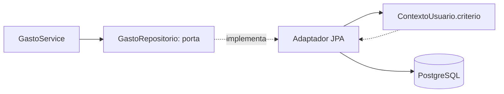

# Padrões de Design Não-Funcional — U2 Lançamentos

O que muda estruturalmente ao sair da unidade que **declarou** o isolamento para a que o
**implementa**. Sem código de implementação — isso é da Code Generation.

**Herdado de U1 e não revisitado**: arquitetura hexagonal por feature (D-51), cadeia de filtros,
`open-in-view: false`, formato de erro, log com id de correlação (D-53), JWT stateless (D-02).

---

## 1. A porta cresce sem abrir buraco (D-63) — o padrão central da unidade

U1 escreveu a porta com dois métodos e nenhum implementador:

```kotlin
interface RepositorioComVisibilidade<T> {
    fun buscarVisivel(id: UUID): T?
    fun listarVisiveis(): List<T>
}
```

U2 é a primeira a implementá-la, e a primeira a esbarrar no seu limite: `listarVisiveis()` não
recebe filtro. Consultar por período e paginar através dele significaria trazer tudo para a memória
e filtrar lá — o que resolve o desempenho na direção errada e, pior, torna a porta um lugar por onde
a base inteira passa.

**A porta cresce por feature, não na base:**

```kotlin
interface GastoRepositorio : RepositorioComVisibilidade<Gasto> {
    fun consultar(filtro: FiltroGasto, pagina: Paginacao): PaginaDeGastos
    fun totalizar(filtro: FiltroGasto): TotaisDeGastos
    fun contarPorCategoria(categoriaId: UUID): Long
    fun realocarCategoria(de: UUID, para: UUID): Int
}
```

Três propriedades sustentam a garantia de D-52:

1. **`FiltroGasto` tem `de` e `ate` obrigatórios.** Não existe forma de pedir "todos os gastos" —
   o tipo não permite construir a pergunta.
2. **O critério de visibilidade nunca é parâmetro.** O adaptador o obtém de `ContextoUsuario.criterio()`
   e o aplica em toda consulta. Não há como chamar um método destes "sem visibilidade", porque não
   há argumento que a desligue.
3. **Cada feature declara só as consultas de que precisa.** Não há método genérico sobrando para
   alguém reaproveitar torto.

> **Por que não uma álgebra de critérios genérica na porta base**, que era a alternativa: ela
> produziria menos código repetido e reintroduziria a especificação vazia — `listarVisiveis(Spec.of())`
> compila, e varre tudo. Trocaria um erro impossível por um erro que compila, que é a mesma troca
> ruim que U1 recusou ao rejeitar o `@Filter` do Hibernate.



O adaptador é o único ponto do sistema que conhece ao mesmo tempo o critério e o SQL. O serviço não
sabe que existe visibilidade; o domínio, menos ainda.

---

## 2. Agregação monetária no banco (D-64)

`totalizar` soma com `SUM` no PostgreSQL, sem carregar linha alguma. A coluna é `numeric(_,2)`, e a
soma de decimais exatos não arredonda — não há divisão envolvida, que é onde `Dinheiro` tem regra
(HALF_UP, resíduo distribuído).

**A consequência, dita com todas as letras**: a aplicação passa a ter **dois lugares onde dinheiro é
somado** — `Dinheiro.mais()` e o `SUM` do banco — e nada verifica que concordam.

A alternativa apresentada incluía um teste de propriedade comparando as duas somas sobre o mesmo
conjunto, e **não foi a escolhida**. O risco é portanto aceito por decisão, não por omissão.

**O que sobra de proteção, sem custo adicional**: a escala 2 da coluna é declarada na migration e
conferida pelo `ddl-auto: validate` a cada inicialização. A única forma de as duas aritméticas
divergirem seria escala diferente entre banco e código — exatamente o que o `validate` reprova.

> Vale notar onde a proteção **não** alcança: se um dia alguém somar valores de moedas diferentes,
> ou aplicar percentual no SQL, o `validate` não vê nada. A regra prática que fica: **o banco pode
> somar; dividir, nunca.** Divisão monetária é de `Dinheiro`, que tem os testes de propriedade — e é
> justamente o que U3 vai fazer no parcelamento.

---

## 3. Leitura por projeção (D-65)

Com `open-in-view: false` desde U1, tocar uma associação preguiçosa fora da transação estoura — de
propósito, para transformar um problema de desempenho difícil de notar num erro difícil de ignorar.

A listagem precisa do nome da categoria e do nome do dono em cada item. A projeção resolve os dois
problemas de uma vez:

```
SELECT g.id, g.descricao, g.valor, g.data, g.escopo,
       c.id, c.nome,          -- categoria
       u.id, u.nome           -- dono
  FROM gasto g
  JOIN categoria c ON ...
  JOIN usuario   u ON ...
 WHERE <predicado de visibilidade>
   AND g.data BETWEEN :de AND :ate
   AND <filtros opcionais>
```

**Uma consulta, nenhuma entidade materializada, nenhum acesso preguiçoso.** O N+1 não é evitado por
configuração de fetch — ele não tem por onde acontecer, porque não há entidade com associação a ser
percorrida.

### 3.1 Os dois caminhos de leitura, e por que são dois

| Operação | Devolve | Para quê |
|---|---|---|
| `buscarVisivel(id)` | `Gasto`, entidade de domínio | Editar, excluir — precisa das invariantes |
| `consultar(filtro, pagina)` | `PaginaDeGastos`, projeção | Exibir — não precisa de invariante nenhuma |

A distinção não precisa ser lembrada: são métodos diferentes com tipos de retorno diferentes.
Quem quiser editar a partir de uma projeção não consegue, porque ela não tem os métodos de domínio.

---

## 4. A tensão com D-29, registrada

D-29 decidiu **"mesmo modelo para escrita e leitura"**. A projeção de §3 cria um segundo caminho de
leitura que não passa pela entidade. É preciso dizer o que isso é e o que não é.

**O que não é**: não há segunda tabela, segundo armazenamento, sincronização, evento, nem
denormalização. Nada precisa ser mantido em dia com nada.

**O que é**: a **mesma tabela lida de duas formas** — como entidade quando se vai escrever, como
projeção quando só se vai exibir. A fonte de verdade continua sendo uma só, e uma mudança de schema
quebra os dois caminhos ao mesmo tempo, que é o comportamento desejável.

> **Registrado como refinamento de D-29, não como revogação.** A distinção importa porque U3 tem
> `Fatura` e `Compra`, onde a tentação de "otimizar a leitura" é maior e o custo de errar também.
> Este documento **não é precedente** para separar armazenamentos: é precedente para escolher a
> forma de ler uma tabela conforme o que se vai fazer com o resultado.

---

## 5. Paginação

**Offset com limite**, `?pagina=0&tamanho=20`, máximo de **100** por página.

Decidido por julgamento, sem consultar, e registrado para poder ser contestado. Keyset seria mais
eficiente em bases grandes e mais complexo de construir com ordenação por data; RNF-12 fala em uso
doméstico com dezenas de usuários, e o `OFFSET` só degrada em páginas profundas que ninguém vai
alcançar num histórico pessoal.

O limite de 100 existe para que `?tamanho=1000000` não vire um caminho de exaustão de memória. É a
única defesa de recurso desta unidade, e é barata.

**Os totais não são paginados** (D-57): vêm de operação própria, sempre sobre o período inteiro.

---

## 6. O isolamento vira teste de arquitetura (D-66)

U1 provou o isolamento com um teste de comportamento dedicado. U2 acrescenta 2 entidades com dono;
U3 acrescenta 6. Escrever a prova à mão a cada uma funciona enquanto alguém lembrar.

**O teste de arquitetura reprova o build quando:**

| Condição | Por que é defeito |
|---|---|
| Existe entidade com campo `dono` cujo repositório de domínio não estende `RepositorioComVisibilidade` | É uma entidade fora do isolamento |
| Um repositório de domínio expõe método que devolve a entidade sem receber filtro obrigatório | É a brecha que D-63 fecha |
| Um adaptador de persistência é injetado direto num controller, saltando o serviço | Contorna a fronteira onde a transação e o critério são definidos |
| Uma classe de `dominio` importa `jakarta.persistence` ou `org.springframework` | Quebra a regra de dependência de D-51 |

**O que ele não substitui**: o teste de comportamento continua existindo. Um teste de arquitetura
prova que a estrutura está no lugar; só o de comportamento prova que o predicado devolve as linhas
certas. Os dois respondem a perguntas diferentes.

> **É o mesmo princípio de D-52, aplicado uma camada acima.** D-52 fez o compilador impedir a
> consulta sem filtro. D-66 faz o CI impedir a entidade que nasceu fora do padrão. Em ambos os
> casos, a garantia sai da disciplina de quem escreve e passa para uma máquina que não esquece.

---

## 7. Categorias obrigatórias

| Categoria | Aplicável | O que foi decidido, ou por que não se aplica |
|---|---|---|
| **Resilience** | Não | Nenhuma integração externa nova. A única falha possível continua sendo a indisponibilidade do banco, tratada em U1. Não há circuito a abrir nem retentativa que faça sentido |
| **Scalability** | Não, com registro | RNF-12: uso doméstico, instância única. U2 **não adiciona componente com estado** — o único do sistema segue sendo o `RegistroDeTentativas` de U1. Numa segunda instância, U2 funcionaria sem alteração |
| **Performance** | **Sim** | D-64 (agregação no banco), D-65 (projeção), paginação com teto de 100, índices `gasto(dono, data)` e `gasto(grupo, data)` |
| **Security** | **Sim** | D-63 (porta com filtro obrigatório) e D-66 (teste de arquitetura). É a unidade em que o isolamento deixa de ser declaração e vira implementação |
| **Logical Components** | Parcial | Nenhum componente de infraestrutura novo. Ver `logical-components.md` |

---

## 8. Decisões registradas nesta stage

| ID | Decisão |
|---|---|
| D-63 | A porta de visibilidade cresce **por feature**, com filtro obrigatório no tipo e critério nunca parametrizável |
| D-64 | Totais somados com `SUM` no banco. Duas aritméticas monetárias, **sem teste de comparação** — risco aceito |
| D-65 | Leitura de listagem por **projeção direta para DTO**; refinamento de D-29, não revogação |
| D-66 | **Teste de arquitetura** reprova o build quando uma entidade com dono escapa do padrão |
