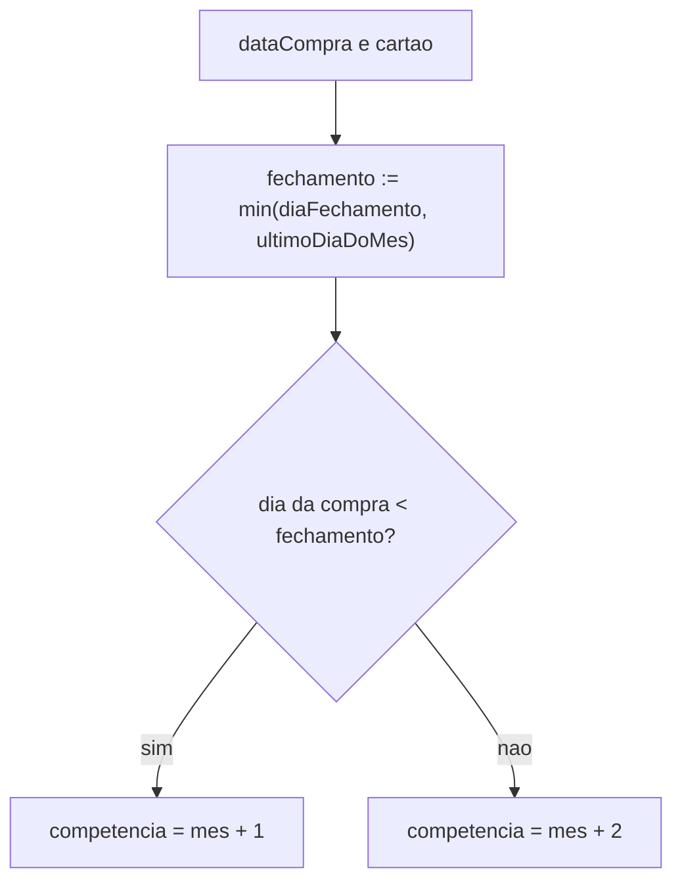
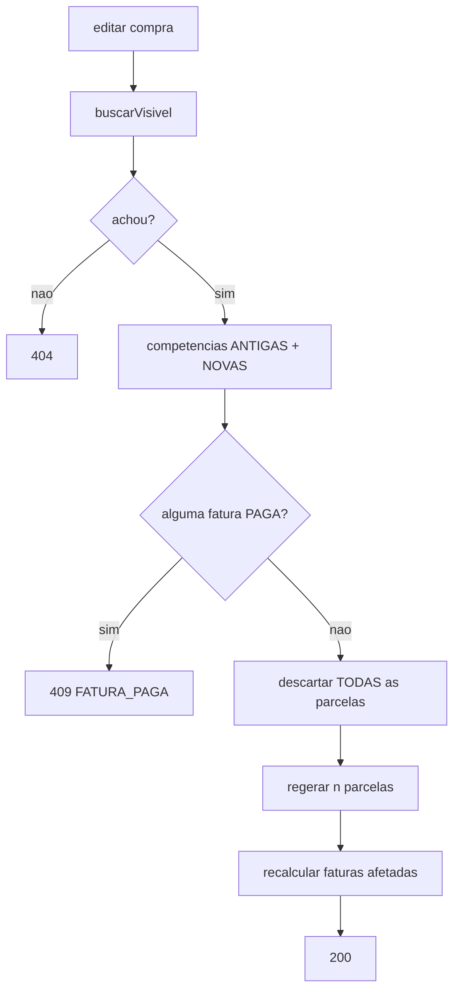
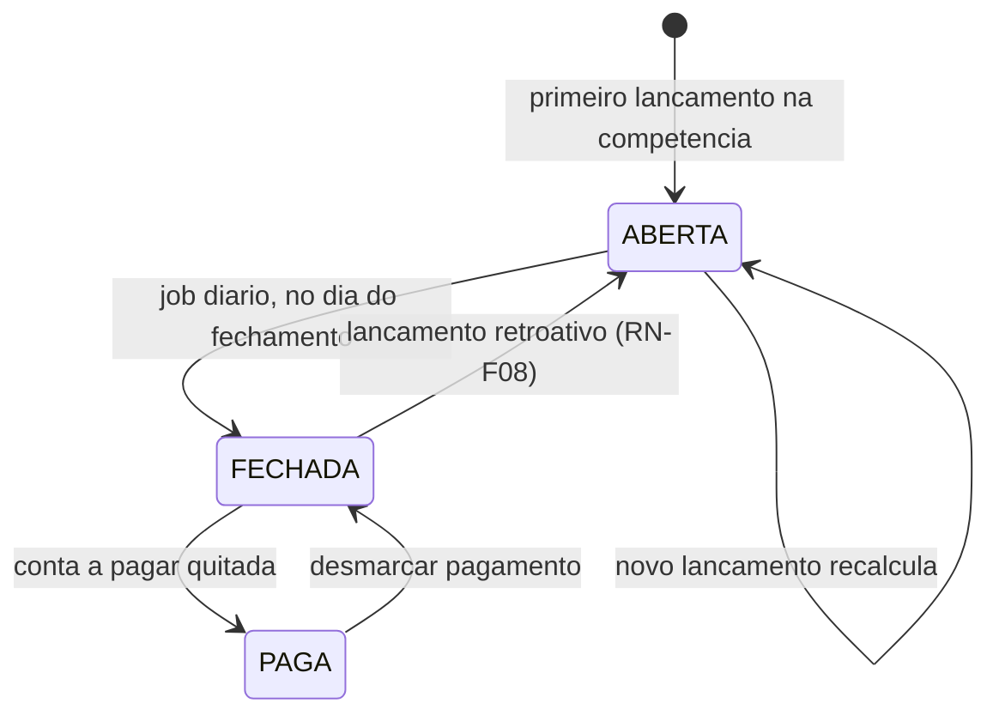
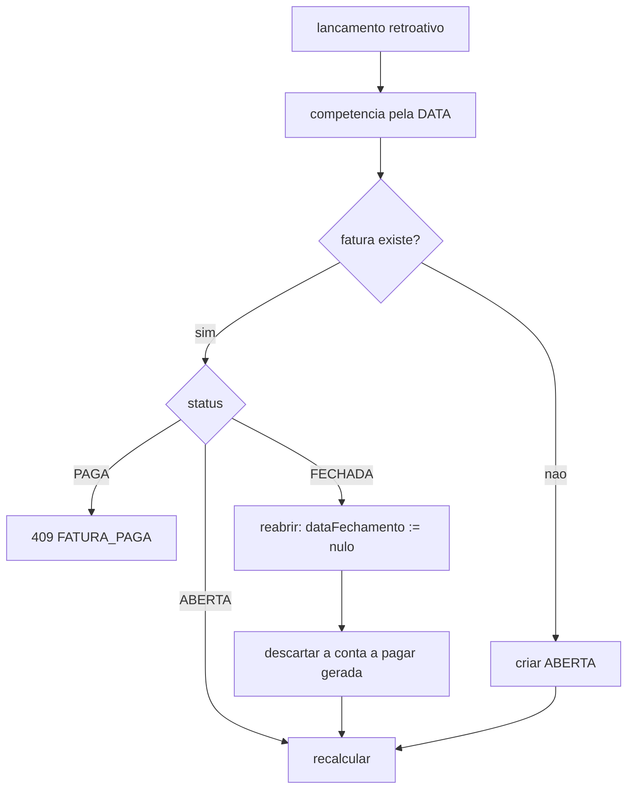
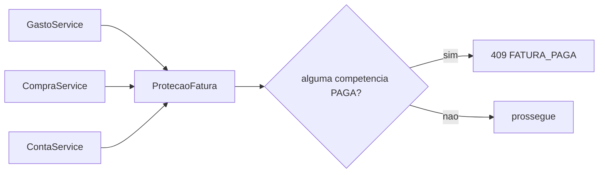
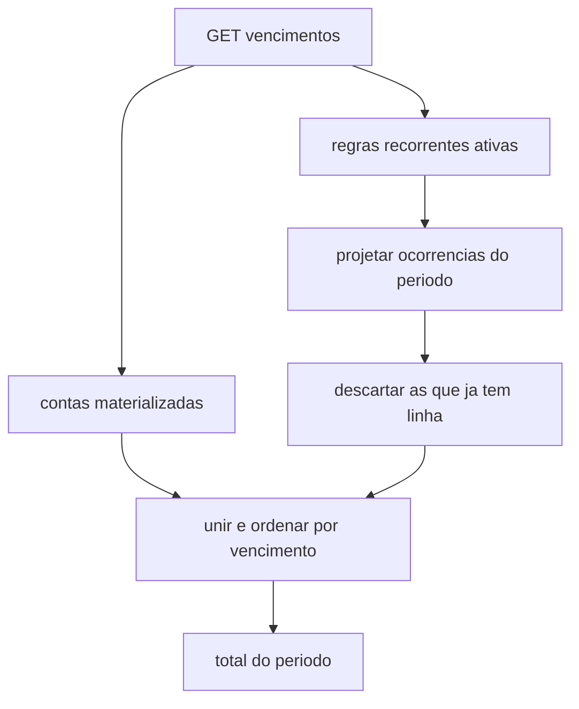
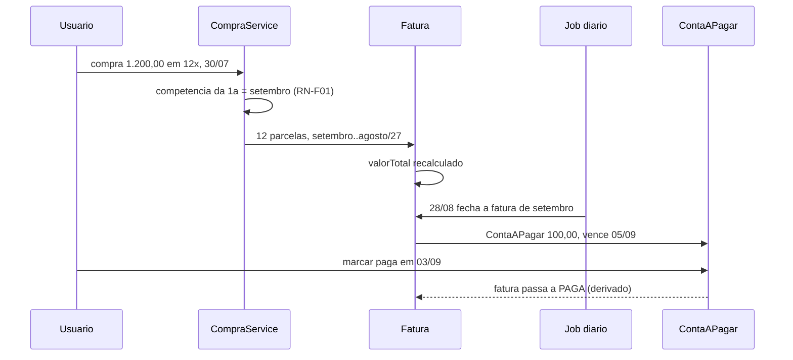

# Modelo de Lógica de Negócio — U3 Crédito

Fluxos e algoritmos, tecnologia-agnósticos. Regras em `business-rules.md`; entidades em
`domain-entities.md`.

---

## 1. Operações da unidade

```kotlin
interface CartaoService {
    fun cadastrar(cmd: CadastrarCartao): CartaoDTO
    fun editar(id: UUID, cmd: EditarCartao): CartaoDTO
    fun encerrar(id: UUID)
    fun listar(): List<CartaoDTO>
}

interface CompraService {
    fun lancar(cmd: LancarCompraParcelada): CompraDTO   // valorTotal, NAO valorParcela (D-67)
    fun editar(id: UUID, cmd: LancarCompraParcelada): CompraDTO
    fun excluir(id: UUID)
    fun consultar(id: UUID): CompraDetalheDTO
}

interface FaturaService {
    fun consultar(cartaoId: UUID, competencia: Competencia): FaturaDTO
    fun consultarFuturas(cartaoId: UUID, ate: Competencia): List<FaturaDTO>
    fun recalcular(cartaoId: UUID, competencia: Competencia): FaturaDTO
    // NAO existe `fechar` publico: o fechamento e do job (D-71)
}

interface ContaService {
    fun cadastrar(cmd: CadastrarConta): ContaDTO
    fun editar(id: UUID, cmd: EditarConta): ContaDTO
    fun excluir(id: UUID)
    fun marcarPaga(id: UUID, dataPagamento: LocalDate, valorAjustado: Dinheiro?): ContaDTO
    fun desmarcarPagamento(id: UUID): ContaDTO
    fun vencimentosDoPeriodo(de: LocalDate, ate: LocalDate): VencimentosDTO
    fun aVencer(dias: Int): List<ContaDTO>
    fun vencidas(): List<ContaDTO>
}

interface RecorrenteService {
    fun cadastrar(cmd: CadastrarRecorrente): RecorrenteDTO
    fun encerrar(id: UUID, aPartirDe: Competencia)
    fun listar(): List<RecorrenteDTO>
}

// Regra transversal, invocada por gasto, compra e conta (RN-F07)
interface ProtecaoFatura {
    fun exigirAlteracaoPermitida(cartaoId: UUID, competencias: Set<Competencia>)
}
```

**Divergências deliberadas da Application Design**, ambas registradas:

| Desenhado | Agora | Por quê |
|---|---|---|
| `LancarCompraParcelada(valorParcela, …)` | `valorTotal` | D-67 |
| `FaturaService.fechar(...)` público | Só o job fecha | D-71 — o fechamento é consequência da data, não operação de usuário |

---

## 2. O algoritmo da competência (RN-F01) — o núcleo da unidade

```
diaEfetivo(dia, ano, mes) = min(dia, ultimoDiaDoMes(ano, mes))          // RN-K03, D-69

competenciaDe(dataCompra, cartao):
    fechamento = diaEfetivo(cartao.diaFechamento, ano(dataCompra), mes(dataCompra))
    se dia(dataCompra) < fechamento:
        retorna Competencia(dataCompra) + 1 mes
    senao:
        retorna Competencia(dataCompra) + 2 meses
```



**Por que `+2` e não `+1` no ramo de baixo.** A fatura que fecha no mês M cobre compras de M-1 e M,
e é a fatura da competência M+1. Uma compra em 30/07 num cartão que fecha 28 já passou do
fechamento de julho, então entra no ciclo que fecha em 28/08 — e essa é a fatura de **setembro**.

**A janela de uma competência C**, cartão que fecha dia F:
`[ F do mês C-2 , F do mês C-1 )` — fechada à esquerda, aberta à direita. O corte exclusivo de E-03
é exatamente o parêntese à direita.

| Competência | Janela (fecha dia 28) | Fecha em | Vence (dia 5) |
|---|---|---|---|
| agosto | 28/06 ≤ d < 28/07 | 28/07 | 05/08 |
| setembro | 28/07 ≤ d < 28/08 | 28/08 | 05/09 |

Confere com H-20 e com H-45.

> **O erro que esta seção existe para prevenir**: usar `diaVencimento` no lugar de `diaFechamento`.
> RF-61 é explícito, e o engano é natural porque o vencimento é a data que o usuário vê no
> aplicativo do banco. A propriedade 6 do PBT existe para pegá-lo.

---

## 3. Parcelamento

```
lancarCompra(valorTotal, n, dataCompra, cartao):
    exigir valorTotal > 0 e n >= 1                         // RN-P02
    primeira = competenciaDe(dataCompra, cartao)
    competencias = [primeira + i meses  para i em 0..n-1]   // RN-P05
    ProtecaoFatura.exigirAlteracaoPermitida(cartao, competencias)   // RN-P08
    valores = dividir(valorTotal, n)                        // RN-P03
    gravar compra e as n parcelas
    recalcular as faturas das competencias afetadas
```

### 3.1 A divisão (RN-P03, D-68)

```
base = piso(valorTotal_em_centavos / n)
parcelas 1..n-1 = base
parcela n       = valorTotal - (n-1) * base
```

| Total | N | Resultado |
|---|---|---|
| 100,00 | 3 | 33,33 · 33,33 · **33,34** |
| 100,00 | 7 | 14,28 ×6 · **14,32** |
| 1.200,00 | 12 | 100,00 ×12 — sem resíduo |
| 1,19 | 120 | 0,00 ×119 · **1,19** |

> **Reversão registrada.** `Dinheiro.dividirEm`, entregue em U1, distribui um centavo por parte nas
> últimas — comportamento adotado porque o property-based testing achou o defeito da regra original
> (3.36, O-28). D-68 volta ao "última absorve", cumprindo RF-31 e E-01 ao pé da letra. Foi
> apresentado com os quatro exemplos acima e **confirmado pelo usuário**.
>
> A alteração de `dividirEm` e a substituição da propriedade *"partes diferem no máximo 0,01"* por
> *"as primeiras n-1 são iguais"* acontecem na Code Generation.

### 3.2 Edição (RN-P06)



**A união das competências antigas e novas** é o ponto fácil de errar: mudar de 12 para 6 parcelas
esvazia 6 faturas que antes tinham valor. Verificar só as novas deixaria alterar uma fatura paga
por subtração.

---

## 4. Ciclo de vida da fatura



**`PAGA` é derivado** (RN-F06): as transições de e para ele acontecem na conta a pagar, não na
fatura. O diagrama mostra o estado observável, não campos.

### 4.1 O fechamento (RN-F05, D-71)

```
job diario:
    para cada cartao ativo:
        para cada fatura ABERTA cuja janela ja terminou:
            fatura.dataFechamento = data do fechamento da janela
            gerar ContaAPagar(tipo=FATURA_CARTAO,
                              valor=fatura.valorTotal,
                              vencimento=diaEfetivo(cartao.diaVencimento, mes da competencia),
                              origemFatura=fatura.id)
```

### 4.2 O modo de falha que D-71 introduziu

Se o job não rodar — instância parada, exceção, deploy no horário —, a fatura **não fecha e a conta
a pagar não nasce**. Ninguém recebe erro: o vencimento simplesmente não aparece na lista.

**Tratamento, e é o que torna a decisão viável:** o job não fecha "as faturas de hoje". Ele fecha
**todas as faturas cuja janela já terminou e que ainda estão abertas**. Rodando após três dias
parado, ele recupera os três dias.

| Propriedade | Consequência |
|---|---|
| **Idempotente** | Rodar duas vezes no mesmo dia não gera duas contas — a fatura já tem `dataFechamento` |
| **Recuperável** | Não depende de ter rodado ontem |
| Sem estado próprio | Nada a persistir sobre "última execução" |

> A alternativa recusada — fechar sob demanda, na consulta — **não tinha este modo de falha**, porque
> o fechamento acontecia no caminho de quem consulta. O custo de D-71 é este, e ele está pago pela
> idempotência.

> **Duas instâncias fechariam a mesma fatura duas vezes.** É a **segunda** coisa do sistema que
> quebra com escala horizontal, ao lado do `RegistroDeTentativas` de U1. Vai para a NFR Design.

### 4.3 Reabertura (RN-F08, E-12)



A compra fica na competência **correta pela data**, nunca empurrada para a fatura aberta. Empurrar
faria o total bater com o registro do sistema e não com o extrato do banco — que é o oposto do que
H-20 quer.

---

## 5. A regra transversal: bloqueio de fatura paga (RN-F07)

Três chamadores, uma regra:



| Chamador | Quando invoca | Competências verificadas |
|---|---|---|
| `GastoService` | lançar, editar, excluir gasto **com cartão** | A do gasto, antes e depois da edição |
| `CompraService` | lançar, editar, excluir compra | **Todas** as n, antigas ∪ novas |
| `ContaService` | excluir conta derivada de fatura | A da fatura de origem |

> **O risco desta regra é estrutural: ela pode ser esquecida em um dos três.** É a mesma classe de
> problema que D-52 resolveu para visibilidade, e merece o mesmo tipo de tratamento na NFR Design —
> uma verificação que falhe sozinha, não uma que dependa de alguém lembrar.

---

## 6. Vencimentos: onde tudo converge

```
vencimentosDoPeriodo(de, ate):
    materializadas = contas visiveis com vencimento no periodo      // RN-A04
    projetadas     = ocorrencias de recorrentes ativas no periodo
                     que ainda NAO tem linha                        // RN-R02
    retorna ordenar(materializadas + projetadas, por vencimento)
```



**Materializada e projetada são indistinguíveis na resposta.** A diferença é de armazenamento.

### 6.1 Materialização (RN-R02, D-72)

A linha nasce quando ganha estado próprio:

| Ação | Efeito |
|---|---|
| Consultar | Nada. Só projeta |
| Marcar paga | **Materializa** e grava o pagamento |
| Ajustar o valor | **Materializa** com o valor ajustado |

O índice único parcial `(origemRecorrente, competencia)` garante que duas materializações
simultâneas não criem duas linhas — mesmo padrão dos outros dois índices parciais do projeto.

### 6.2 Ajuste de valor (RN-R03, H-48)

```
Energia, valorBase 180,00
  agosto:   ajustado para 213,40  -> materializa com 213,40
  valorBase permanece 180,00
  setembro: projetada com 180,00
```

O ajuste é **da ocorrência**, nunca da regra. É esta exigência que obriga a ocorrência a ter
identidade — sem ela, D-72 poderia ser cálculo puro.

---

## 7. As duas jornadas

### J-01 — Da compra ao pagamento



**Resolvida.** O elo que faltava era quem dispara o fechamento — D-71 — e de onde vem o `PAGA` —
D-70.

### J-03 — Total do grupo × total pessoal, com cartão

Já resolvida por RF-97 e D-28 em U2. O que U3 acrescenta: **a parcela entra nos totais pela sua
competência**, não pela data da compra.

> **Isto encosta em J-02**, que é de U4 e segue aberta: o "realizado" do orçamento conta o gasto de
> cartão pela data da compra ou pela competência da fatura? U3 **não a resolve** e também não a
> prejudica — deixa as duas datas disponíveis em cada parcela, que é o que U4 vai precisar para
> escolher.

---

## 8. Decisões registradas nesta stage

| ID | Decisão | Fecha |
|---|---|---|
| D-67 | A entrada do parcelamento é o **valor total**, não o valor da parcela | — |
| D-68 | A **última parcela absorve** todo o resíduo — reverte o comportamento de U1 | — |
| D-69 | Dia inexistente cai para o **último dia do mês** | **D-04**, E-04, E-11 |
| D-70 | `Fatura.status = PAGA` é **derivado** da conta a pagar | **D-33** |
| D-71 | **Job diário** fecha as faturas; idempotente e recuperável | **D-20** |
| D-72 | Ocorrência recorrente **materializa ao ser tocada** | **D-19** |

**Pendência de requisitos aberta por esta stage**: RF-29 e H-27 descrevem a entrada por valor de
parcela e ficaram **desatualizados** por D-67. A correção é mudança de texto, não reinterpretação.
