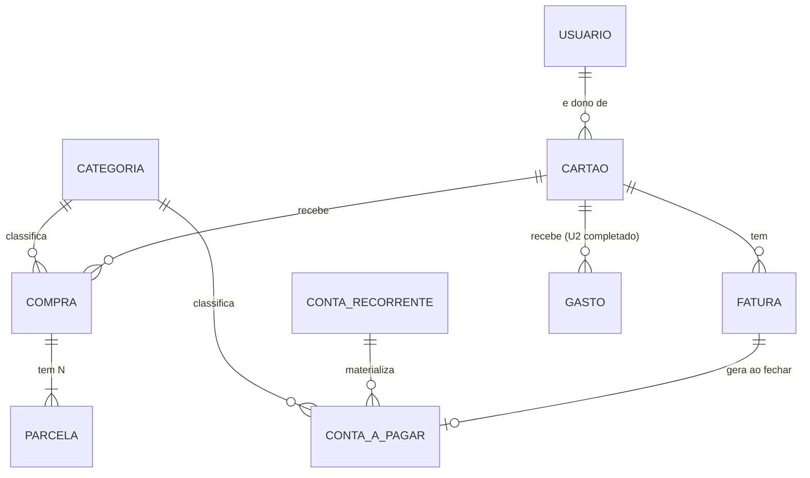

# Modelo de Domínio — U3 Crédito

Seis entidades — mais que U1 e U2 somadas. Tecnologia-agnóstico; a persistência aparece só na §8.

**Herdado sem alteração**: `Dinheiro`, `Competencia`, `Escopo`, `CriterioVisibilidade`,
`RepositorioComVisibilidade`, `Categoria`.

**Herdado e completado**: `Gasto` — os campos `cartao` e `competencia`, nulos desde U2, passam a
ser preenchidos. **Nenhum `ALTER TABLE`**: a decisão da Units Generation paga aqui.

---

## 1. `Cartao`

Raiz de agregado. Um cartão de crédito e o seu ciclo.

| Atributo | Tipo | Obrigatório | Observação |
|---|---|---|---|
| `id` | UUID | sim | |
| `apelido` | texto | sim | "Nubank", "Inter" |
| `diaFechamento` | inteiro 1–31 | sim | Corte da competência (RF-23, RF-61) |
| `diaVencimento` | inteiro 1–31 | sim | Dia em que a fatura vence |
| `dono` | UUID de `Usuario` | sim | Nunca muda |
| `escopo` | `Escopo` | sim | PESSOAL ou GRUPO (RF-24) |
| `grupo` | UUID de `Grupo` | condicional | Bicondicional com o escopo |
| `encerradoEm` | instante | não | Cartão inativo, sem apagar histórico |
| `criadoEm` | instante | sim | |

**Invariantes**

1. `diaFechamento` e `diaVencimento` entre 1 e 31 — **qualquer valor é aceito** (D-69)
2. Bicondicional `escopo == GRUPO ⟺ grupo != null`
3. `dono` imutável

> **Por que 1–31 e não 1–28.** A alternativa era recusar dias que não existem em todo mês, o que
> eliminaria o caso de borda ao custo de recusar cartões reais — há cartão que fecha dia 30. D-69
> resolve por queda para o último dia do mês, e o cadastro fica livre.

### 1.1 O que não é atributo

**Sem `limite`.** Nenhum requisito o pede, e um limite sem controle de utilização é um número que
não faz nada. Se surgir, vem com a regra de o que acontece ao estourá-lo.

**Sem `bandeira`, `ultimosDigitos`, `cor`.** Apresentação, sem front-end neste repositório.

**Sem `faturaAtual`.** Seria um ponteiro a manter em dia; a fatura corrente é derivada da data.

---

## 2. `Fatura`

Raiz de agregado. Entidade **persistida** (D-31) — não é uma visão calculada.

| Atributo | Tipo | Obrigatório | Observação |
|---|---|---|---|
| `id` | UUID | sim | |
| `cartao` | UUID de `Cartao` | sim | |
| `competencia` | `Competencia` | sim | Ano-mês. **Único por cartão** |
| ~~`valorTotal`~~ | — | — | ⚠️ **Deixou de ser atributo** — ver §2.3 |
| `dataFechamento` | data | não | Nula enquanto ABERTA |
| `dataVencimento` | data | sim | `diaVencimento` do cartão no mês da competência, com D-69 |
| `contaAPagar` | UUID de `ContaAPagar` | não | Criada no fechamento (RF-59) |
| `criadoEm` | instante | sim | |

**Invariantes**

1. `(cartao, competencia)` é único
2. `dataFechamento != null ⟺ a fatura está FECHADA`
3. `contaAPagar != null ⟹ dataFechamento != null`

### 2.1 O status tem dois níveis, e só um é persistido (D-70)

```
ABERTA   <- dataFechamento == null
FECHADA  <- dataFechamento != null  E  contaAPagar.status == EM_ABERTO
PAGA     <- dataFechamento != null  E  contaAPagar.status == PAGA
```

**`PAGA` não é um campo da fatura.** Vem da conta a pagar vinculada, que é onde o pagamento
realmente acontece (RF-27, RF-57).

> **Por que derivar.** RF-27 diz que marcar a fatura como paga *"equivale a quitar a conta a pagar
> correspondente"*. Equivalência entre dois campos é algo que alguém precisa manter; derivação não
> é. Persistir os dois criaria o estado `fatura.paga = true` com `conta.status = EM_ABERTO`, que
> nenhum código produz de propósito e todo sistema com dois campos acaba produzindo.

### 2.2 O que não é atributo

**Sem `status`** — ver acima. **Sem `dataPagamento`**: vive na conta.
**Sem lista de lançamentos**: a fatura não é dona deles. `Gasto` e `Parcela` apontam para a
competência; a fatura os encontra, não os contém.

### 2.3 Correção posterior — `valorTotal` não é atributo (D-75)

Este documento listava `valorTotal` como atributo persistido, com a invariante *"sempre igual à soma
dos lançamentos"*. A **NFR Design de U3 decidiu o contrário** (D-75): o total é **calculado na
leitura**, por `SUM` sobre os lançamentos da competência.

O motivo é que a invariante, como estava escrita, dependia de todo caminho de escrita lembrar de
recalcular — lançar, editar, excluir, reabrir. Esquecer um faria o total divergir **em silêncio**.
Calculado na leitura, a invariante deixa de precisar de guardião.

> **O que continua persistido**: o **valor da `ContaAPagar`** gerada no fechamento. Aquilo é fato
> histórico — o que foi efetivamente cobrado — e não pode mudar se um lançamento antigo for
> corrigido depois. A fatura reflete a soma atual; a conta reflete o que foi fechado. Sem essa
> distinção, corrigir um gasto de março mudaria o valor de uma conta paga em abril.

*Correção aplicada em 2026-08-03, durante a NFR Design. Registrada aqui em vez de reescrita em
silêncio, para que o rastro da mudança fique legível.*

---

## 3. `Compra`

Raiz de agregado. Uma compra parcelada no cartão.

| Atributo | Tipo | Obrigatório | Observação |
|---|---|---|---|
| `id` | UUID | sim | |
| `descricao` | texto | sim | |
| `valorTotal` | `Dinheiro` | sim | **Informado pelo usuário** (D-67) |
| `numeroParcelas` | inteiro ≥ 1 | sim | |
| `dataCompra` | data | sim | Determina a competência da primeira parcela |
| `cartao` | UUID de `Cartao` | sim | |
| `categoria` | UUID de `Categoria` | sim | Visível ao lançador (RN-L02 de U2) |
| `dono` | UUID de `Usuario` | sim | Nunca muda |
| `escopo` | `Escopo` | sim | |
| `grupo` | UUID de `Grupo` | condicional | |
| `criadoEm` | instante | sim | |

**Invariantes**

1. `valorTotal > 0` e `numeroParcelas >= 1`
2. **`soma(parcelas) == valorTotal`** — a invariante central de RF-32, verificada em toda criação e
   edição
3. `dono` imutável

### 3.1 A entrada é o total, não a parcela (D-67)

A Application Design desenhou `LancarCompraParcelada(valorParcela, numeroParcelas)`. **Foi
invertido.** O usuário informa o **valor total** e o número de parcelas; o sistema divide.

> **Consequência que precisa ficar escrita**: RF-29 e H-27 dizem o contrário — *"informando valor da
> parcela e número de parcelas, calculando o valor total"*. Os dois textos ficaram **desatualizados
> por decisão**, e a correção deles é pendência de requisitos, não reinterpretação.

---

## 4. `Parcela`

Pertence ao agregado `Compra`. Não tem ciclo de vida próprio.

| Atributo | Tipo | Obrigatório | Observação |
|---|---|---|---|
| `id` | UUID | sim | |
| `compra` | UUID de `Compra` | sim | |
| `numero` | inteiro ≥ 1 | sim | Posição. `"3/12"` é `numero`/`compra.numeroParcelas` (RF-35) |
| `valor` | `Dinheiro` | sim | |
| `competencia` | `Competencia` | sim | Fatura em que cai |

**Invariantes**

1. `numero` entre 1 e `compra.numeroParcelas`, sem lacuna e sem repetição
2. A competência da parcela `n` é a da parcela 1 mais `n-1` meses
3. Parcela **não é editável individualmente** (RF-33, H-30) — a edição é sempre da compra inteira

> **Por que `Parcela` não é raiz de agregado.** Editar uma parcela sozinha quebraria a invariante 2
> de `Compra` sem que ninguém percebesse: a soma deixaria de fechar. A regra "edite a compra
> inteira" existe para proteger a invariante, e modelar a parcela como raiz convidaria a violá-la.

### 4.1 A regra de resíduo (D-68) — reversão registrada

`valorTotal` dividido por `numeroParcelas` com **a última parcela absorvendo todo o resíduo**:

```
base    = piso(valorTotal em centavos / n)
parcela i (i < n) = base
parcela n         = valorTotal - (n-1) * base
```

| Exemplo | Resultado |
|---|---|
| R$ 100,00 em 3 | 33,33 · 33,33 · **33,34** |
| R$ 100,00 em 7 | 14,28 ×6 · **14,32** |
| R$ 1,19 em 120 | 0,00 ×119 · **1,19** |

> **Isto reverte o comportamento entregue em U1.** `Dinheiro.dividirEm` distribui hoje um centavo
> por parte, nas últimas — adotado porque o property-based testing encontrou o defeito da regra
> original (research-log 3.36, O-28). A reversão foi apresentada com os três exemplos acima e
> **confirmada explicitamente pelo usuário**, e RF-31 e E-01 voltam a ser cumpridos ao pé da letra.
>
> A alteração de `dividirEm` e a reescrita da propriedade *"partes diferem no máximo 0,01"*
> acontecem na Code Generation desta unidade.

---

## 5. `ContaAPagar`

Raiz de agregado. **A entidade mais central da unidade** — é onde todo vencimento converge.

| Atributo | Tipo | Obrigatório | Observação |
|---|---|---|---|
| `id` | UUID | sim | |
| `descricao` | texto | sim | |
| `valor` | `Dinheiro` | sim | Ajustável no pagamento se recorrente (RF-64) |
| `dataVencimento` | data | sim | **Própria de cada conta** (RF-55) |
| `tipo` | `TipoConta` | sim | FATURA_CARTAO · PIX · BOLETO · FATURA_SERVICO (RF-56) |
| `status` | `EM_ABERTO` \| `PAGA` | sim | **Persistido aqui** — é a fonte de verdade do pagamento |
| `dataPagamento` | data | condicional | Não-nula ⟺ `status == PAGA` |
| `categoria` | UUID de `Categoria` | sim | |
| `dono` | UUID de `Usuario` | sim | Nunca muda |
| `escopo` | `Escopo` | sim | Mesmas regras dos gastos (RF-65, H-49) |
| `grupo` | UUID de `Grupo` | condicional | |
| `origemFatura` | UUID de `Fatura` | não | Não-nula ⟹ conta derivada, valor não editável |
| `origemRecorrente` | UUID de `ContaRecorrente` | não | Ocorrência materializada (D-72) |
| `competenciaRecorrencia` | `Competencia` | condicional | Qual ocorrência é. Não-nula ⟺ `origemRecorrente != null` |
| `criadoEm` | instante | sim | |

**Invariantes**

1. `status == PAGA ⟺ dataPagamento != null`
2. `origemFatura` e `origemRecorrente` **nunca são ambas não-nulas** — uma conta tem no máximo uma origem
3. `origemFatura != null ⟹ valor não é editável diretamente` (P-11, H-45)
4. `(origemRecorrente, competenciaRecorrencia)` é único — uma ocorrência por período

### 5.1 Três origens, uma entidade

| Origem | Como nasce | Editável? |
|---|---|---|
| Avulsa | Usuário cadastra (RF-55) | Sim |
| Fatura de cartão | Gerada no fechamento (RF-59, H-45) | Valor **não** — deriva dos lançamentos |
| Ocorrência recorrente | Materializada ao ser tocada (D-72) | Valor sim, no pagamento (RF-64, H-48) |

> **Uma entidade só, e não três.** RF-62 é explícito: *"contas recorrentes e avulsas convivem no
> mesmo modelo"*. A visão de vencimentos de RF-58 precisa reunir tudo ordenado por data — com três
> entidades, ela seria três consultas e uma ordenação em memória.

---

## 6. `ContaRecorrente`

Raiz de agregado. A **regra** que gera ocorrências, não as ocorrências.

| Atributo | Tipo | Obrigatório | Observação |
|---|---|---|---|
| `id` | UUID | sim | |
| `descricao` | texto | sim | "Aluguel", "Energia" |
| `valorBase` | `Dinheiro` | sim | **Não muda** quando uma ocorrência é ajustada (H-48) |
| `diaVencimento` | inteiro 1–31 | sim | Com D-69 |
| `frequencia` | `MENSAL` | sim | Única no MVP (P-10) |
| `tipo` | `TipoConta` | sim | |
| `categoria` | UUID de `Categoria` | sim | |
| `dono` · `escopo` · `grupo` | | | Como nas demais |
| `inicioEm` | `Competencia` | sim | Primeira ocorrência |
| `encerradaEm` | `Competencia` | não | Após ela, nada é gerado (RF-67, H-51) |
| `criadoEm` | instante | sim | |

**Invariantes**

1. `encerradaEm == null` ou `encerradaEm >= inicioEm`
2. Encerrar **não apaga** ocorrências já materializadas (H-51)
3. `valorBase` é imutável por pagamento de ocorrência

### 6.1 Por que a regra e a ocorrência são entidades distintas

H-48 exige ajustar o valor de agosto sem mexer no valor base nem nas ocorrências futuras. Isso só é
expressável se a ocorrência tiver **identidade e estado próprios** — e é o que a torna uma
`ContaAPagar`, não um cálculo.

Ao mesmo tempo, materializar todas as ocorrências futuras criaria linhas até o infinito. D-72
resolve: a consulta **projeta** as ocorrências do período a partir da regra, e a linha só nasce
quando ganha estado próprio — pagamento ou valor ajustado.

> **A consequência mais sutil de D-72**: uma ocorrência projetada e uma materializada precisam ser
> **indistinguíveis** para quem consulta. Se a resposta expusesse a diferença, o cliente teria de
> saber que existem dois tipos de linha — e a distinção é detalhe de armazenamento, não de negócio.

---

## 7. Relações



**A fatura não aponta para os lançamentos.** `Gasto` e `Parcela` carregam `competencia`; a fatura
os encontra por consulta. A seta é de mão única, e é o que permite recalcular sem manter lista.

---

## 8. Persistência

| Tabela | Restrições relevantes |
|---|---|
| `cartao` | `CHECK` dos dias entre 1 e 31; `CHECK` da bicondicional escopo↔grupo; FKs |
| `fatura` | **único `(cartao_id, competencia)`**; FK `conta_a_pagar_id`; `CHECK (conta_a_pagar_id IS NULL OR data_fechamento IS NOT NULL)` |
| `compra` | `CHECK (valor_total > 0)`; `CHECK (numero_parcelas >= 1)`; bicondicional; FK `categoria` **`RESTRICT`** |
| `parcela` | **único `(compra_id, numero)`**; FK `compra_id` **`CASCADE`** — parcela não existe sem compra (RF-34); índice `(cartao_id, competencia)` via join |
| `conta_a_pagar` | `CHECK` de `status`↔`data_pagamento`; **`CHECK` de origem única**; **único parcial `(origem_recorrente_id, competencia_recorrencia)`**; índice `(dono_id, data_vencimento)` e `(grupo_id, data_vencimento)` |
| `conta_recorrente` | `CHECK (dia_vencimento BETWEEN 1 AND 31)`; bicondicional |
| `gasto` | **Sem alteração de schema.** `cartao_id` e `competencia` passam a ser preenchidos |

> **`parcela` é `CASCADE`, `compra.categoria` é `RESTRICT`.** As duas escolhas são opostas e as duas
> estão certas: RF-34 manda apagar as parcelas com a compra, e RF-37 proíbe perder a classificação
> do histórico. A direção da cascata segue a posse do agregado, não uma preferência de estilo.

> **O índice único parcial de `conta_a_pagar`** é o terceiro do projeto e a garantia real de que
> duas materializações simultâneas da mesma ocorrência não criam duas linhas. Como os dois
> anteriores, é PostgreSQL puro e **invisível ao `ddl-auto: validate`**.
