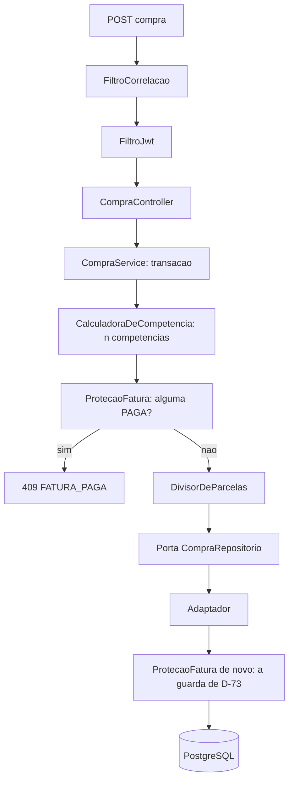
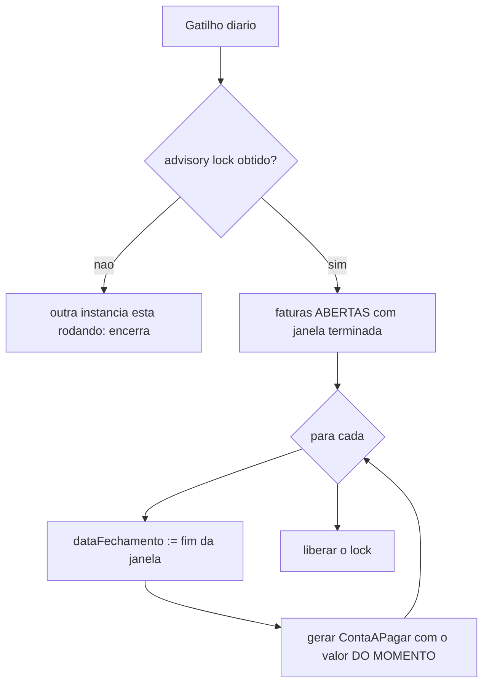

# Componentes Lógicos — U3 Crédito

**Continua valendo** o inventário de U1 e U2. Esta unidade acrescenta um componente de natureza
nova — o primeiro com agendamento — e move uma linha da tabela de ausências para a de presenças.

---

## 1. Componentes novos

| Componente | Natureza | Estado | Papel |
|---|---|---|---|
| `CartaoService` · `CompraService` · `FaturaService` · `ContaService` · `RecorrenteService` | Beans singleton | Nenhum | Orquestram e definem fronteira transacional |
| Portas e adaptadores das 6 entidades | Porta + adaptador | Nenhum | Padrão de D-63, com filtro obrigatório |
| **`ProtecaoFatura`** | Bean singleton | Nenhum | RN-F07 — invocado pelo serviço **e** pelo adaptador (D-73) |
| **`FechamentoAgendado`** | **`@Scheduled`** | Nenhum próprio | 🆕 **O primeiro componente agendado do sistema** (D-71) |
| `TravaDeExecucao` | Bean singleton | **Nenhum na aplicação** — o estado é do banco | Advisory lock do PostgreSQL (D-74) |
| `CalculadoraDeCompetencia` | Função pura | Nenhum | RN-F01 e RN-K03. Testável sem banco |
| `DivisorDeParcelas` | Função pura | Nenhum | RN-P03, sobre `Dinheiro.dividirEm` |

**Nenhum componente novo guarda estado em memória.** O `FechamentoAgendado` tem gatilho temporal,
mas o que ele decide vem inteiramente do banco — não há "última execução" guardada em lugar nenhum.

> É o que permite que ele seja recuperável: um componente que soubesse quando rodou pela última vez
> precisaria que **esse** dado sobrevivesse a um reinício.

---

## 2. A tabela de ausências, atualizada

### 2.1 O que saiu da tabela

| Antes (U1) | Agora |
|---|---|
| **Agendador** — *"nenhuma operação de U1 é assíncrona"* | ✅ **Existe**, por D-71 |

**O que se perde ao deixar de não ter um**, inventariado no momento da decisão:

| Perda | Mitigação adotada |
|---|---|
| Falha **silenciosa por não-execução** — job não roda, fatura não fecha, vencimento não aparece, ninguém recebe erro | O job fecha **todas** as faturas cuja janela terminou, não as de hoje. Três dias parado, recupera os três |
| Execução dupla com duas instâncias | Advisory lock (D-74). **A lista do que quebra com escala horizontal não cresceu** |
| Um comportamento do sistema que não é disparado por requisição, e portanto não tem id de correlação natural | O job gera o próprio id de correlação por execução, seguindo D-53 |

> **A tabela de ausências funcionou como se pretendia** — e não por vetar. U1 previu que *"alguém em
> U3 vai propor um cache"*. Ninguém propôs cache; propuseram agendador, e ele entrou. O valor da
> tabela foi forçar a pergunta certa: não *"podemos ter um job?"*, mas *"o que muda ao deixar de não
> ter?"*. As três linhas acima são a resposta, escrita agora e não reconstruída quando a fatura de
> alguém não fechar.

### 2.2 O que continua não existindo

Além de tudo o que U1 e U2 já registraram:

| Não existe | Por quê |
|---|---|
| **Fila de mensagens** | O job é síncrono e curto. Uma fila resolveria um problema de vazão que não existe na escala de RNF-12 |
| **Cache de fatura** | D-75 tornou o total uma consulta de agregação. Cachear seria reintroduzir o estado que D-75 acabou de eliminar |
| **Tabela de ocorrências futuras** | D-72 projeta. Materializar tudo criaria linhas até o infinito para contas que talvez sejam encerradas antes |
| **Notificação de vencimento** | Não há requisito, e não há canal — sem serviço de e-mail (ausência de U1) nem push. RF-66 entrega a consulta; agir sobre ela é do usuário |
| **Histórico de alterações de fatura** | Nenhum requisito. A reabertura (RN-F08) é rastreável pelo estado atual, não por trilha |
| **Retentativa do job** | Não é necessária: a próxima execução recupera sozinha o que a anterior não fez. É a recuperação estrutural tornando a retentativa supérflua |

---

## 3. Composição de uma requisição de lançamento

A verificação aparece **duas vezes de propósito**. Em cima, para dar mensagem; embaixo, para
garantir. Ver `nfr-design-patterns.md` §1.

---

## 4. O job, em detalhe

**`valor do momento`** é o ponto de contato com D-75: a fatura calcula o total na leitura, mas a
conta a pagar **congela** aquele valor. A partir do fechamento, os dois números podem legitimamente
divergir se um lançamento antigo for corrigido — e é assim que deve ser.

---

## 5. O que U3 deixa para U4

| Deixado | Consumido por |
|---|---|
| `Parcela` com **data da compra e competência** disponíveis | **J-02**, ainda aberta: o realizado do orçamento conta por qual das duas? U3 não decide e não atrapalha |
| O padrão de guarda no adaptador (D-73) | Qualquer regra futura que dependa de estado de outra entidade |
| `ContaAPagar` como ponto de convergência de vencimentos | Nada em U4 depende dele, mas é onde o sistema já reúne tudo |
| O agendador, agora existente | Se U4 precisar de algo periódico, o componente e o lock já estão lá |

> **A última linha é uma advertência, não uma facilidade.** Agora que existe um agendador, a próxima
> proposta de tarefa periódica não encontrará a barreira que U3 encontrou. A pergunta *"o que muda ao
> deixar de não ter?"* já foi respondida uma vez — e a resposta não se aplica automaticamente ao
> segundo job.
