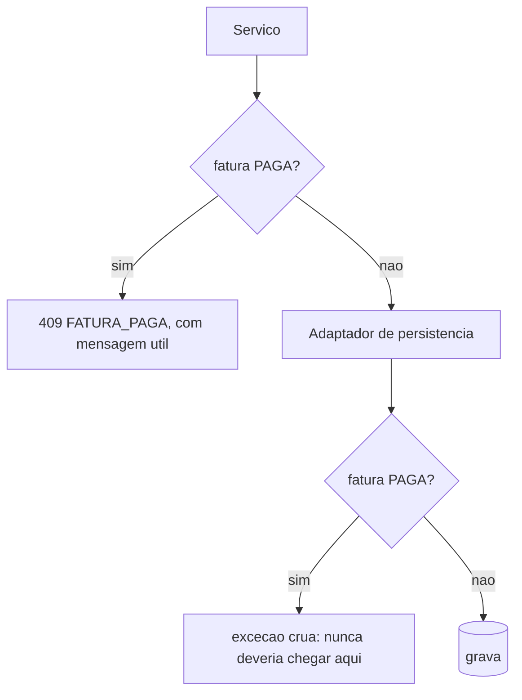
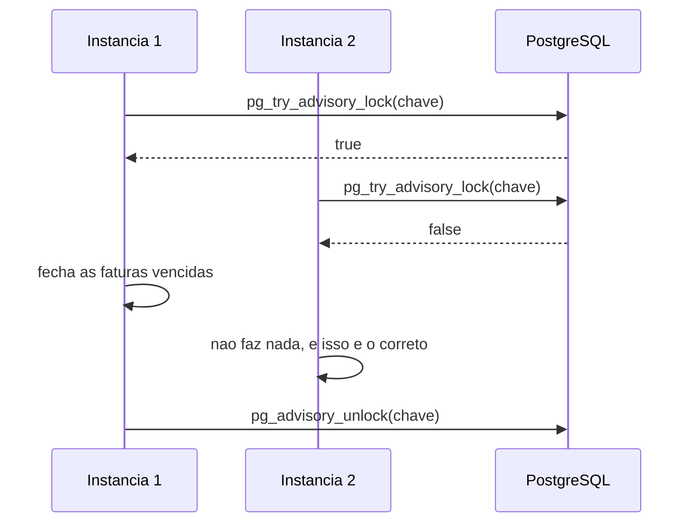

# Padrões de Design Não-Funcional — U3 Crédito

Quatro problemas estruturais que a Functional Design endereçou a esta stage. **Nenhum é sobre
desempenho** — todos são sobre garantias que dependiam de alguém lembrar.

**Herdado e não revisitado**: hexagonal por feature (D-51), `open-in-view: false`, JWT stateless,
porta por feature com filtro obrigatório (D-63), projeção de leitura (D-65), teste de arquitetura
(D-66).

---

## 1. O bloqueio de fatura paga desce para o adaptador (D-73)

RN-F07 tem **três chamadores**: `gasto`, `compra` e `conta`. Como chamada explícita, a garantia vale
enquanto alguém lembrar — e U3 tem seis entidades novas.

**A verificação passa a existir em dois lugares, com papéis diferentes:**

| Camada | Papel | Se alguém esquecer |
|---|---|---|
| **Serviço** | Verificar cedo, para dar mensagem acionável | A mensagem fica ruim (erro genérico em vez de 409 explicado) |
| **Adaptador** | Impedir a gravação | **Não é possível esquecer** — a gravação passa por ali |

> **É o mesmo padrão que U1 e U2 usam para unicidade**: *verificar para dar mensagem, restringir
> embaixo para garantir*. A diferença é que ali "embaixo" era o banco, com um índice; aqui é o
> adaptador, porque a regra depende de estado de **outra** entidade e não cabe numa restrição
> declarativa.

**O que o adaptador verifica**: toda gravação de entidade que tenha `cartao` e `competencia` —
`Gasto`, `Parcela` — e toda exclusão de conta derivada de fatura.

**O que ele não faz**: recalcular nada. Com D-75, não há total a manter.

---

## 2. O job com lock no banco (D-74)

`@Scheduled` na aplicação, com **advisory lock** do PostgreSQL antes de executar. O lock é do banco,
que já é o ponto de serialização de todo o resto — não introduz dependência nova.

**Três propriedades, e as três importam:**

| Propriedade | Por quê |
|---|---|
| **Idempotente** | Rodar duas vezes não gera duas contas: a fatura fechada já tem `dataFechamento` |
| **Recuperável** | Fecha **todas** as faturas cuja janela já terminou, não "as de hoje". Três dias parado, recupera os três |
| **Exclusivo** | O lock garante uma execução por vez, mesmo com N instâncias |

> **A idempotência é a que mais protege**, e ela é do design funcional, não do lock. O lock evita
> trabalho duplicado e corrida; a idempotência evita **dano** se o lock falhar. As duas juntas
> significam que o pior caso do agendamento é trabalho desperdiçado, nunca conta a pagar duplicada.

### 2.1 A lista que encolheu

A NFR Design de U1 registrou que `RegistroDeTentativas` é *"o único componente com estado, e é
justamente o que quebra com uma segunda instância"*. U3 ia acrescentar o segundo.

**Com D-74, não acrescenta.** O `RegistroDeTentativas` volta a ser o único item da lista.

É a primeira vez neste projeto que essa lista **encolhe em vez de crescer**, e vale registrar por
quê: o problema foi resolvido no momento em que foi criado, e não deixado como dívida a cobrar
quando a segunda instância existisse.

---

## 3. `Fatura.valorTotal` calculado na leitura (D-75)

A Functional Design listava `valorTotal` como atributo persistido, com a invariante *"sempre igual à
soma dos lançamentos"*. **A invariante dependia de todo caminho de escrita lembrar de recalcular** —
lançar, editar, excluir, reabrir fatura, realocar categoria. Esquecer um faria o total divergir em
silêncio.

Passa a ser `SUM` sobre os lançamentos da competência, na leitura. A invariante deixa de precisar de
guardião: ela é verdadeira por construção.

### 3.1 O que continua persistido, e por quê

| Valor | Natureza | Muda se um lançamento antigo for corrigido? |
|---|---|---|
| `Fatura.valorTotal` | **Derivado** — a soma atual | Sim, e deve |
| `ContaAPagar.valor` | **Fato histórico** — o que foi cobrado no fechamento | **Não** |

> Sem essa distinção, corrigir um gasto de março mudaria o valor de uma conta **paga** em abril — e
> o histórico deixaria de bater com o extrato do banco, que é exatamente o que H-24 existe para
> impedir.

### 3.2 Custo, dito com números

O `SUM` percorre os lançamentos de **uma competência de um cartão** — dezenas de linhas na escala de
RNF-12, com índice `(cartao_id, competencia)`. É a mesma decisão de D-64 em U2, e pela mesma razão:
o banco pode somar.

**A regra que continua valendo**: *o banco pode somar; dividir, nunca.* A divisão do parcelamento
(RN-P03) acontece em `Dinheiro`, com teste de propriedade — e é o único lugar do sistema onde
dinheiro é dividido.

---

## 4. A alteração de `dividirEm` (D-68) — reversão planejada

A Code Generation desta unidade **altera código de U1**. É a primeira vez que isso acontece de forma
não-aditiva no projeto, e merece plano explícito:

| Item | Ação |
|---|---|
| `Dinheiro.dividirEm` | Passa a concentrar o resíduo na última parte |
| Propriedade *"partes diferem no máximo 0,01"* | **Passa a ser falsa.** Substituída por *"as primeiras n-1 são iguais entre si"* |
| Propriedade *"soma das partes == total"* | **Continua valendo**, e é a que RF-32 exige |
| Propriedade *"nenhuma parte negativa"* | Continua valendo |
| Exemplo canônico 100,00 em 3 | **Não muda**: 33,33 / 33,33 / 33,34 |

> **O critério de aceitação da alteração**: a suíte de `Dinheiro` deve ficar verde **depois** de a
> propriedade obsoleta ser substituída — nunca desligada. Uma propriedade removida sem substituta é
> cobertura perdida sem registro.

---

## 5. Categorias obrigatórias

| Categoria | Aplicável | O que foi decidido |
|---|---|---|
| **Resilience** | **Sim — primeira vez no projeto** | D-71 trouxe a primeira falha **silenciosa por não-execução**. Tratada por idempotência + recuperação de janelas anteriores (§2). Continua sem integração externa: nada a repetir, nenhum circuito a abrir |
| **Scalability** | Parcial | D-74 impede execução dupla. A lista do que quebra com escala horizontal **encolheu para um item** |
| **Performance** | **Sim** | D-75 (`SUM` na leitura), índice `(cartao_id, competencia)`, e a projeção de ocorrências limitada ao período consultado |
| **Security** | Parcial | Nenhum mecanismo novo. As 6 entidades entram no padrão existente, e o `ArquiteturaTest` de U2 as cobre **automaticamente** — primeiro retorno concreto de D-66 |
| **Logical Components** | **Sim** | O agendador muda de lado na tabela. Ver `logical-components.md` |

---

## 6. Decisões registradas nesta stage

| ID | Decisão |
|---|---|
| D-73 | O bloqueio de fatura paga desce para o **adaptador de persistência**; o serviço continua verificando para dar mensagem |
| D-74 | O job de fechamento é `@Scheduled` com **advisory lock** do PostgreSQL |
| D-75 | `Fatura.valorTotal` é **calculado na leitura**; o valor da conta a pagar continua persistido como fato histórico |
| D-76 | A Code Generation de U3 sai em **uma entrega só** — contra a recomendação, com blocos de verificação intermediária como mitigação |
