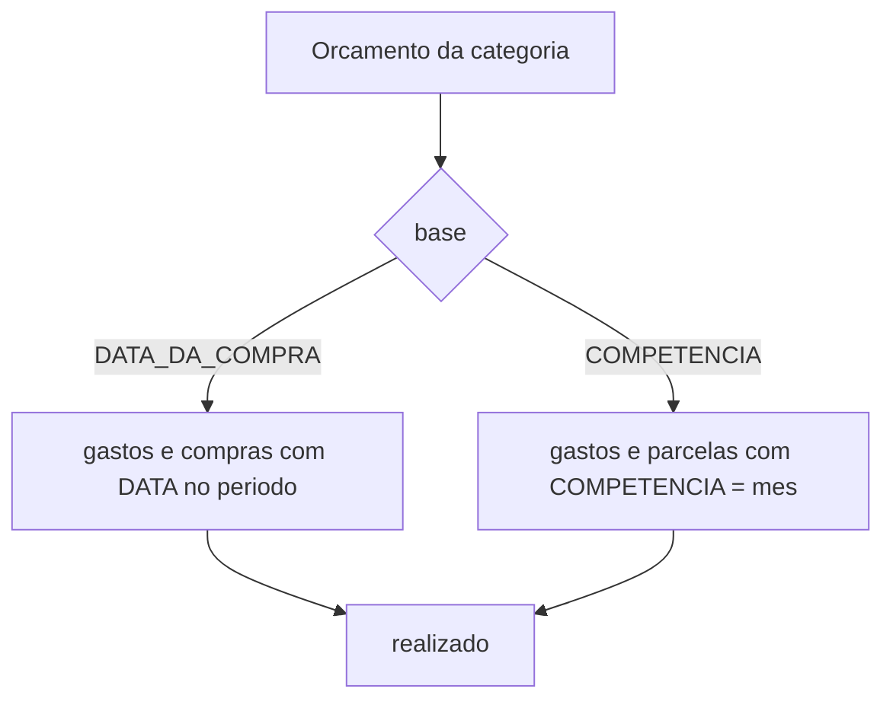
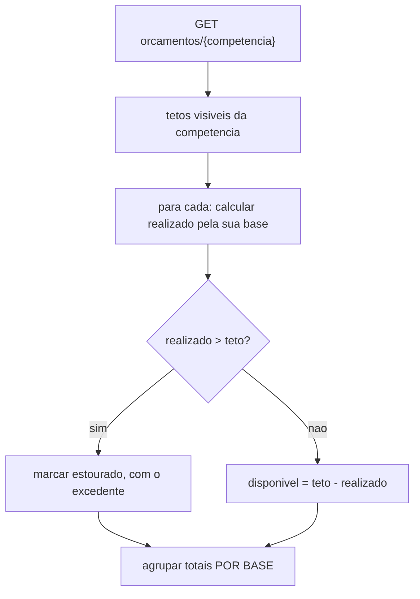
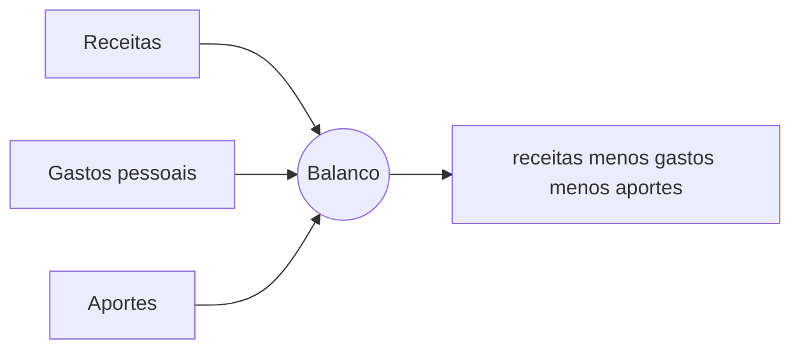
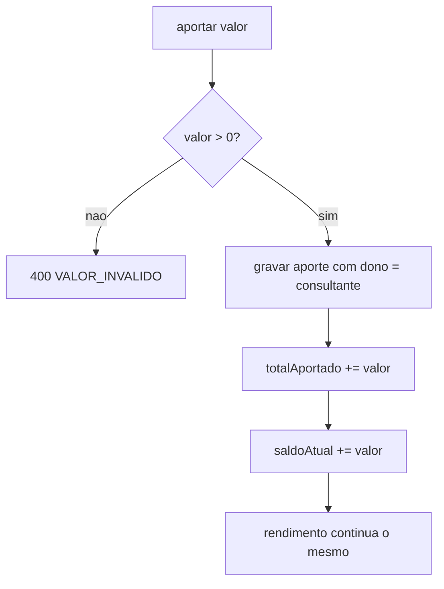

# Modelo de Lógica de Negócio — U4 Planejamento

Fluxos e algoritmos. Regras em `business-rules.md`; entidades em `domain-entities.md`.

---

## 1. Operações

```kotlin
interface ReceitaService {
    fun cadastrar(cmd: CadastrarReceita): ReceitaDTO
    fun editar(id: UUID, cmd: CadastrarReceita): ReceitaDTO
    fun excluir(id: UUID)
    fun consultar(de: LocalDate, ate: LocalDate): PeriodoDeReceitas
    fun balanco(de: LocalDate, ate: LocalDate): BalancoDTO
}

interface OrcamentoService {
    fun definir(cmd: DefinirOrcamento): OrcamentoDTO
    fun remover(id: UUID)
    fun acompanhar(competencia: Competencia, grupoId: UUID?): AcompanhamentoDTO
}

interface InvestimentoService {
    fun criarObjetivo(cmd: CriarObjetivo): ObjetivoDTO
    fun editarObjetivo(id: UUID, cmd: CriarObjetivo): ObjetivoDTO
    fun excluirObjetivo(id: UUID)
    fun aportar(objetivoId: UUID, valor: Dinheiro, data: LocalDate): ObjetivoDTO
    fun atualizarSaldo(objetivoId: UUID, saldo: Dinheiro): ObjetivoDTO
    fun consultar(objetivoId: UUID): ObjetivoDTO
    fun posicaoConsolidada(): PosicaoDTO
}
```

---

## 2. J-02 resolvida — a base do realizado (D-77)



**O caso que separa as duas**, e que a jornada expôs — compra de R$ 1.200,00 em 12x, em 30/07, num
cartão que fecha dia 28:

| Competência do orçamento | `DATA_DA_COMPRA` | `COMPETENCIA` |
|---|---|---|
| 2026-07 | **R$ 1.200,00** | R$ 0,00 |
| 2026-09 | R$ 0,00 | **R$ 100,00** |
| 2027-08 | R$ 0,00 | **R$ 100,00** |

Um gasto **à vista** dá o mesmo resultado nas duas bases, porque a competência dele é nula e a data
é a única referência. **A escolha só importa onde há cartão** — e só é possível porque U3 deixou as
duas datas disponíveis em cada parcela.

### 2.1 O algoritmo

```
realizado(orcamento):
    escopo = orcamento.escopo
    janela = competencia do orcamento

    lancamentos =
        se escopo == PESSOAL: os visiveis em que o consultante e DONO
        se escopo == GRUPO:   os visiveis de escopo GRUPO daquele grupo

    filtrados = lancamentos com categoria == orcamento.categoria

    se base == DATA_DA_COMPRA:
        soma dos que tem DATA dentro do mes da competencia
    se base == COMPETENCIA:
        soma dos gastos com competencia == janela
        + soma das parcelas com competencia == janela
```

**Aportes não entram** (RN-O07, D-79): não têm categoria.

### 2.2 A consequência de D-77, e o tratamento

Com bases diferentes entre categorias, **somar os realizados de todas produz um número sem
significado** — seria somar *"quanto me comprometi"* com *"quanto vou pagar"*.

A resposta não traz um total único:

```
AcompanhamentoDTO
├── categorias[]            <- comparacao POR CATEGORIA, sempre exata
├── totalPorBase
│   ├── DATA_DA_COMPRA: { orcado, realizado }
│   └── COMPETENCIA:    { orcado, realizado }
└── (nao existe totalGeral)
```

> **Terceira aplicação do mesmo padrão no ciclo.** RF-97 separou total pessoal de total de grupo;
> D-28 proibiu somá-los; agora D-77 cria um terceiro par incomensurável. Em todos os três, a
> resposta foi **apresentar lado a lado e nunca somar** — e em todos, a ausência do campo agregado
> **é** a regra, verificada por teste.

---

## 3. Orçado × realizado (H-40, H-41)



Categoria **sem teto definido** não aparece como estourada — aparece como não orçada, se aparecer.
Um teto que não existe não pode ser ultrapassado.

---

## 4. Balanço (H-38, RF-41, RF-76)

```
balanco(de, ate) =
      soma(receitas do periodo, do consultante)
    − soma(gastos do periodo em que o consultante e dono)      // totalPessoal de U2
    − soma(aportes do periodo, do consultante)                 // RF-76, D-18
```



**O aporte entra com sinal negativo, e isso é a decisão D-18**: investir reduz o resultado do mês,
embora o patrimônio não diminua. O balanço mede **fluxo de caixa**, não variação patrimonial.

**O balanço é sempre pessoal** (RN-B03), e não por simplificação: sem receita de grupo (P-05), não
existe o outro lado da conta.

> A assimetria vale registrar: **gastos** têm as duas grandezas (pessoal e de grupo), **orçamento**
> ganhou as duas em D-78, e o **balanço** tem uma só — porque as receitas têm uma só.

---

## 5. Investimento

### 5.1 Aportar (RN-I04, D-80)



A última linha é o ponto de D-80: como as duas grandezas sobem juntas, **o rendimento não se move**.
Sem isso ele nasceria em −R$ 500 depois do primeiro aporte, e ficaria errado até o usuário corrigir.

### 5.2 Rendimento (RN-I06)

```
rendimento = saldoAtual − totalAportado
```

| Situação | Rendimento |
|---|---|
| Aportou 1.000, saldo 1.080 | **+80,00** |
| Aportou 1.000, saldo 950 | **−50,00** — exibido, não rejeitado (E-14) |
| Aportou 1.000, nunca atualizou o saldo | **0,00** — graças a D-80 |

### 5.3 Aporte mensal necessário (RN-I08, H-57)

```
se meta == null ou prazoAlvo == null:  ausente
falta = meta − saldoAtual
se falta <= 0:                          meta atingida
meses = meses cheios entre hoje e prazoAlvo
se meses <= 0:                          ATRASADO (E-15) — aportes continuam permitidos
aporteMensal = falta dividido por meses, ARREDONDANDO PARA CIMA
```

> **O arredondamento é para cima, e é o ponto da regra.** Esta é a segunda divisão monetária do
> sistema, e ela tem direção **oposta** à do parcelamento: lá a soma tem que ser **exata**; aqui ela
> tem que ser **suficiente**. Arredondar para baixo faria o usuário chegar ao prazo faltando
> centavos — o que derrota o propósito do número.
>
> É a propriedade 4 do PBT: `aporteMensal × meses >= falta`, sempre.

---

## 6. J-02 fechada — e o que isso encerra

J-02 era a última questão em aberto do ciclo. Com D-77:

| Questão | Situação |
|---|---|
| J-01 — da compra ao pagamento | ✅ Resolvida em U3 (D-70, D-71) |
| J-02 — base do realizado | ✅ **Resolvida aqui** (D-77) |
| J-03 — total do grupo × pessoal | ✅ Resolvida na revisão 8 (RF-97, D-28) |
| D-04, D-19, D-20, D-33 | ✅ Fechadas em U3 |
| D-02, D-05, D-06 | ✅ Fechadas em U1 |

**Nenhuma decisão do ciclo permanece adiada.**

---

## 7. Decisões registradas

| ID | Decisão | Fecha |
|---|---|---|
| D-77 | Cada orçamento declara a **base do realizado**: data da compra ou competência | **J-02** |
| D-78 | O orçamento pode ser **PESSOAL ou de GRUPO**, comparando contra o total correspondente | — |
| D-79 | O aporte **não** entra no realizado do orçamento; conta só no balanço | — |
| D-80 | Registrar aporte **soma ao saldo** do objetivo | — |

**Pendência de requisitos que atravessa para fora do ciclo**: RF-29 e H-27 continuam desatualizados
por D-67 (U3). É correção de texto, e não afeta código.
