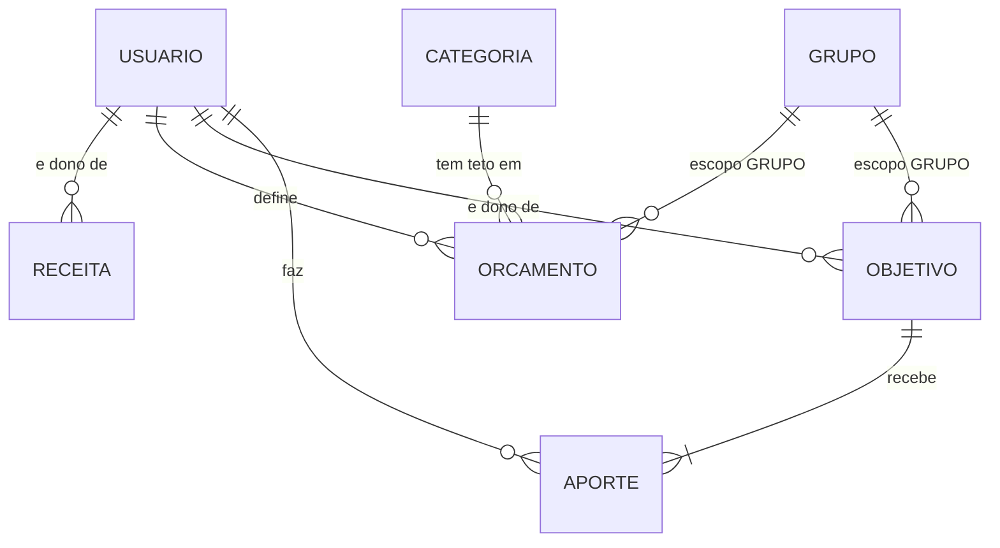

# Modelo de Domínio — U4 Planejamento

Quatro entidades, a menor das unidades de domínio. Tecnologia-agnóstico; persistência na §6.

**Herdado sem alteração**: `Dinheiro`, `Competencia`, `Escopo`, `Categoria`, `Gasto`, `Parcela`,
`RepositorioComVisibilidade`.

---

## 1. `Receita`

Raiz de agregado. O dinheiro que entra.

| Atributo | Tipo | Obrigatório | Observação |
|---|---|---|---|
| `id` | UUID | sim | |
| `descricao` | texto | sim | |
| `valor` | `Dinheiro` | sim | **Estritamente positivo** |
| `data` | data | sim | |
| `dono` | UUID de `Usuario` | sim | Nunca muda |
| `criadoEm` | instante | sim | |

**Invariantes**

1. `valor > 0` — receita negativa é gasto, e gasto tem entidade própria
2. `dono` imutável

### 1.1 Receita não tem escopo

É a **única entidade com dono do sistema que não tem `Escopo`**, e a exceção é da premissa **P-05**:
*receitas são individuais, não compartilhadas em grupo* (H-36).

> **A consequência prática é a que importa**: não existe "receita da casa". O balanço é sempre
> pessoal, e é por isso que ele não tem a duplicidade pessoal/grupo que gastos, contas e orçamento
> têm. Um requisito futuro de renda familiar seria requisito novo, não ajuste.

Como não tem escopo, a porta dela aplica só a primeira metade do predicado de RN-V01 —
`dono == usuarioAtual` — e nada mais. **Continua estendendo `RepositorioComVisibilidade`**: o
`ArquiteturaTest` (D-66) a cobre automaticamente.

---

## 2. `Orcamento`

Raiz de agregado. Teto mensal por categoria.

| Atributo | Tipo | Obrigatório | Observação |
|---|---|---|---|
| `id` | UUID | sim | |
| `categoria` | UUID de `Categoria` | sim | Precisa ser visível |
| `competencia` | `Competencia` | sim | Ano-mês do teto |
| `valorTeto` | `Dinheiro` | sim | **Não negativo** — zero é teto válido |
| `base` | `BaseDoRealizado` | sim | **`DATA_DA_COMPRA` ou `COMPETENCIA`** (D-77, J-02) |
| `dono` | UUID de `Usuario` | sim | Nunca muda |
| `escopo` | `Escopo` | sim | PESSOAL ou GRUPO (D-78) |
| `grupo` | UUID de `Grupo` | condicional | Bicondicional com o escopo |
| `criadoEm` | instante | sim | |

**Invariantes**

1. `valorTeto >= 0` — **zero é legítimo**: "não quero gastar nada nesta categoria este mês"
2. `(categoria, competencia, dono, escopo, grupo)` é único — um teto por categoria por mês por escopo
3. Bicondicional `escopo == GRUPO ⟺ grupo != null`

### 2.1 `base` — o campo em que J-02 se materializa (D-77)

```
DATA_DA_COMPRA  ->  o realizado conta pelo dia em que se comprou
COMPETENCIA     ->  o realizado conta pelo mês em que se paga
```

Para gastos à vista **as duas coincidem**, e o campo não faz diferença. Ele só separa as duas
leituras quando há cartão — e só há cartão porque U3 deixou as duas datas disponíveis em cada
parcela.

> **A consequência que precisa ficar escrita**: com bases diferentes entre categorias, **somar os
> realizados de todas as categorias não produz um número com significado** — seria somar "quanto me
> comprometi" com "quanto vou pagar". A resposta da consulta trata isso apresentando os totais
> **separados por base**, nunca somados. Ver `business-logic-model.md` §3.

### 2.2 Escopo do orçamento (D-78)

| Escopo | Compara contra |
|---|---|
| PESSOAL | `totalPessoal` — lançamentos de que o consultante é dono, de qualquer escopo |
| GRUPO | `totalGrupo` — lançamentos de escopo GRUPO daquele grupo, de qualquer dono |

Um gasto de escopo GRUPO cujo dono é o consultante conta **nos dois** — e não é dupla contagem,
pelo mesmo motivo de RN-T04: são grandezas distintas que nunca se somam.

### 2.3 O que não é atributo

**Sem `valorRealizado`.** É derivado, e a lição de D-75 vale aqui inteira: um agregado persistido
exigiria que todo lançamento, edição e exclusão lembrasse de recalcular, e esquecer um produziria um
número errado que parece certo.

**Sem `alerta`/`notificado`.** RF-44 pede sinalizar a categoria estourada na consulta; sinalizar não
é notificar, e não há canal de notificação no sistema (ausência registrada desde U1).

---

## 3. `ObjetivoInvestimento`

Raiz de agregado. Um bolso nomeado onde se guarda dinheiro com propósito.

| Atributo | Tipo | Obrigatório | Observação |
|---|---|---|---|
| `id` | UUID | sim | |
| `nome` | texto | sim | "Viagem", "Geral" |
| `meta` | `Dinheiro` | **não** | **Opcional** (RF-73) — "Geral" pode não ter alvo |
| `prazoAlvo` | data | **não** | **Opcional** (RF-74) |
| `saldoAtual` | `Dinheiro` | sim | Atualizável à mão (RF-71); **soma automática do aporte** (D-80) |
| `totalAportado` | `Dinheiro` | sim | Derivado da soma dos aportes (RF-70) |
| `dono` | UUID de `Usuario` | sim | Nunca muda |
| `escopo` | `Escopo` | sim | Objetivo de grupo: todos aportam (RF-75) |
| `grupo` | UUID de `Grupo` | condicional | |
| `criadoEm` | instante | sim | |

**Invariantes**

1. `meta`, se informada, é positiva
2. `saldoAtual` **pode ser negativo?** Não — mas o **rendimento** pode (E-14, ver §3.1)
3. `totalAportado` é sempre a soma dos aportes do objetivo

### 3.1 O rendimento é derivado e pode ser negativo

```
rendimento = saldoAtual − totalAportado
```

**Negativo é resultado válido** (RF-72, E-14, P-08): prejuízo e resgate não registrado são casos
reais. Deve ser **exibido, não rejeitado** — e é a razão de `Dinheiro` aceitar negativos desde U1,
onde a decisão foi tomada sem consumidor à vista.

> É a segunda vez que uma escolha de U1 sem consumidor imediato paga em unidade posterior — a
> primeira foi `dividirEm`. Diferente daquela, esta não precisou ser revertida.

### 3.2 `totalAportado` é derivado, `saldoAtual` é estado

A distinção é a mesma de U3 entre a fatura e a conta a pagar (D-75 e §3.1 daquele documento):

| Valor | Natureza |
|---|---|
| `totalAportado` | **Derivado** — a soma dos aportes. Muda quando um aporte muda |
| `saldoAtual` | **Estado declarado pelo usuário** — quanto o dinheiro vale hoje. O sistema não sabe |

> **É por isso que RF-71 existe.** O sistema não tem cotação, não tem integração com corretora e não
> pretende ter. O saldo é informação que só o usuário possui — e a decisão de aceitá-la à mão é o
> que permite ao sistema calcular rendimento sem controlar ativos.

### 3.3 O que não é atributo

**Sem `rendimento`** — derivado (§3.1). **Sem `progresso`** — derivado de `saldoAtual / meta`.
**Sem `aporteMensalNecessario`** — derivado do prazo, e recalculado a cada consulta.

---

## 4. `Aporte`

Pertence ao agregado `ObjetivoInvestimento`.

| Atributo | Tipo | Obrigatório | Observação |
|---|---|---|---|
| `id` | UUID | sim | |
| `objetivo` | UUID | sim | |
| `valor` | `Dinheiro` | sim | Estritamente positivo |
| `data` | data | sim | |
| `dono` | UUID de `Usuario` | sim | **Cada aporte registra o seu dono** (RF-75) |
| `criadoEm` | instante | sim | |

**Invariantes**

1. `valor > 0` — resgate não é aporte negativo; ajusta-se o `saldoAtual`
2. `dono` imutável

### 4.1 O aporte conta como gasto no balanço, mas **não é** um gasto (D-79)

| Onde | Entra? |
|---|---|
| **Balanço** do período (RF-41, RF-76, D-18) | **Sim** — investir reduz o resultado do mês |
| **Realizado** do orçamento (RF-43) | **Não** |
| Listagem e totais de gastos (U2) | **Não** — não é `Gasto` |

> **Por que não entra no orçamento**: o orçamento é **por categoria**, e o aporte não tem categoria —
> tem objetivo. Forçar uma seria inventar dado, exatamente como seria escolher uma categoria para a
> conta derivada de fatura em U3.

> **Por que entra no balanço**: D-18 declarou a semântica — *investir reduz o resultado do mês,
> embora o patrimônio não diminua*. O balanço mede **fluxo de caixa**, não variação patrimonial. É
> escolha consciente, e está em H-38 com todas as letras.

---

## 5. Relações



**Nenhuma tabela de U1, U2 ou U3 é alterada.** U4 acrescenta quatro e não toca em nada.

---

## 6. Persistência

| Tabela | Restrições relevantes |
|---|---|
| `receita` | FK `dono`; `CHECK (valor > 0)`; índice `(dono_id, data)` |
| `orcamento` | **único** `(dono_id, categoria_id, competencia, escopo, grupo_id)`; `CHECK (valor_teto >= 0)`; bicondicional; FK `categoria` **`RESTRICT`** |
| `objetivo_investimento` | `CHECK (meta IS NULL OR meta > 0)`; bicondicional |
| `aporte` | FK `objetivo` **`CASCADE`**; FK `dono`; `CHECK (valor > 0)`; índice `(objetivo_id)` e `(dono_id, data)` |

> **`aporte` é `CASCADE` e `orcamento.categoria` é `RESTRICT`** — as mesmas direções opostas de U3,
> pelo mesmo motivo: a cascata segue a **posse do agregado**. Aporte pertence ao objetivo; categoria
> não pertence a ninguém, e RF-37 existe para não perder a classificação do histórico.

> **A unicidade do orçamento inclui o escopo e o grupo**, e não só categoria e competência. Sem
> isso, D-78 seria inexpressável: eu não poderia ter um teto pessoal de "Mercado" em agosto **e** um
> teto da casa para a mesma categoria no mesmo mês.
