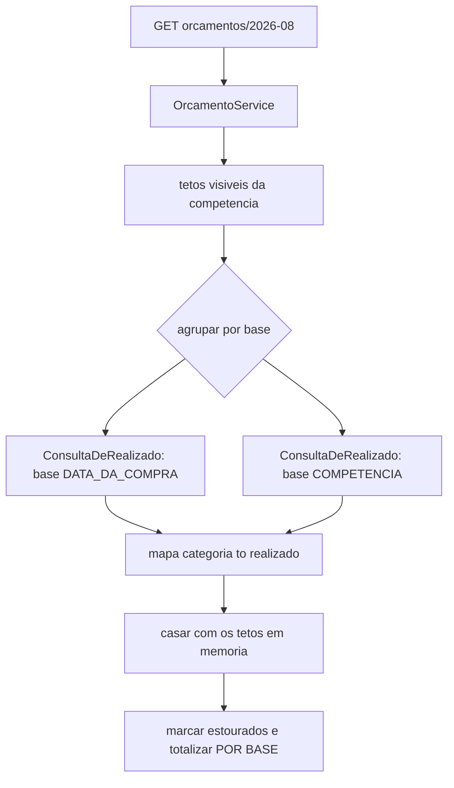

# Componentes Lógicos — U4 Planejamento

O **inventário final do ciclo**. U4 acrescenta serviços e portas, nenhum componente de
infraestrutura, e nenhum estado.

---

## 1. Componentes novos

| Componente | Natureza | Estado | Papel |
|---|---|---|---|
| `ReceitaService` · `OrcamentoService` · `InvestimentoService` | Beans singleton | Nenhum | Orquestram e definem fronteira transacional |
| Portas e adaptadores das 4 entidades | Porta + adaptador | Nenhum | Padrão de D-63 |
| **`ConsultaDeRealizado`** | **Porta em `gasto` (U2)**, consumida por U4 | Nenhum | D-81 — leitura entre unidades |
| `CalculadoraDeAporte` | Função pura | Nenhum | RN-I08, com arredondamento **para cima** |

**Zero componentes com estado.** É a terceira unidade seguida em que essa frase é verdadeira.

---

## 2. O inventário final: o que quebra com escala horizontal

Este era um inventário informal, mantido desde U1. Fecha assim:

| Componente | Unidade | Situação |
|---|---|---|
| `RegistroDeTentativas` | U1 | ⚠️ **Quebra.** Contador de tentativas de login em memória |
| `FechamentoAgendado` | U3 | ✅ **Resolvido** por advisory lock (D-74) |
| — | U2, U4 | Nada acrescentado |

**Um item, no fim do ciclo.** Vale registrar como ele se manteve assim:

| Unidade | O que aconteceu |
|---|---|
| U1 | O item nasceu, e nasceu **registrado** — a NFR Design o nomeou como o único componente com estado |
| U2 | Nada acrescentado. Todos os componentes ficaram sem estado por construção |
| U3 | Ia acrescentar o segundo (o job). D-74 resolveu **no minuto em que o problema foi criado** |
| U4 | Nada acrescentado |

> A decisão de manter `RegistroDeTentativas` na lista foi tão deliberada quanto a de tirar o job
> dela. Resolvê-lo exigiria armazenamento compartilhado — a mesma coisa que a tabela de ausências de
> U1 recusou por não haver escala que a justificasse. **Os dois casos receberam tratamento diferente
> porque tinham custo diferente**, e a lista existe para tornar essa distinção visível.

---

## 3. A tabela de ausências, no fechamento do ciclo

Nasceu em U1 com sete linhas. Ao fim de quatro unidades:

| Item | Situação final |
|---|---|
| Cache | ❌ Continua não existindo. Proposto zero vezes; a linha da tabela nunca precisou ser invocada |
| Fila / mensageria | ❌ Continua não existindo |
| **Agendador** | ✅ **Passou a existir** em U3 (D-71), com o inventário do que se perdeu escrito no mesmo momento |
| Circuit breaker | ❌ Sem integração externa em nenhuma das quatro unidades |
| Store de sessão | ❌ JWT stateless (D-02) existe para não ter |
| Store de refresh token | ❌ D-50 dispensou refresh |
| Serviço de e-mail | ❌ Nenhum requisito de notificação surgiu — nem em RF-66, que entrega a consulta e deixa a ação com o usuário |
| Auditoria de acesso | ❌ Nenhum requisito |
| Notificação de vencimento | ❌ Acrescentada à tabela em U3, e continua ausente |
| Tabela de ocorrências futuras | ❌ D-72 projeta em vez de materializar |

**Uma linha das dez mudou de lado em quatro unidades.**

> A tabela previu, em U1, que *"alguém em U3 vai propor um cache"*. **Ninguém propôs cache.**
> Propuseram um agendador — que não estava entre as previsões. O valor da tabela não esteve em
> acertar qual componente seria pedido: esteve em existir uma resposta escrita para quando algum
> fosse.

---

## 4. Composição da consulta mais cara de U4

**Duas idas ao banco no pior caso**, independentemente de quantas categorias estejam orçadas (D-84).
O casamento acontece em memória, sobre um mapa.

O nó final é onde D-77 se materializa: **totais por base, nunca somados** — terceira aplicação do
padrão que RF-97 e D-28 inauguraram.

---

## 5. O que o ciclo entrega, do ponto de vista de componentes

| Categoria | Total |
|---|---|
| Serviços de aplicação | 13 |
| Portas de domínio | 12, todas com filtro obrigatório |
| Componentes com estado | **1** (`RegistroDeTentativas`) |
| Componentes agendados | **1** (`FechamentoAgendado`, com lock) |
| Integrações externas | **0** |
| Caches | **0** |
| Filas | **0** |

> A última linha é a que resume a postura do ciclo: **nada foi acrescentado por antecipação**. Cada
> componente que existe foi motivado por um requisito escrito, e cada um que não existe tem uma linha
> dizendo por quê.
