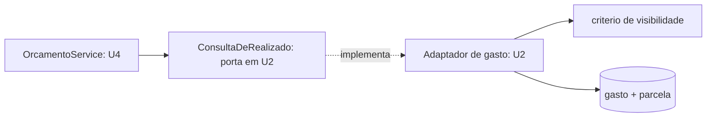

# Padrões de Design Não-Funcional — U4 Planejamento

A **última NFR Design do ciclo**. U4 é a primeira unidade cuja leitura principal depende de dados
que ela não possui — e é onde o padrão de leitura entre unidades fica fixado.

**Herdado e não revisitado**: hexagonal por feature (D-51), porta com filtro obrigatório (D-63),
projeção de leitura (D-65), `ArquiteturaTest` (D-66), guarda no adaptador (D-73), *o banco pode
somar; dividir, nunca*.

---

## 1. Leitura entre unidades: quem sabe somar é quem é dono (D-81)

O realizado do orçamento soma `gasto` (U2) e `parcela` (U3). U4 não é dona de nenhuma das duas.

**A porta vive no domínio de quem possui o dado:**

```kotlin
// em gasto/dominio — U2
interface ConsultaDeRealizado {
    fun somarPorCategoria(
        janela: Competencia,
        base: BaseDoRealizado,
        escopo: Escopo,
        grupo: UUID?,
    ): Map<UUID, Dinheiro>
}
```

`OrcamentoService` **apenas consome**. Não conhece tabela, não escreve SQL, não reimplementa
predicado.



**O ganho não é de organização — é de isolamento.** O filtro de visibilidade continua sendo aplicado
por quem o escreveu. A alternativa recusada obrigaria U4 a reimplementar o predicado de RN-V01, que
é exatamente onde erros de isolamento nascem.

### 1.1 O tipo que retrocedeu para `common`

A porta vive em U2, mas `BaseDoRealizado` é conceito de **U4** — criado por D-77. Uma porta de U2
importando um tipo de U4 inverteria a seta: a unidade mais antiga dependeria da mais nova.

**`BaseDoRealizado` foi para `common/dominio`**, ao lado de `Escopo` e `Competencia`. É vocabulário
compartilhado: U2 e U3 **sabem as duas datas**, U4 **escolhe qual usar**. Nenhuma é dona sozinha.

> É o mesmo lugar e o mesmo motivo de `Escopo`, que nasceu em U1 sem consumidor porque
> `Visibilidade` precisava conhecê-lo. A diferença: aqui o tipo nasce **em U4** e retrocede para
> `common`. Primeira vez no ciclo que um conceito muda de casa para baixo.

### 1.2 O contraste com U3, que fez diferente

Em U3, o adaptador de `fatura` lê `gasto`, `parcela` e `conta_a_pagar` por **consulta nativa**. Por
que ali sim e aqui não?

| | U3 (fatura → gasto) | U4 (orçamento → gasto) |
|---|---|---|
| Fronteira | Entre **features da mesma unidade** | Entre **unidades** |
| Desenhadas | Juntas, na mesma stage | Com meses e três gates de distância |
| Predicado de visibilidade | A fatura **não tem dono** — herda a do cartão | O orçamento tem dono e escopo próprios |

O terceiro item é o decisivo. A fatura não precisa aplicar RN-V01, porque a visibilidade dela já foi
resolvida pelo cartão. O orçamento precisa — e é aí que reimplementá-lo seria perigoso.

---

## 2. `totalAportado` calculado na leitura (D-82)

Terceira aplicação do mesmo critério no ciclo:

| Valor | Natureza | Decisão |
|---|---|---|
| Total de gastos do período (U2) | Soma | Calculado (`SUM`) — D-64 |
| `Fatura.valorTotal` (U3) | Soma | Calculado — D-75 |
| `ContaAPagar.valor` (U3) | **Fato histórico** | **Persistido** |
| `totalAportado` (U4) | Soma | Calculado — **D-82** |
| `saldoAtual` (U4) | **Fato declarado pelo usuário** | **Persistido** |

> **O critério consolidou-se em uma frase**: *se o número é uma soma, calcule; se é um fato, guarde.*
> As duas linhas persistidas da tabela não são somas de nada — são declarações. `ContaAPagar.valor` é
> o que foi cobrado; `saldoAtual` é quanto o dinheiro vale hoje, e só o usuário sabe.

---

## 3. Aportar e excluir são inversas (D-83)

D-80 decidiu que aportar **soma** ao saldo. D-83 fecha a simetria: excluir **subtrai**.

```
aportar(500):   totalAportado += 500  (derivado)   saldoAtual += 500
excluir(500):   totalAportado -= 500  (derivado)   saldoAtual -= 500
                                                    rendimento inalterado nas duas
```

Sem D-83, excluir um aporte de R$ 500 faria o rendimento **subir R$ 500 do nada** — porque
`totalAportado` cairia (derivado, automático) e `saldoAtual` não.

> A assimetria seria invisível: nenhum erro, nenhum log, apenas um número de rendimento que passou a
> mentir. É a mesma classe de defeito que D-75 eliminou em U3.

---

## 4. Uma consulta agrupada, não N (D-84)

```
SELECT categoria_id, SUM(valor)
  FROM <gastos e parcelas visiveis da janela>
 GROUP BY categoria_id
```

Uma ida ao banco **por base declarada** — no máximo duas, já que só existem duas bases. O serviço
casa o mapa resultante com os tetos em memória.

> **Registrado porque importa para o próximo**: o `ArquiteturaTest` **não pegaria** um N+1 aqui. Ele
> é estrutural — verifica quem pode depender de quem, e se as portas exigem filtro. N+1 é
> comportamental. **Nem toda garantia cabe numa regra de arquitetura**, e supor o contrário é como
> supor que o compilador pega lógica errada.

---

## 5. `Receita` exercita a metade do predicado que nunca rodou sozinha

`Receita` é a única entidade com dono do sistema **sem `Escopo`** (P-05). O predicado de RN-V01
reduz-se a `dono == usuarioAtual` — e essa metade nunca tinha sido exercitada isolada.

Ela **continua estendendo `RepositorioComVisibilidade`**, então o `ArquiteturaTest` a cobre
automaticamente. O que muda é só a segunda metade do OU não existir.

> É um caso de teste que o ciclo inteiro não tinha: até aqui, toda entidade com dono também tinha
> escopo, e o predicado sempre rodava completo. Um defeito que só aparecesse com o lado direito
> ausente teria passado despercebido por três unidades.

---

## 6. Categorias obrigatórias

| Categoria | Aplicável | O que foi decidido |
|---|---|---|
| **Resilience** | Não | Nenhuma integração externa. U4 não acrescenta job, fila nem chamada fora do processo |
| **Scalability** | Parcial | U4 **não acrescenta componente com estado**. Inventário final em `logical-components.md` |
| **Performance** | **Sim** | D-84 (uma consulta agrupada), D-82 (`SUM` na leitura) |
| **Security** | Parcial | Nenhum mecanismo novo. `Receita` exercita a metade do predicado que nunca rodou sozinha (§5) |
| **Logical Components** | **Sim** | O inventário final do ciclo |

---

## 7. Decisões registradas

| ID | Decisão |
|---|---|
| D-81 | Leitura entre unidades por **porta exposta por quem é dono do dado**; `BaseDoRealizado` retrocede para `common` |
| D-82 | `totalAportado` **calculado na leitura**; `saldoAtual` permanece persistido |
| D-83 | Excluir aporte **subtrai do saldo** — simétrico a D-80 |
| D-84 | Acompanhamento por **uma consulta agrupada** por base, não uma por orçamento |
