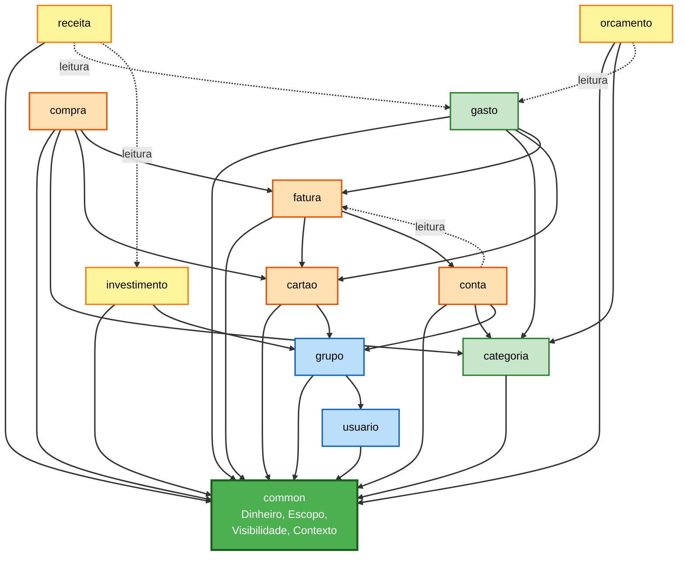
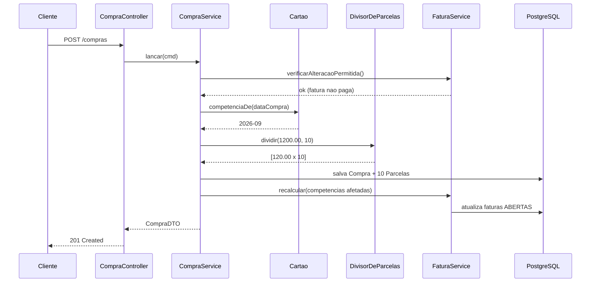

# Dependências entre Componentes

**Stage**: INCEPTION - Application Design
**Timestamp**: 2026-07-30T16:11:59Z

---

## 1. Matriz de dependências

Linha **depende de** coluna. `D` = dependência direta · `R` = leitura de repositório apenas.

| ↓ depende de → | common | usuario | grupo | categoria | gasto | cartao | compra | fatura | conta | receita | orcamento | investimento |
|---|---|---|---|---|---|---|---|---|---|---|---|---|
| **common** | — | | | | | | | | | | | |
| **usuario** | D | — | | | | | | | | | | |
| **grupo** | D | D | — | | | | | | | | | |
| **categoria** | D | D | | — | R | | | | | | | |
| **gasto** | D | D | D | D | — | D | | D | | | | |
| **cartao** | D | D | D | | | — | | | | | | |
| **compra** | D | D | D | D | | D | — | D | | | | |
| **fatura** | D | | | | R | D | R | — | D | | | |
| **conta** | D | D | D | D | | | | D | — | | | |
| **receita** | D | D | | | R | | | | | — | | R |
| **orcamento** | D | D | | D | R | | | | | | — | |
| **investimento** | D | D | D | | | | | | | | | — |

**Observações**

- **`common` não depende de nada.** É a base — se dependesse de qualquer feature, criaria ciclo.
- **Toda feature depende de `common`** — pelo menos de `Visibilidade` e `Dinheiro`.
- **`fatura` ↔ `conta`** é o único par com dependência em ambos os sentidos. Ver §3.
- `receita` e `orcamento` acessam `gasto` **apenas por leitura** de repositório, para compor
  balanço e realizado. Não invocam `GastoService`.

---

## 2. Grafo de dependências



**Alternativa textual** — as cores agrupam por unidade de trabalho:

```
NIVEL 0 - base
  common          (nao depende de nada)

NIVEL 1 - U1 Fundacao
  usuario     -> common
  grupo       -> common, usuario

NIVEL 2 - U2 Lancamentos
  categoria   -> common, usuario
  gasto       -> common, categoria, cartao, fatura

NIVEL 3 - U3 Credito
  cartao      -> common, grupo
  compra      -> common, categoria, cartao, fatura
  fatura      -> common, cartao, conta
  conta       -> common, categoria, grupo, fatura (leitura)

NIVEL 4 - U4 Planejamento
  receita     -> common, gasto (leitura), investimento (leitura)
  orcamento   -> common, categoria, gasto (leitura)
  investimento-> common, grupo
```

---

## 3. O ciclo `fatura` ↔ `conta`

**Único ciclo do grafo**, e é intencional — decorre da unificação de D-14 (fatura de cartão vira
conta a pagar).

```
fatura --> conta    FaturaService.fechar() cria a ContaAPagar derivada (RF-59)
conta ..> fatura    ContaService precisa saber se a fatura vinculada bloqueia (RF-95)
```

**Como quebrar o ciclo**: `conta` **não** depende de `FaturaService`. Ela guarda apenas
`faturaId: UUID?` e, quando precisa verificar bloqueio, consulta via interface declarada em
`common`:

```kotlin
// declarada em common, implementada por fatura
interface ProtecaoFatura {
    fun verificarAlteracaoPermitida(competencia: Competencia, cartaoId: UUID)
}
```

Assim a dependência de `conta` aponta para `common`, não para `fatura`. **A dependência real é
unidirecional**: `fatura → conta`.

> **Alternativa considerada e descartada**: fundir `Fatura` e `ContaAPagar` numa entidade só.
> Eliminaria o ciclo, mas a fatura tem ciclo de vida próprio (ABERTA → FECHADA, recálculo, projeção
> de futuras) que uma conta a pagar comum não tem. Fundir sobrecarregaria a entidade e faria
> `ContaAPagar` carregar campos irrelevantes para PIX, boleto e fatura de serviço.

---

## 4. Padrões de comunicação

| Padrão | Onde | Justificativa |
|---|---|---|
| **Chamada direta de serviço** | Dentro de uma transação (compra → fatura) | Monolito single-module; consistência imediata é requisito (RNF-02) |
| **Leitura de repositório alheio** | `receita`, `orcamento` → `gasto` | Só precisam somar valores; injetar o serviço inteiro criaria acoplamento desnecessário |
| **Interface em `common`** | `conta` → `fatura` (ProtecaoFatura) | Quebra o ciclo mantendo o comportamento |
| **Predicado compartilhado** | Todas → `Visibilidade` | Isolamento estrutural, não por disciplina (RF-03) |

**Não adotados**, e por quê:

| Padrão | Por que não |
|---|---|
| Eventos de domínio | Monolito com uma transação; eventos adicionariam indireção sem ganho de desacoplamento real |
| Mensageria | Sem requisito de processamento assíncrono (RNF-12: dezenas de usuários) |
| CQRS com modelos separados | Decisão D-29 — mesmo modelo para escrita e leitura, adequado ao volume |

---

## 5. Fluxos de dados principais

### 5.1 Lançar compra parcelada em cartão de grupo (J-01)



**Alternativa textual:**

```
1. Cliente          -> CompraController : POST /compras
2. Controller       -> CompraService    : lancar(cmd)
3. CompraService    -> FaturaService    : verificarAlteracaoPermitida()
4. FaturaService    -> CompraService    : ok (fatura nao paga)
5. CompraService    -> Cartao           : competenciaDe(dataCompra)
6. Cartao           -> CompraService    : 2026-09
7. CompraService    -> DivisorDeParcelas: dividir(1200.00, 10)
8. Divisor          -> CompraService    : [120.00 x 10]
9. CompraService    -> PostgreSQL       : salva Compra + 10 Parcelas
10. CompraService   -> FaturaService    : recalcular(competencias)
11. FaturaService   -> PostgreSQL       : atualiza faturas ABERTAS
12. CompraService   -> Controller       : CompraDTO
13. Controller      -> Cliente          : 201 Created

    TUDO EM UMA UNICA TRANSACAO (RNF-02)
```

---

### 5.2 Consultar o mês com os dois totais (J-03, RF-97)

```
1. Cliente        -> GastoController : GET /gastos?de=..&ate=..
2. Controller     -> GastoService    : consultar(filtro)
3. GastoService   -> Visibilidade    : aplicar(spec)
4. Visibilidade   -> GastoService    : spec + (dono = eu OU grupo IN meusGrupos)
5. GastoService   -> Repository      : findAll(spec)
6. Repository     -> GastoService    : List<Gasto>
7. GastoService                      : totalPessoal = soma onde dono == eu
8. GastoService                      : totalGrupo   = soma onde escopo == GRUPO
9. GastoService   -> Controller      : PaginaGastos(itens, totalPessoal, totalGrupo)
10. Controller    -> Cliente         : 200 OK

    Os dois totais NUNCA se somam (D-28)
```

---

### 5.3 Fechar o mês (J-02)

```
1. ContaService.vencimentosDoPeriodo(agosto)
     -> lista unificada: FATURA_CARTAO (derivada), PIX, BOLETO, FATURA_SERVICO
     -> ordenada por vencimento, com totalPessoal e totalGrupo

2. FaturaService.consultar(cartao, agosto)
     -> lancamentos e parcelas que compoem a fatura

3. ContaService.marcarPaga(conta, data)
     -> status PAGA; fatura vinculada passa a bloquear alteracoes

4. OrcamentoService.acompanhar(agosto)
     -> orcado x realizado por categoria, com sinalizacao de estouro
     -> PONTO EM ABERTO (J-02): o "realizado" conta o gasto de cartao pela
        data da compra ou pela competencia da fatura?
```

---

## 6. Ordem de implementação

Derivada do grafo — um componente só pode ser implementado depois de suas dependências.

| Ordem | Componentes | Unidade | Bloqueia |
|---|---|---|---|
| 1 | `common` | U1 | **Tudo** |
| 2 | `usuario`, `grupo` | U1 | Todo o resto — isolamento depende deles |
| 3 | `categoria` | U2 | `gasto`, `conta`, `orcamento` |
| 4 | `cartao` | U3 | `gasto` com cartão, `compra`, `fatura` |
| 5 | `fatura` + `conta` | U3 | Implementados **juntos** — ver §3 |
| 6 | `gasto`, `compra` | U2, U3 | `receita`, `orcamento` |
| 7 | `receita`, `orcamento`, `investimento` | U4 | — |

> **Nota sobre a ordem 5**: `fatura` e `conta` têm dependência mútua no comportamento (fechamento
> gera conta; conta paga bloqueia fatura). Devem ser implementados na mesma iteração, mesmo estando
> em pacotes separados.
>
> **Divergência com o plano de execução**: o plano previa U2 (Lançamentos) antes de U3 (Crédito).
> O grafo mostra que `gasto` depende de `cartao` e `fatura` — logo, a parte de `gasto` vinculada a
> cartão só funciona após U3. **Sugestão para a Units Generation**: dividir `gasto` em duas etapas —
> gasto à vista em U2, gasto em cartão em U3 —, ou mover `cartao`/`fatura` para antes.
