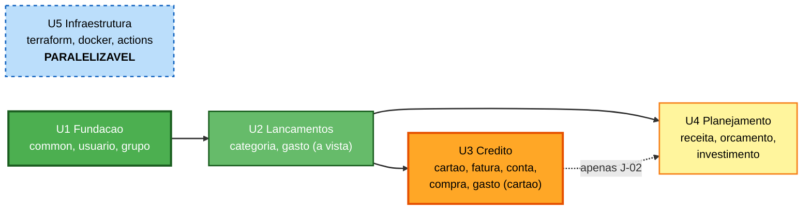

# Dependências entre Unidades

**Stage**: INCEPTION - Units Generation - Part 2
**Timestamp**: 2026-07-30T16:11:59Z

---

## 1. Matriz

Linha **depende de** coluna.

| ↓ depende de → | U1 | U2 | U3 | U4 | U5 |
|---|---|---|---|---|---|
| **U1 — Fundação** | — | | | | |
| **U2 — Lançamentos** | ✅ | — | | | |
| **U3 — Crédito** | ✅ | ✅ | — | | |
| **U4 — Planejamento** | ✅ | ✅ | ⚠️ | — | |
| **U5 — Infraestrutura** | | | | | — |

✅ dependência total · ⚠️ dependência parcial

**U5 não depende de nada e nada depende dela** — é a única unidade totalmente paralelizável.

---

## 2. Grafo



**Alternativa textual:**

```
U5 Infraestrutura   (isolada — sem dependencia em nenhum sentido)


U1 Fundacao
     |
     v
U2 Lancamentos
     |
     +---------------------+
     |                     |
     v                     v
U3 Credito ...........> U4 Planejamento
            (apenas J-02)

Caminho critico: U1 -> U2 -> U3
U4 depende de U2; de U3 apenas pela jornada J-02
```

---

## 3. Caminho crítico

```
U1 Fundacao  ->  U2 Lancamentos  ->  U3 Credito
```

**Três unidades sequenciais.** U3 é a mais longa — 25 histórias e 6 entidades.

### Oportunidades de paralelização

| O que pode correr em paralelo | Condição |
|---|---|
| **U5** com qualquer unidade | Nenhuma — é totalmente independente |
| **U4** com U3 | Parcial: todas as histórias de U4 exceto **J-02** dependem apenas de U2 |

> **U4 quase não depende de U3.** Receitas, orçamento e investimentos precisam apenas de `usuario`,
> `categoria` e `gasto`. A única amarra é **J-02** (fechar o mês), que cruza vencimentos, faturas e
> orçamento. Se J-02 for movida para o fim, **U3 e U4 tornam-se paralelizáveis**.

---

## 4. Pontos de coordenação

### 4.1 `gasto` entre U2 e U3 🔴 **Crítico**

Único componente implementado em duas unidades.

| Aspecto | Acordo |
|---|---|
| Schema | A entidade `Gasto` nasce em U2 **já com** `cartaoId` e `competencia` nuláveis. **Nenhuma migration de `ALTER TABLE` em U3** |
| API | `POST /gastos` aceita `cartaoId` opcional desde U2, mas **rejeita** o campo até U3 estar pronta |
| Testes | U2 cobre o caminho à vista; U3 acrescenta os de cartão sem alterar os de U2 |
| Verificação | Ao concluir U3, os testes de U2 devem continuar passando sem modificação |

### 4.2 `Visibilidade` — U1 para todas 🔴 **Crítico**

O predicado de isolamento nasce em U1 e é usado por toda consulta das demais unidades.

- **Contrato**: `Visibilidade.aplicar(spec)` — assinatura estável desde U1
- **Verificação em cada unidade**: nenhum repositório novo expõe método sem o predicado
- **Risco se quebrar**: vazamento silencioso de dados entre usuários — a consulta retorna dados a
  mais **sem erro nenhum**

### 4.3 `Dinheiro` — U1 para todas

Value object com aritmética decimal exata. `dividirEm` é usado por U3 (parcelamento).

- **Contrato**: escala 2, arredondamento explícito, resíduo na última posição
- **Verificação**: os testes de propriedade de U1 continuam passando quando U3 exercita `dividirEm`

### 4.4 `fatura` ↔ `conta` — dentro de U3

Dependência mútua de comportamento: o fechamento gera a conta; a conta paga bloqueia a fatura.
**Devem ser implementados na mesma iteração**, mesmo em pacotes separados.

### 4.5 Migrations — sequencial entre unidades

Uma migration por unidade, aplicada em ordem. **Migration já aplicada nunca é alterada** — correção
exige nova migration.

```
V1__fundacao.sql       U1   usuario, grupo, membro_grupo
V2__lancamentos.sql    U2   categoria, gasto (com colunas de cartao nulaveis)
V3__credito.sql        U3   cartao, fatura, compra, parcela, conta, conta_recorrente
V4__planejamento.sql   U4   receita, orcamento, objetivo, aporte
```

---

## 5. Estratégia de teste

| Nível | Quando | Escopo |
|---|---|---|
| **Unitário** | Dentro de cada unidade | Lógica pura: `competenciaDe`, `dividirEm` |
| **Property-based** 🔬 | U1 (`Dinheiro`), U3 (`DivisorDeParcelas`) | Invariantes monetárias — regras PBT-02, PBT-03 |
| **Integração** | Ao fim de cada unidade | Contra PostgreSQL real via Testcontainers |
| **Regressão de fronteira** | Ao fim de U3 | Testes de U2 devem passar sem modificação |
| **Jornada ponta a ponta** | J-01, J-03 em U3 · J-02 em U4 | Cruzam 3+ áreas — validam as costuras |

### Checkpoints de integração

| Após | Verificar |
|---|---|
| U1 | Isolamento de dados entre dois usuários (H-03) |
| U2 | Membro de grupo enxerga gasto do outro, com totais corretos e distintos (H-17) |
| U3 | J-01 e J-03 ponta a ponta; testes de U2 intactos |
| U4 | J-02 ponta a ponta — cruza U2, U3 e U4 |
| U5 | `terraform plan` executa; pipeline constrói e implanta |

---

## 6. Estratégia de rollback

Não há sistema em produção durante o ciclo — o rollback é **`git revert`** até o primeiro
`terraform apply` com dados reais.

| Situação | Recuperação |
|---|---|
| Falha dentro de uma unidade | `git revert` dos commits da unidade; as anteriores permanecem íntegras |
| Migration incorreta já aplicada | **Nova migration corretiva.** Nunca editar migration aplicada |
| Falha em U3 quebrando U2 | Os testes de regressão de fronteira (§5) detectam antes do merge |
| Falha após deploy com dados reais | 🔴 Ver **R-01** e **R-05** — sem backup gerenciado e sem gate no apply, é o cenário de maior risco do projeto |

---

## 7. Sequência recomendada

```
1. U5 Infraestrutura   <- primeiro, para as demais nascerem com CI verde
2. U1 Fundacao
3. U2 Lancamentos
4. U3 Credito          <- a mais longa
5. U4 Planejamento     <- se J-02 for adiada, pode correr junto com U3
```

> **Por que U5 primeiro**, embora seja paralelizável: o pipeline rodando desde o início faz cada
> unidade seguinte já nascer com testes executando no CI, e tira do caminho a incerteza do
> bootstrap manual — que é o único passo do projeto que exige intervenção sua fora da sessão.
>
> **Contraindicação**: U5 provisiona recursos AWS antes de haver aplicação para rodar neles. Se
> custo em conta ociosa for uma preocupação, o `bootstrap/` e os workflows podem ser feitos primeiro
> e o `apply` da EC2 adiado para depois de U1.
