# Execution Plan

**Stage**: INCEPTION - Workflow Planning
**Timestamp**: 2026-07-30T16:11:59Z

**Contexto carregado**: reverse engineering (9 artefatos), requirements.md (revisão 7 — 95 RF
ativos, 17 RNF, 26 decisões, 5 riscos), stories.md (11 épicos, 63 histórias), personas.md.

---

## 1. Análise Detalhada

### 1.1 Escopo da transformação

- **Tipo**: **Transformação arquitetural completa** sobre um esqueleto. Tecnicamente brownfield
  (existe build, configuração e testes), funcionalmente greenfield (zero regra de negócio).
- **Mudanças primárias**: construção integral do domínio de negócio, da camada de persistência com
  migrations, da camada de API REST com autenticação, da infraestrutura como código e do pipeline
  de CI/CD.
- **Componentes relacionados**: hoje existe **um único módulo Gradle**. O trabalho cria estrutura
  de pacotes, entidades, repositórios, serviços, controllers, migrations Flyway, módulos Terraform
  e workflows do GitHub Actions.

### 1.2 Avaliação de impacto

| Área | Impacto | Descrição |
|---|---|---|
| **Mudanças voltadas ao usuário** | **Sim** — total | Todo o sistema é novo. 63 histórias de usuário, nenhuma funcionalidade preexistente |
| **Mudanças estruturais** | **Sim** — total | Estrutura de pacotes e separação de camadas ainda não existem (D-03) |
| **Modelo de dados** | **Sim** — total | Nenhuma entidade JPA existe. 10+ agregados a criar, com schema versionado via Flyway |
| **API** | **Sim** — total | Nenhum controller existe. Contrato consumido por front-end em outro repositório (RF-78) |
| **Impacto em NFR** | **Sim** | Autenticação (D-02), integridade monetária (RNF-01), transacionalidade (RNF-02), property-based testing (RNF-07) |
| **Infraestrutura** | **Sim** | EC2, PostgreSQL na instância, volume EBS, security group, Terraform (RF-45 a RF-54) |
| **Operações** | **Sim** | Pipeline completo em GitHub Actions com OIDC, ECR e SSM (RF-81 a RF-93) |

### 1.3 Relacionamento de componentes

```
Modulo unico: financial-control (Gradle, single-module)
  |
  +-- src/main/kotlin        -> A CRIAR: dominio, API, persistencia
  +-- src/main/resources
  |     +-- application.yml  -> A ALTERAR: config de Flyway e perfis
  |     +-- db/migration     -> A CRIAR: migrations Flyway
  +-- src/test               -> A EXPANDIR: testes de exemplo + PBT
  +-- build.gradle.kts       -> A ALTERAR: Flyway, security, Kotest, springdoc
  +-- Dockerfile             -> A CRIAR (RF-48)
  +-- infra/terraform        -> A CRIAR (RF-45)
  |     +-- bootstrap        -> A CRIAR, aplicado manualmente (RF-91)
  +-- .github/workflows      -> A CRIAR (RF-81 a RF-86)
  +-- docker-compose.yml     -> A ALTERAR: incluir a aplicacao
```

| Componente | Tipo de mudança | Motivo | Prioridade |
|---|---|---|---|
| `src/main/kotlin` | **Maior** | Domínio inteiro a criar | Crítica |
| `build.gradle.kts` | Menor | Novas dependências (Flyway, Security, Kotest, springdoc) | Crítica |
| `application.yml` | Configuração | Flyway, perfis, segredos externalizados | Crítica |
| `src/test` | **Maior** | Testes de exemplo + PBT; base do Testcontainers já existe | Crítica |
| `Dockerfile` | **Maior** (novo) | Empacotamento da aplicação (RF-48) | Importante |
| `infra/terraform` | **Maior** (novo) | IaC completa (RF-45 a RF-54) | Importante |
| `.github/workflows` | **Maior** (novo) | Pipeline (RF-81 a RF-86) | Importante |
| `docker-compose.yml` | Menor | Incluir o serviço da aplicação | Opcional |
| `FinancialControlApplication.kt` | Nenhuma | Bootstrap permanece como está | — |

### 1.4 Avaliação de risco

- **Nível de risco**: **Médio**
- **Complexidade de rollback**: **Fácil** — não há sistema em produção, dados de usuário reais nem
  migração de dados legados. Todo o trabalho está sob controle de versão e o `git revert` é
  suficiente. O risco de rollback só sobe **depois** do primeiro `terraform apply` com dados reais
  (ver R-01 e R-05).
- **Complexidade de teste**: **Complexa** — invariantes monetárias exigindo property-based testing,
  cálculo de competência de fatura com regra de fronteira, rateio configurável, e testes de
  integração contra PostgreSQL real via Testcontainers.

**Justificativa do nível Médio (e não Alto)**: a complexidade do domínio é alta, mas o *impacto do
erro* é contido. Não há usuários, não há dados a preservar, não há integração externa a quebrar.
Os dois riscos de severidade Alta já registrados (R-01, banco sem backup gerenciado; R-05, apply
automático sem gate) só se materializam após o primeiro deploy com dados reais — momento posterior
ao encerramento deste ciclo AI-DLC.

---

## 2. Visualização do fluxo

```mermaid
flowchart TD
    Start(["Pedido do usuario"])

    subgraph INCEPTION["🔵 INCEPTION"]
        WD["Workspace Detection<br/><b>COMPLETED</b>"]
        RE["Reverse Engineering<br/><b>COMPLETED</b>"]
        RA["Requirements Analysis<br/><b>COMPLETED</b>"]
        US["User Stories<br/><b>COMPLETED</b>"]
        WP["Workflow Planning<br/><b>IN PROGRESS</b>"]
        AD["Application Design<br/><b>EXECUTE</b>"]
        UG["Units Generation<br/><b>EXECUTE</b>"]
    end

    subgraph CONSTRUCTION["🟢 CONSTRUCTION"]
        FD["Functional Design<br/>por unidade<br/><b>EXECUTE</b>"]
        NFRA["NFR Requirements<br/>1a unidade apenas<br/><b>EXECUTE</b>"]
        NFRD["NFR Design<br/>por unidade<br/><b>EXECUTE</b>"]
        ID["Infrastructure Design<br/>unidade de infra<br/><b>EXECUTE</b>"]
        CG["Code Generation<br/>por unidade<br/><b>EXECUTE</b>"]
        BT["Build and Test<br/><b>EXECUTE</b>"]
    end

    subgraph OPERATIONS["🟡 OPERATIONS"]
        OPS["Operations<br/><b>PLACEHOLDER</b>"]
    end

    Start --> WD
    WD --> RE
    RE --> RA
    RA --> US
    US --> WP
    WP --> AD
    AD --> UG
    UG --> FD
    FD --> NFRA
    NFRA --> NFRD
    NFRD --> ID
    ID --> CG
    CG -->|proxima unidade| FD
    CG --> BT
    BT -.-> OPS
    BT --> End(["Ciclo AI-DLC completo"])

    style WD fill:#4CAF50,stroke:#1B5E20,stroke-width:3px,color:#fff
    style RE fill:#4CAF50,stroke:#1B5E20,stroke-width:3px,color:#fff
    style RA fill:#4CAF50,stroke:#1B5E20,stroke-width:3px,color:#fff
    style US fill:#4CAF50,stroke:#1B5E20,stroke-width:3px,color:#fff
    style WP fill:#4CAF50,stroke:#1B5E20,stroke-width:3px,color:#fff
    style AD fill:#FFA726,stroke:#E65100,stroke-width:3px,stroke-dasharray: 5 5,color:#000
    style UG fill:#FFA726,stroke:#E65100,stroke-width:3px,stroke-dasharray: 5 5,color:#000
    style FD fill:#FFA726,stroke:#E65100,stroke-width:3px,stroke-dasharray: 5 5,color:#000
    style NFRA fill:#FFA726,stroke:#E65100,stroke-width:3px,stroke-dasharray: 5 5,color:#000
    style NFRD fill:#FFA726,stroke:#E65100,stroke-width:3px,stroke-dasharray: 5 5,color:#000
    style ID fill:#FFA726,stroke:#E65100,stroke-width:3px,stroke-dasharray: 5 5,color:#000
    style CG fill:#4CAF50,stroke:#1B5E20,stroke-width:3px,color:#fff
    style BT fill:#4CAF50,stroke:#1B5E20,stroke-width:3px,color:#fff
    style OPS fill:#BDBDBD,stroke:#424242,stroke-width:2px,stroke-dasharray: 5 5,color:#000
    style INCEPTION fill:#BBDEFB,stroke:#1565C0,stroke-width:3px,color:#000
    style CONSTRUCTION fill:#C8E6C9,stroke:#2E7D32,stroke-width:3px,color:#000
    style OPERATIONS fill:#FFF59D,stroke:#F57F17,stroke-width:3px,color:#000
    style Start fill:#CE93D8,stroke:#6A1B9A,stroke-width:3px,color:#000
    style End fill:#CE93D8,stroke:#6A1B9A,stroke-width:3px,color:#000

    linkStyle default stroke:#333,stroke-width:2px
```



**Alternativa textual:**

```
INCEPTION
  [x] Workspace Detection      COMPLETED
  [x] Reverse Engineering      COMPLETED  (aprovado)
  [x] Requirements Analysis    COMPLETED  (aprovado, revisao 7)
  [x] User Stories             COMPLETED  (aprovado)
  [>] Workflow Planning        IN PROGRESS
  [ ] Application Design       EXECUTE
  [ ] Units Generation         EXECUTE

CONSTRUCTION  (loop por unidade de trabalho)
  [ ] Functional Design        EXECUTE  por unidade
  [ ] NFR Requirements         EXECUTE  1a unidade apenas
  [ ] NFR Design               EXECUTE  por unidade
  [ ] Infrastructure Design    EXECUTE  unidade de infra apenas
  [ ] Code Generation          EXECUTE  por unidade  (SEMPRE)
  [ ] Build and Test           EXECUTE  ao final     (SEMPRE)

OPERATIONS
  [ ] Operations               PLACEHOLDER (fase vazia no metodo)
       -> lacuna coberta por GitHub Actions (RF-81 a RF-93)
```

---

## 3. Stages a executar

**Todas as stages condicionais executam.** O escopo — 95 requisitos funcionais cobrindo domínio,
API, persistência, infraestrutura e CI/CD — não deixa nenhuma delas dispensável. As justificativas
abaixo são específicas, não genéricas.

### 🔵 INCEPTION

- [x] **Workspace Detection** — COMPLETED
- [x] **Reverse Engineering** — COMPLETED e aprovado
- [x] **Requirements Analysis** — COMPLETED e aprovado (revisão 7)
- [x] **User Stories** — COMPLETED e aprovado
- [x] **Workflow Planning** — IN PROGRESS

- [ ] **Application Design** — ✅ **EXECUTE**
  **Justificativa**: não existe nenhum componente de negócio. A estrutura de pacotes e a separação
  de camadas são a decisão **D-03**, ainda aberta. Além disso, duas questões levantadas pelas
  jornadas transversais só se resolvem aqui:
  - **J-01** — o rateio incide sobre cada parcela, não sobre a compra. Isso muda a estrutura do
    modelo: a cota referencia a parcela, não o agregado Compra
  - **J-03** — a API precisa distinguir "total do grupo" de "minhas cotas"

  É também a stage que produz o contrato **OpenAPI 3.1** (RF-78), entregável que destrava o
  desenvolvimento do front-end.

- [ ] **Units Generation** — ✅ **EXECUTE**
  **Justificativa**: 95 requisitos funcionais e 63 histórias não cabem numa unidade só. A marcação
  de **núcleo mínimo** (30 histórias) feita nas User Stories já sinaliza um corte natural, e a
  infraestrutura tem ciclo de vida independente do domínio. Sem decomposição, a Construction
  viraria um bloco único sem ponto de verificação intermediário.

### 🟢 CONSTRUCTION

- [ ] **Functional Design** — ✅ **EXECUTE** (por unidade)
  **Justificativa**: é a stage de maior densidade de decisão pendente. Resolve:
  - **D-04** (residual) — fechamento em dia 29–31 e meses curtos (E-04)
  - **D-19** — mecanismo de geração das ocorrências de contas recorrentes
  - **D-20** — mecanismo de fechamento automático da fatura
  - **J-02** — o "realizado" do orçamento conta pela data da compra ou pela competência da fatura
  - **E-11** — conta recorrente com vencimento em dia 29–31

  Também é onde as invariantes monetárias (H-12, H-28, H-29) viram especificação executável, e onde
  a regra **PBT-01** exige a seção "Testable Properties" nos artefatos.

- [ ] **NFR Requirements** — ✅ **EXECUTE** (primeira unidade apenas)
  **Justificativa**: resolve **D-02** — o mecanismo de autenticação (JWT stateless, sessão ou
  OAuth2/OIDC) —, confirma **D-05** (Kotest Property Testing, exigido pela regra **PBT-09**) e
  fecha a ferramenta de geração do OpenAPI (**D-06** residual).
  **Escopo reduzido**: são decisões de stack que valem para o projeto inteiro. Rodar por unidade
  produziria repetição sem ganho — executa na primeira unidade e as demais herdam.

- [ ] **NFR Design** — ✅ **EXECUTE** (por unidade)
  **Justificativa**: NFR Requirements executa, então esta é sua consequência direta. Incorpora os
  padrões de RNF-01 (aritmética decimal exata), RNF-02 (atomicidade de compra+parcelas e
  gasto+cotas), RNF-05 (isolamento em toda consulta) e RNF-09 (formato consistente de erro).

- [ ] **Infrastructure Design** — ✅ **EXECUTE** (unidade de infraestrutura apenas)
  **Justificativa**: **D-09** determinou que a IaC entra neste ciclo. Resolve **D-11**
  (dimensionamento da EC2, AMI, região, topologia de rede) e completa **D-12** (mecanismo de
  deploy, já parcialmente resolvido por D-24 — SSM Run Command). Produz a versão executável do
  `bootstrap-runbook.md` e detalha as mitigações de **R-05** (`prevent_destroy` nos recursos com
  estado).
  **Escopo reduzido**: a infraestrutura é compartilhada por todas as unidades de domínio. Roda uma
  vez, na unidade de infraestrutura.

- [ ] **Code Generation** — ✅ **EXECUTE** (SEMPRE, por unidade)
  **Justificativa**: obrigatória pelo método. Gera código Kotlin, migrations Flyway, testes de
  exemplo e property-based, módulos Terraform e workflows do GitHub Actions.

- [ ] **Build and Test** — ✅ **EXECUTE** (SEMPRE, ao final)
  **Justificativa**: obrigatória pelo método. Regra **PBT-08** exige que a execução dos testes de
  propriedade registre o seed e esteja integrada ao CI.

### 🟡 OPERATIONS

- [ ] **Operations** — ⬜ **PLACEHOLDER**
  **Justificativa**: a fase é um placeholder vazio no AI-DLC — `operations/operations.md` declara
  que *"the AI-DLC workflow currently ends after the Build and Test phase in CONSTRUCTION"*. A
  lacuna de provisionamento foi coberta por decisão de projeto: o pipeline em GitHub Actions
  (RF-81 a RF-93) executa o `terraform apply` no merge para `main`.

### Stages puladas

**Nenhuma.** Todas as stages condicionais do AI-DLC executam neste ciclo. Isso é consequência do
escopo, não de excesso de zelo — cada uma resolve decisões nomeadas e ainda abertas.

---

## 4. Decomposição em unidades — expectativa

A decomposição definitiva é produto da **Units Generation**. O corte abaixo é a expectativa que
orientou este plano, derivada da marcação de núcleo feita nas User Stories:

| Unidade prevista | Conteúdo | Base |
|---|---|---|
| **U1 — Fundação** | Identidade, grupos, compartilhamento e rateio (E1, E2, E3) | Nenhuma outra unidade funciona sem isolamento de dados e escopo de grupo |
| **U2 — Lançamentos** | Gastos, categorias (E4, E7) | Depende de U1 (escopo e rateio) |
| **U3 — Crédito** | Cartões, parcelamento, contas a pagar (E5, E6, E10) | Área de maior complexidade de regra; depende de U1 e U2 |
| **U4 — Planejamento** | Receitas, orçamento, investimentos (E8, E9, E11) | Fora do núcleo; depende de U2 |
| **U5 — Infraestrutura** | Terraform, Docker, GitHub Actions (RF-45 a RF-54, RF-81 a RF-93) | Ciclo de vida independente do domínio |

**Núcleo mínimo utilizável** = U1 + U2 + U3. Entrega um sistema com identidade, grupos, gastos
compartilhados, cartões, parcelamento e contas a pagar — sem receitas, orçamento nem investimentos.

**Caminho crítico**: U1 → U2 → U3. U4 depende apenas de U2. **U5 é paralelizável** — não depende
de nenhuma unidade de domínio, e pode ser desenvolvida a qualquer momento.

---

## 5. Sequência de mudança

Módulo único, sem dependências entre pacotes de build. A sequência é de **camadas dentro do
módulo**:

| # | Etapa | Motivo |
|---|---|---|
| 1 | Dependências no `build.gradle.kts` | Flyway, Security, Kotest e springdoc precisam existir antes de qualquer código que os use |
| 2 | Migrations Flyway + configuração | `ddl-auto: validate` quebra o startup na primeira `@Entity` sem schema (achado da engenharia reversa) |
| 3 | Entidades e repositórios | Base do domínio |
| 4 | Serviços e regras de negócio | Onde vivem as invariantes monetárias |
| 5 | Controllers e DTOs | Camada de API |
| 6 | Testes de exemplo e PBT | Complementares, conforme regra PBT-10 |
| 7 | `Dockerfile` e Terraform | Independentes do domínio; podem ocorrer em paralelo a partir da etapa 1 |
| 8 | Workflows do GitHub Actions | Dependem do `Dockerfile` e do Terraform |

**Ponto de coordenação crítico**: a etapa 2 é bloqueante. Enquanto não houver migration, nenhuma
entidade pode ser criada sem quebrar a aplicação.

---

## 6. Estimativa

O AI-DLC trabalha em **bolts** — ciclos de horas ou dias. Em vez de estimativa de calendário, que
depende da disponibilidade do usuário, a medida útil é a contagem de **pontos de aprovação**:

| Fase | Stages | Gates de aprovação |
|---|---|---|
| INCEPTION restante | Application Design, Units Generation | 2 |
| CONSTRUCTION | 5 stages × unidades, com escopo reduzido em NFR Requirements e Infrastructure Design | ~17 |
| Fechamento | Build and Test | 1 |
| **Total restante** | | **~20 gates** |

Considerando 5 unidades previstas: Functional Design (5), NFR Requirements (1), NFR Design (5),
Infrastructure Design (1), Code Generation (5, cada uma com Planning + Generation), Build and Test
(1).

> **Observação**: Code Generation tem duas partes (Planning e Generation) numa mesma stage, mas um
> único gate de aprovação ao final, conforme a regra.

---

## 7. Critérios de sucesso

**Objetivo primário**: entregar uma API REST funcional de controle financeiro pessoal e
compartilhado, com schema versionado, testes automatizados, infraestrutura como código e pipeline
de entrega — pronta para o primeiro `terraform apply`.

### Entregáveis

| # | Entregável | Requisito |
|---|---|---|
| 1 | Domínio implementado em Kotlin, com as camadas definidas na Application Design | RF-01 a RF-44, RF-55 a RF-77, RF-94 a RF-96 |
| 2 | Migrations Flyway versionadas, com `ddl-auto: validate` passando | RNF-04 |
| 3 | Especificação OpenAPI 3.1 em YAML | RF-78 a RF-80 |
| 4 | Testes de exemplo + property-based (Kotest) contra PostgreSQL real | RNF-06, RNF-07 |
| 5 | `Dockerfile` da aplicação | RF-48 |
| 6 | Módulos Terraform, incluindo `bootstrap/` | RF-45 a RF-54, RF-91 |
| 7 | Workflows do GitHub Actions com OIDC, ECR e SSM | RF-81 a RF-93 |
| 8 | Runbook de bootstrap em versão executável | RF-92 |

### Portões de qualidade

- ✅ `./gradlew build` passa, com todos os testes verdes
- ✅ `ddl-auto: validate` passa contra o schema criado pelas migrations
- ✅ Invariantes monetárias verificadas por property-based testing:
  `soma(cotas) == valorTotal` (H-12) e `soma(parcelas) == valorTotal` (H-28, H-29)
- ✅ Nenhuma consulta retorna dados fora das regras de visibilidade (H-03)
- ✅ Conformidade com as regras PBT bloqueantes: **PBT-02, PBT-03, PBT-07, PBT-08, PBT-09**
- ✅ `terraform plan` executa sem erro nos módulos gerados
- ✅ Nenhuma credencial de longa duração versionada ou em GitHub Secrets (RF-82)
- ✅ Cobertura requisito ↔ código rastreável

### Teste de integração

Os testes rodam contra **PostgreSQL real via Testcontainers**, padrão já estabelecido no
repositório. As jornadas transversais (J-01, J-02, J-03) são candidatas diretas a testes de
integração ponta a ponta — cada uma exercita 3 ou mais áreas do domínio.

### Prontidão operacional

**Fora do escopo deste ciclo**: monitoramento, alertas e logging estruturado não foram solicitados
e a extensão de resiliência está desligada. O ciclo entrega o pipeline capaz de provisionar e
implantar; a observabilidade fica limitada ao Actuator com `health` e `info`, como já está hoje.

---

## 8. Decisões que cada stage vai fechar

Rastreamento explícito das 6 decisões e 3 questões que seguem abertas:

| Item | Descrição | Stage que resolve |
|---|---|---|
| **D-03** | Estrutura de pacotes e separação de camadas | Application Design |
| **J-01** | Rateio incide sobre cada parcela, não sobre a compra | Application Design |
| **J-03** | API distinguir "total do grupo" de "minhas cotas" | Application Design |
| **D-02** | Mecanismo de autenticação | NFR Requirements |
| **D-05** | Confirmação do Kotest Property Testing | NFR Requirements |
| **D-06** | Ferramenta de geração do OpenAPI no backend | NFR Requirements |
| **D-04** | Fechamento em dia 29–31 com mês curto (E-04) | Functional Design |
| **D-19** | Mecanismo de geração de ocorrências recorrentes | Functional Design |
| **D-20** | Mecanismo de fechamento automático da fatura | Functional Design |
| **J-02** | Base de cálculo do "realizado" do orçamento | Functional Design |
| **E-11** | Conta recorrente com vencimento em dia 29–31 | Functional Design |
| **D-11** | Dimensionamento da EC2, AMI, região, rede | Infrastructure Design |
| **D-12** | Detalhes do mecanismo de deploy | Infrastructure Design |
| **R-05** | Mitigações do apply automático (`prevent_destroy`) | Infrastructure Design |

Ao final do ciclo, **nenhuma decisão deve permanecer em aberto**.
