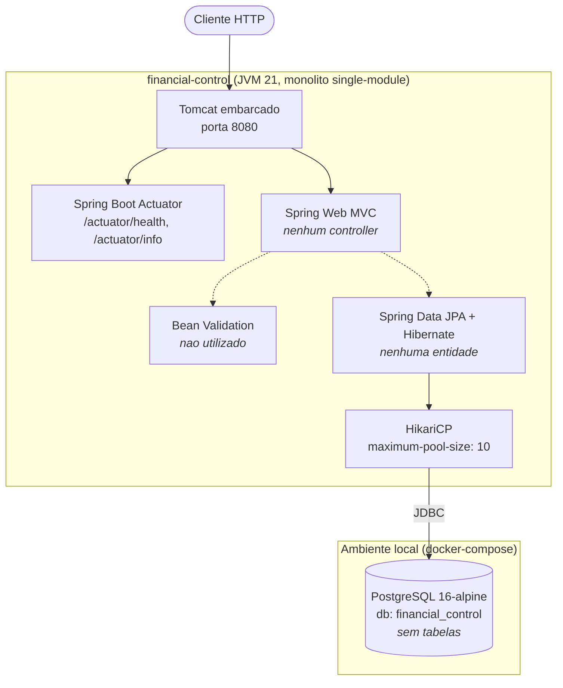
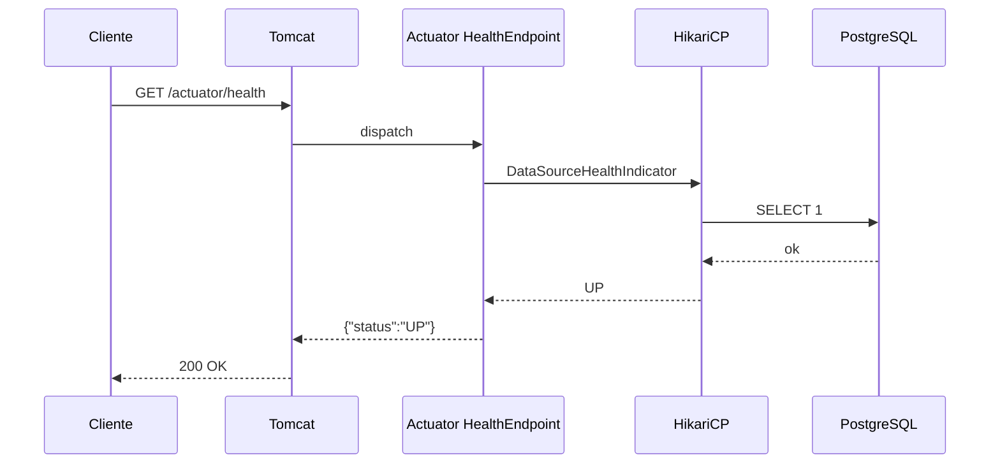

# System Architecture

## System Overview

`financial-control` é um **monolito Spring Boot single-module**, escrito em Kotlin 2.1.21 sobre a
JVM 21, construído com Gradle (Kotlin DSL). A aplicação expõe HTTP via Spring Web MVC (servlet
stack, Tomcat embarcado) e persiste em PostgreSQL 16 através de Spring Data JPA / Hibernate.

**Estado atual**: apenas o esqueleto executável. A aplicação sobe, conecta ao banco e expõe os
endpoints de Actuator (`health`, `info`). **Não há controllers, services, repositories ou entidades
de domínio.**

Não há empacotamento em containers da aplicação (não existe `Dockerfile`), não há infraestrutura
como código (sem CDK, Terraform ou CloudFormation) e não há pipeline de CI/CD (sem `.github/`).
O `docker-compose.yml` provisiona **apenas o banco de dados** para desenvolvimento local.

## Architecture Diagram



**Alternativa textual do diagrama:**

```
Cliente HTTP
  |
  v
Tomcat embarcado (porta 8080)
  |
  +--> Spring Boot Actuator  -> /actuator/health, /actuator/info   [ATIVO]
  |
  +--> Spring Web MVC        -> nenhum controller                  [INATIVO]
         |
         +-.-> Bean Validation    -> nao utilizado                 [INATIVO]
         |
         +-.-> Spring Data JPA    -> nenhuma entidade              [INATIVO]
                |
                v
              HikariCP (pool max 10)
                |
                | JDBC
                v
              PostgreSQL 16-alpine (db: financial_control, sem tabelas)
```

## Component Descriptions

### `FinancialControlApplication` (classe de bootstrap)
- **Purpose**: Ponto de entrada da aplicação.
- **Responsibilities**: Executar `runApplication<FinancialControlApplication>(*args)`; habilitar
  component scan e auto-configuração a partir do pacote `com.rafaelmatheus.financialcontrol`.
- **Dependencies**: `spring-boot-starter-web`, `spring-boot-starter-data-jpa`,
  `spring-boot-starter-validation`, `spring-boot-starter-actuator`, `jackson-module-kotlin`,
  `kotlin-reflect`.
- **Type**: Application

### Configuração de runtime (`src/main/resources/application.yml`)
- **Purpose**: Externalizar configuração de datasource, servidor, actuator e logging.
- **Responsibilities**: Definir datasource PostgreSQL com defaults de desenvolvimento
  sobrescrevíveis por variável de ambiente (`DB_URL`, `DB_USER`, `DB_PASSWORD`, `SERVER_PORT`);
  fixar `hibernate.ddl-auto: validate`, `open-in-view: false` e `jdbc.time_zone: UTC`; expor
  somente `health` e `info` no Actuator com `show-details: when-authorized`.
- **Dependencies**: Nenhuma (recurso de configuração).
- **Type**: Application (configuration)

### `TestcontainersConfiguration` (configuração de teste)
- **Purpose**: Prover um PostgreSQL real e efêmero para os testes.
- **Responsibilities**: Expor um bean `PostgreSQLContainer<*>` de imagem `postgres:16-alpine`
  anotado com `@ServiceConnection`, permitindo que o Spring Boot injete automaticamente as
  propriedades de conexão.
- **Dependencies**: `spring-boot-testcontainers`, `testcontainers:postgresql`.
- **Type**: Test

### `FinancialControlApplicationTests` (teste de smoke)
- **Purpose**: Verificar que o contexto Spring inicializa.
- **Responsibilities**: Um único teste `contextLoads()`, com `@ActiveProfiles("test")` e
  `@Import(TestcontainersConfiguration::class)`.
- **Dependencies**: `spring-boot-starter-test`, `kotlin-test-junit5`, `junit-jupiter`.
- **Type**: Test

### PostgreSQL (docker-compose)
- **Purpose**: Banco de dados relacional para desenvolvimento local.
- **Responsibilities**: Serviço `postgres` com imagem `postgres:16-alpine`, container
  `financial-control-db`, porta `5432` publicada, volume nomeado `postgres_data` e healthcheck via
  `pg_isready`.
- **Dependencies**: Docker / Docker Compose.
- **Type**: Infrastructure (apenas desenvolvimento local)

## Data Flow

Só existe um fluxo funcional hoje: o health check.



**Alternativa textual do diagrama:**

```
1. Cliente          -> Tomcat            : GET /actuator/health
2. Tomcat           -> Actuator Health   : dispatch
3. Actuator Health  -> HikariCP          : DataSourceHealthIndicator
4. HikariCP         -> PostgreSQL        : SELECT 1
5. PostgreSQL       -> HikariCP          : ok
6. HikariCP         -> Actuator Health   : UP
7. Actuator Health  -> Tomcat            : {"status":"UP"}
8. Tomcat           -> Cliente           : 200 OK
```

Nenhum fluxo de negócio existe. Os fluxos de cadastro de gastos e de parcelas de cartão de crédito
serão definidos a partir da Requirements Analysis.

## Integration Points

- **External APIs**: Nenhuma. Não há clientes HTTP, `RestTemplate`, `WebClient` ou SDKs de
  terceiros no classpath.
- **Databases**:
  - PostgreSQL 16 — único data store. Acessado via JDBC (`org.postgresql:postgresql`, runtime) e
    Spring Data JPA. Database `financial_control`, sem tabelas de negócio.
- **Third-party Services**: Nenhum.
- **Messaging / Filas**: Nenhum (sem Kafka, RabbitMQ, SQS).
- **Cache**: Nenhum (sem Redis, Caffeine ou `spring-boot-starter-cache`).
- **Segurança**: Nenhuma. `spring-boot-starter-security` **não** está no classpath — todos os
  endpoints são anônimos e não autenticados. Consequência prática: `management.endpoint.health.show-details: when-authorized`
  nunca revelará detalhes, pois não existe noção de usuário autenticado.

## Infrastructure Components

- **CDK Stacks**: Nenhuma. Não há infraestrutura como código no repositório (sem CDK, Terraform,
  CloudFormation, Helm ou manifests Kubernetes).
- **Deployment Model**: Não definido. Não existe `Dockerfile` para a aplicação; o
  `docker-compose.yml` cobre **apenas o PostgreSQL local**. O modo de execução documentado no
  README é local: `docker compose up -d` seguido de `./gradlew bootRun`.
- **Networking**: Não definido. Sem VPC, subnets ou security groups. Localmente, apenas a porta
  `5432` (PostgreSQL) e a porta `8080` (aplicação, default `SERVER_PORT`).
- **Observabilidade**: Somente Actuator com `health` e `info`. Sem métricas exportadas
  (Micrometer registry não configurado), sem tracing distribuído, sem logging estruturado.
  Nível de log da aplicação em `INFO`.
