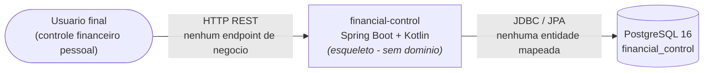

# Business Overview

> **Nota importante**: A análise de engenharia reversa revelou que este repositório é um
> **esqueleto executável sem domínio de negócio implementado**. Isso é uma decisão explícita do
> projeto, documentada no `README.md`: *"O repositório nasce sem domínio de negócio por decisão de
> projeto: o modelo de domínio será gerado pelo próprio fluxo AI-DLC, a partir da fase de Inception."*
>
> Portanto, este documento descreve o **contexto de negócio pretendido** (derivado do nome do
> projeto, do README e da intenção declarada pelo usuário) e registra explicitamente que
> **nenhuma transação de negócio está implementada em código hoje**.

## Business Context Diagram



**Alternativa textual do diagrama:**

```
Usuario final
     |
     | HTTP REST (nenhum endpoint de negocio implementado)
     v
financial-control (Spring Boot + Kotlin, esqueleto)
     |
     | JDBC / Spring Data JPA (nenhuma entidade mapeada)
     v
PostgreSQL 16 (database: financial_control)
```

## Business Description

- **Business Description**: O sistema pretende ser uma aplicação de **controle de gastos
  financeiros pessoais**. Conforme intenção declarada pelo usuário na abertura deste ciclo AI-DLC,
  o escopo alvo inclui o cadastro de gastos e o cadastro/gestão de **parcelas de cartão de
  crédito**. No estado atual do código, nada disso está implementado — existe apenas a
  infraestrutura de execução (aplicação Spring Boot que sobe, conecta em PostgreSQL e expõe
  health check).

- **Business Transactions**: **Nenhuma transação de negócio implementada**.

  | Transação | Status no código | Origem |
  |---|---|---|
  | Cadastrar gasto | Não implementada | Intenção declarada pelo usuário (a especificar em Requirements Analysis) |
  | Cadastrar compra parcelada em cartão de crédito | Não implementada | Intenção declarada pelo usuário (a especificar em Requirements Analysis) |
  | Consultar/listar gastos | Não implementada | Inferência a validar |
  | Consultar parcelas por período/fatura | Não implementada | Inferência a validar |

  As transações acima são **candidatas**, não requisitos confirmados. Serão definidas e validadas
  na stage de Requirements Analysis.

- **Business Dictionary**: Nenhum termo de negócio está codificado no sistema hoje (não há
  entidades, DTOs, enums de domínio ou tabelas). Os termos abaixo aparecem apenas como
  identificadores de infraestrutura, **não** como conceitos de domínio modelados:

  | Termo | Onde aparece | Significado atual |
  |---|---|---|
  | `financial-control` | `settings.gradle.kts`, `spring.application.name` | Nome do artefato/aplicação |
  | `financial_control` | `docker-compose.yml`, `DB_URL` | Nome do schema/database PostgreSQL (vazio) |
  | `financial` | `docker-compose.yml`, `DB_USER` | Usuário do banco de dados |

  O dicionário de negócio real (ex.: *gasto*, *categoria*, *parcela*, *fatura*, *cartão*,
  *competência*) deverá ser construído na Requirements Analysis.

## Component Level Business Descriptions

### `com.rafaelmatheus.financialcontrol` (pacote raiz da aplicação)

- **Purpose**: Ponto de entrada da aplicação Spring Boot. Do ponto de vista de negócio, **não
  entrega nenhuma capacidade** — apenas inicializa o contexto Spring.
- **Responsibilities**:
  - Bootstrap da aplicação (`FinancialControlApplication.kt`, anotação `@SpringBootApplication`).
  - Habilitar auto-configuração de Web MVC, Data JPA, Validation e Actuator (via dependências
    declaradas no `build.gradle.kts`).

### Camada de persistência (PostgreSQL)

- **Purpose**: Armazenar os dados financeiros do usuário (pretendido).
- **Responsibilities**: Nenhuma no estado atual. O banco `financial_control` é provisionado pelo
  `docker-compose.yml`, mas **não possui tabelas de negócio** — não há entidades JPA, nem
  migrations (Flyway/Liquibase não estão no classpath), e `spring.jpa.hibernate.ddl-auto` está em
  `validate`.

  > ⚠️ **Observação relevante para o design**: com `ddl-auto: validate` e sem ferramenta de
  > migration, a criação do schema de negócio precisará de uma decisão explícita
  > (Flyway, Liquibase ou outra abordagem) na fase de design/NFR.

### Camada de testes (`src/test`)

- **Purpose**: Garantir que a aplicação inicializa corretamente contra um PostgreSQL real.
- **Responsibilities**:
  - `TestcontainersConfiguration.kt`: provisiona um container efêmero `postgres:16-alpine` e o
    conecta ao contexto Spring via `@ServiceConnection`.
  - `FinancialControlApplicationTests.kt`: teste de smoke (`contextLoads`), sem cobertura de
    negócio.
