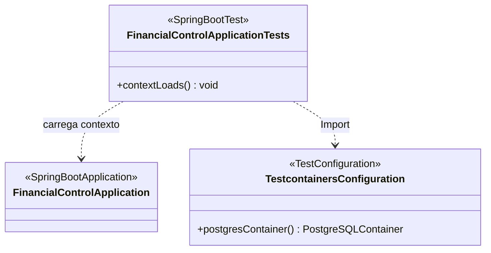

# Code Structure

## Build System

- **Type**: Gradle 8.14.2 com **Kotlin DSL**
- **Configuration**:

  | Arquivo | Conteúdo relevante |
  |---|---|
  | `build.gradle.kts` | Plugins `kotlin("jvm")`, `kotlin("plugin.spring")`, `kotlin("plugin.jpa")` (todos 2.1.21), `org.springframework.boot` 3.5.4, `io.spring.dependency-management` 1.1.7. Toolchain Java 21. `freeCompilerArgs = ["-Xjsr305=strict"]`, `jvmTarget = JVM_21`. `tasks.withType<Test> { useJUnitPlatform() }`. |
  | `settings.gradle.kts` | `rootProject.name = "financial-control"` — **single-module**, sem `include(...)`. |
  | `gradle.properties` | `org.gradle.caching=true`, `org.gradle.parallel=true`, `org.gradle.jvmargs=-Xmx2g -XX:MaxMetaspaceSize=512m`, `kotlin.code.style=official`. |
  | `gradle/wrapper/gradle-wrapper.properties` | Wrapper configurado. ⚠️ O `gradle-wrapper.jar` **não está versionado** neste commit inicial — o README instrui gerar o wrapper com `gradle wrapper --gradle-version 8.14.2` na primeira execução. |

  **Notas sobre os plugins Kotlin**:
  - `plugin.spring` (kotlin-allopen) torna classes anotadas com estereótipos Spring abertas para
    proxying CGLIB — necessário porque classes Kotlin são `final` por padrão.
  - `plugin.jpa` (kotlin-noarg) gera construtores sem argumento para classes anotadas com
    `@Entity`, `@MappedSuperclass` e `@Embeddable` — exigência do Hibernate. **Está configurado mas
    ainda não é exercitado**, pois não existem entidades.

## Key Classes/Modules



**Alternativa textual do diagrama:**

```
com.rafaelmatheus.financialcontrol
|
+-- [main] FinancialControlApplication         <<@SpringBootApplication>>
|             fun main(args: Array<String>)
|
+-- [test] TestcontainersConfiguration         <<@TestConfiguration(proxyBeanMethods=false)>>
|             @Bean @ServiceConnection postgresContainer(): PostgreSQLContainer<*>
|
+-- [test] FinancialControlApplicationTests    <<@SpringBootTest @ActiveProfiles("test")>>
              @Test contextLoads()
              depende de: FinancialControlApplication (contexto)
              depende de: TestcontainersConfiguration (@Import)
```

**Hierarquia de diretórios:**

```
financial-control/
+-- build.gradle.kts
+-- settings.gradle.kts
+-- gradle.properties
+-- docker-compose.yml
+-- .env.example
+-- README.md
+-- CLAUDE.md
+-- .aidlc-rule-details/
+-- gradle/wrapper/gradle-wrapper.properties
+-- src/
    +-- main/
    |   +-- kotlin/com/rafaelmatheus/financialcontrol/
    |   |   +-- FinancialControlApplication.kt
    |   +-- resources/
    |       +-- application.yml
    +-- test/
        +-- kotlin/com/rafaelmatheus/financialcontrol/
        |   +-- FinancialControlApplicationTests.kt
        |   +-- TestcontainersConfiguration.kt
        +-- resources/
            +-- application-test.yml
```

### Existing Files Inventory

Todos os arquivos-fonte e de configuração existentes. Em um projeto brownfield estes são os
candidatos a modificação — porém, dado o estado de esqueleto, o trabalho será majoritariamente de
**criação** de arquivos novos.

**Código-fonte (main):**
- `src/main/kotlin/com/rafaelmatheus/financialcontrol/FinancialControlApplication.kt` — Classe de
  bootstrap `@SpringBootApplication` e função `main`. 11 linhas. *Provavelmente não precisará ser
  modificada.*
- `src/main/resources/application.yml` — Configuração de datasource, JPA, servidor, actuator e
  logging. *Candidata a modificação* (ex.: configuração de migrations, perfis adicionais).

**Código-fonte (test):**
- `src/test/kotlin/com/rafaelmatheus/financialcontrol/TestcontainersConfiguration.kt` —
  `@TestConfiguration` que expõe `PostgreSQLContainer` com `@ServiceConnection`. *Reutilizável como
  base para testes de integração do domínio.*
- `src/test/kotlin/com/rafaelmatheus/financialcontrol/FinancialControlApplicationTests.kt` — Teste
  de smoke `contextLoads()`. *Permanecerá; novos testes serão adicionados ao lado.*
- `src/test/resources/application-test.yml` — Sobrescreve `spring.jpa.hibernate.ddl-auto` para
  `create-drop` no perfil `test`. *Candidata a revisão se migrations forem adotadas.*

**Build e infraestrutura:**
- `build.gradle.kts` — *Candidata a modificação* (novas dependências: migration tool, security,
  OpenAPI, biblioteca de testes de propriedade etc.).
- `settings.gradle.kts` — *Modificar apenas se o projeto for dividido em múltiplos módulos.*
- `gradle.properties` — Ajustes de performance do Gradle. *Improvável mudar.*
- `docker-compose.yml` — Serviço PostgreSQL local. *Candidata a modificação* (ex.: adicionar
  serviço da aplicação).
- `.env.example` — Template de variáveis de ambiente. *Candidata a modificação* se novas
  configurações forem externalizadas.
- `.gitignore` — Contém uma linha comentada `# aidlc-docs/`, indicando decisão de versionar os
  artefatos AI-DLC.

**Documentação e método:**
- `README.md` — Documentação do projeto e da stack.
- `CLAUDE.md` — Workflow AI-DLC (core).
- `.aidlc-rule-details/**` — Regras detalhadas AI-DLC (33 arquivos). *Não modificar.*

## Design Patterns

Nenhum padrão de design de aplicação está implementado — não há código de negócio. Os padrões
abaixo estão presentes apenas como **estrutura habilitada pelo framework**, ainda sem uso:

### Dependency Injection / Inversion of Control
- **Location**: `FinancialControlApplication.kt` (`@SpringBootApplication`),
  `TestcontainersConfiguration.kt` (`@Bean`).
- **Purpose**: Gerenciar o ciclo de vida e o wiring dos componentes.
- **Implementation**: Container Spring com component scan a partir do pacote raiz. Atualmente
  registra apenas beans de auto-configuração; nenhum bean de negócio.

### Externalized Configuration
- **Location**: `application.yml`, `application-test.yml`, `.env.example`.
- **Purpose**: Separar configuração de código e permitir override por ambiente.
- **Implementation**: Sintaxe de placeholder do Spring com defaults —
  `${DB_URL:jdbc:postgresql://localhost:5432/financial_control}`. Perfil `test` sobrescreve
  `ddl-auto`.

### Test Fixture via Testcontainers (`@ServiceConnection`)
- **Location**: `TestcontainersConfiguration.kt`.
- **Purpose**: Testar contra um PostgreSQL real em vez de banco em memória, eliminando divergência
  de dialeto entre teste e produção.
- **Implementation**: Bean `PostgreSQLContainer<*>` anotado com `@ServiceConnection`; o Spring Boot
  deriva `url`, `username` e `password` automaticamente do container.

### Anti-patterns / lacunas estruturais observadas
- **Ausência de camadas**: não existe separação controller / service / repository / domain. A
  estrutura de pacotes precisará ser definida na Application Design.
- **`ddl-auto: validate` sem ferramenta de migration**: a aplicação em `main` valida o schema
  contra as entidades, mas não há Flyway nem Liquibase para criar esse schema. Hoje isso não falha
  porque não há entidades; **assim que a primeira `@Entity` for criada, a aplicação deixará de
  subir** até que uma estratégia de migration seja definida. Este é o achado de maior impacto para
  a próxima fase.

## Critical Dependencies

### Kotlin
- **Version**: 2.1.21 (plugins `jvm`, `plugin.spring`, `plugin.jpa`)
- **Usage**: Linguagem de todo o código-fonte. `kotlin-reflect` no classpath (exigido pelo Spring
  para resolução de parâmetros).
- **Purpose**: Linguagem principal; `-Xjsr305=strict` torna as anotações de nulidade JSR-305
  aplicáveis pelo compilador.

### Spring Boot
- **Version**: 3.5.4 (BOM via `io.spring.dependency-management` 1.1.7)
- **Usage**: `starter-web` (Web MVC + Tomcat embarcado), `starter-data-jpa` (Hibernate + Spring
  Data), `starter-validation` (Bean Validation / Hibernate Validator), `starter-actuator`
  (health/info).
- **Purpose**: Framework de aplicação. Todas as versões transitivas são gerenciadas pelo BOM — o
  `build.gradle.kts` declara dependências sem versão explícita.

### PostgreSQL JDBC Driver
- **Version**: gerenciada pelo BOM do Spring Boot
- **Usage**: `runtimeOnly("org.postgresql:postgresql")` — driver JDBC.
- **Purpose**: Conectividade com PostgreSQL 16.

### Jackson Module Kotlin
- **Version**: gerenciada pelo BOM do Spring Boot
- **Usage**: `com.fasterxml.jackson.module:jackson-module-kotlin`
- **Purpose**: Serialização/desserialização JSON de data classes Kotlin (construtores primários,
  parâmetros com default, nulidade).

### Testcontainers
- **Version**: gerenciada pelo BOM do Spring Boot
- **Usage**: `spring-boot-testcontainers`, `testcontainers:postgresql`, `testcontainers:junit-jupiter`
  (todas escopo `testImplementation`).
- **Purpose**: PostgreSQL efêmero para testes de integração. **Requer Docker em execução** para
  rodar `./gradlew test`.

### JUnit 5
- **Version**: gerenciada pelo BOM do Spring Boot
- **Usage**: `kotlin-test-junit5`, `junit-platform-launcher` (runtime), via `useJUnitPlatform()`.
- **Purpose**: Framework de testes.

### Dependências notavelmente **ausentes**
Relevantes para o planejamento das próximas fases:

| Ausente | Impacto |
|---|---|
| Ferramenta de migration (Flyway / Liquibase) | Bloqueante assim que a primeira entidade JPA existir, dado `ddl-auto: validate` |
| `spring-boot-starter-security` | Não há autenticação, autorização nem proteção de endpoints |
| Documentação de API (springdoc-openapi) | Sem contrato de API publicado |
| MapStruct ou similar | Mapeamento entidade↔DTO será manual |
| Micrometer registry (Prometheus etc.) | Sem exportação de métricas |
| Linter / formatter (ktlint, detekt) | Sem verificação automatizada de estilo ou qualidade estática |
| Cobertura de testes (JaCoCo / Kover) | Sem medição de cobertura |
