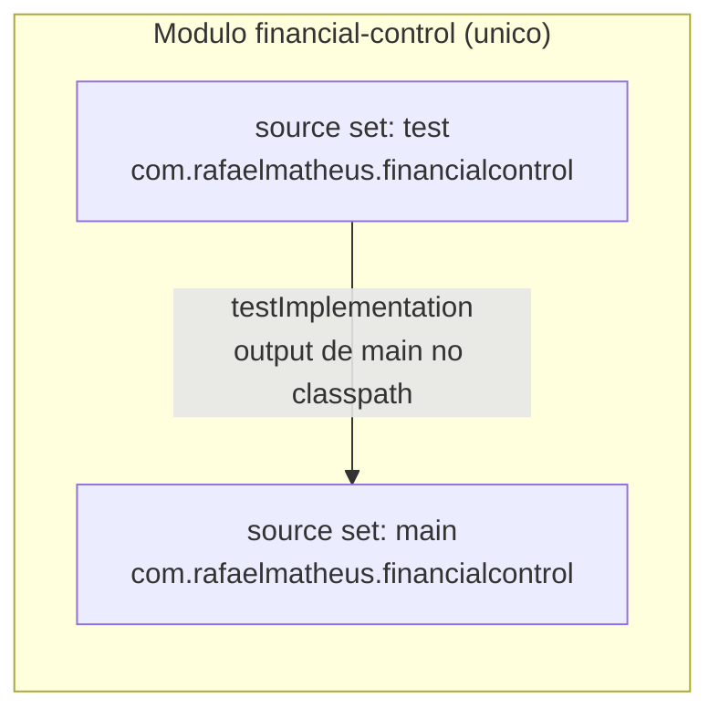

# Dependencies

## Internal Dependencies

O projeto é **single-module** (`settings.gradle.kts` declara apenas `rootProject.name`, sem
`include(...)`). Portanto **não existem dependências entre pacotes internos**. A única relação
interna é entre os source sets `test` e `main` do próprio módulo, criada implicitamente pelo plugin
Gradle Java/Kotlin.



**Alternativa textual do diagrama:**

```
Modulo financial-control (unico modulo Gradle)
  |
  +-- source set: main   (com.rafaelmatheus.financialcontrol)
  |
  +-- source set: test   (com.rafaelmatheus.financialcontrol)
           |
           | testImplementation: output de main entra no classpath de test
           v
         main
```

### `test` depende de `main`
- **Type**: Test (relação implícita de source set do Gradle)
- **Reason**: `FinancialControlApplicationTests` carrega o contexto Spring definido por
  `FinancialControlApplication` (via `@SpringBootTest`) e importa
  `TestcontainersConfiguration`.

## External Dependencies

Todas as dependências abaixo — exceto os plugins Kotlin — são declaradas **sem versão explícita**
no `build.gradle.kts`; as versões são resolvidas pelo BOM do Spring Boot 3.5.4 aplicado pelo plugin
`io.spring.dependency-management` 1.1.7.

### Implementation (compile + runtime)

#### `org.springframework.boot:spring-boot-starter-web`
- **Version**: gerenciada pelo BOM (Spring Boot 3.5.4)
- **Purpose**: Stack HTTP servlet — Spring Web MVC, Tomcat embarcado, Jackson. Base para os
  futuros endpoints REST.
- **License**: Apache License 2.0

#### `org.springframework.boot:spring-boot-starter-data-jpa`
- **Version**: gerenciada pelo BOM (Spring Boot 3.5.4)
- **Purpose**: Persistência — Spring Data JPA, Hibernate ORM, `spring-jdbc`, HikariCP,
  gerenciamento de transações.
- **License**: Apache License 2.0 (Hibernate transitivo sob LGPL 2.1 / Apache 2.0 a partir do
  Hibernate 6)

#### `org.springframework.boot:spring-boot-starter-validation`
- **Version**: gerenciada pelo BOM (Spring Boot 3.5.4)
- **Purpose**: Bean Validation (Jakarta Validation + Hibernate Validator). **No classpath, ainda
  sem uso** — nenhuma anotação de validação existe no código.
- **License**: Apache License 2.0

#### `org.springframework.boot:spring-boot-starter-actuator`
- **Version**: gerenciada pelo BOM (Spring Boot 3.5.4)
- **Purpose**: Endpoints operacionais. Configurado para expor `health` e `info`.
- **License**: Apache License 2.0

#### `com.fasterxml.jackson.module:jackson-module-kotlin`
- **Version**: gerenciada pelo BOM (Spring Boot 3.5.4)
- **Purpose**: Serialização/desserialização JSON de data classes Kotlin — respeita construtores
  primários, parâmetros com valor default e nulidade. Essencial para os futuros DTOs de API.
- **License**: Apache License 2.0

#### `org.jetbrains.kotlin:kotlin-reflect`
- **Version**: 2.1.21 (alinhada ao plugin Kotlin)
- **Purpose**: Reflexão Kotlin. Exigida pelo Spring para resolução de nomes de parâmetros de
  construtor e por Jackson/Kotlin.
- **License**: Apache License 2.0

### RuntimeOnly

#### `org.postgresql:postgresql`
- **Version**: gerenciada pelo BOM (Spring Boot 3.5.4)
- **Purpose**: Driver JDBC do PostgreSQL. Declarado como `runtimeOnly` — não faz parte da API de
  compilação, o que é a prática correta.
- **License**: BSD-2-Clause (licença PostgreSQL)

### TestImplementation

#### `org.springframework.boot:spring-boot-starter-test`
- **Version**: gerenciada pelo BOM (Spring Boot 3.5.4)
- **Purpose**: Kit de testes do Spring — JUnit 5, AssertJ, Mockito, Hamcrest, JSONassert,
  JsonPath, Awaitility, `spring-test` (MockMvc).
- **License**: Apache License 2.0

#### `org.jetbrains.kotlin:kotlin-test-junit5`
- **Version**: 2.1.21
- **Purpose**: Asserções idiomáticas Kotlin (`assertEquals`, `assertFailsWith`) sobre JUnit 5.
- **License**: Apache License 2.0

#### `org.springframework.boot:spring-boot-testcontainers`
- **Version**: gerenciada pelo BOM (Spring Boot 3.5.4)
- **Purpose**: Suporte `@ServiceConnection` — deriva `spring.datasource.*` automaticamente do
  container em execução, eliminando configuração manual de propriedades de teste.
- **License**: Apache License 2.0

#### `org.testcontainers:postgresql`
- **Version**: gerenciada pelo BOM (Spring Boot 3.5.4)
- **Purpose**: Container PostgreSQL efêmero (`postgres:16-alpine`) para testes de integração.
- **License**: MIT

#### `org.testcontainers:junit-jupiter`
- **Version**: gerenciada pelo BOM (Spring Boot 3.5.4)
- **Purpose**: Integração do ciclo de vida dos containers com JUnit 5.
- **License**: MIT

### TestRuntimeOnly

#### `org.junit.platform:junit-platform-launcher`
- **Version**: gerenciada pelo BOM (Spring Boot 3.5.4)
- **Purpose**: API de lançamento exigida pelo Gradle para executar testes na JUnit Platform.
- **License**: Eclipse Public License 2.0

## Plugins de Build

| Plugin | Versão | Propósito | Licença |
|---|---|---|---|
| `org.jetbrains.kotlin.jvm` | 2.1.21 | Compilação Kotlin/JVM | Apache 2.0 |
| `org.jetbrains.kotlin.plugin.spring` (all-open) | 2.1.21 | Abre classes com estereótipos Spring para proxying | Apache 2.0 |
| `org.jetbrains.kotlin.plugin.jpa` (no-arg) | 2.1.21 | Construtor sem argumento para entidades JPA | Apache 2.0 |
| `org.springframework.boot` | 3.5.4 | Empacotamento executável, `bootRun`, aplicação do BOM | Apache 2.0 |
| `io.spring.dependency-management` | 1.1.7 | Resolução de versões via BOM | Apache 2.0 |

## Dependências de ambiente (não-Gradle)

| Item | Requisito | Onde é exigido |
|---|---|---|
| JDK 21 | Obrigatório | Toolchain Gradle; `jvmTarget = JVM_21` |
| Docker + Docker Compose | Obrigatório para desenvolvimento e testes | `docker-compose.yml` (PostgreSQL local) e Testcontainers (`./gradlew test` falha sem Docker) |
| Gradle 8.14.2 | Obrigatório na primeira execução | O `gradle-wrapper.jar` não está versionado; o README instrui `gradle wrapper --gradle-version 8.14.2` |

## Observações sobre a política de dependências

- ✅ **Boa prática**: nenhuma versão hardcoded para dependências gerenciadas pelo BOM — evita
  conflitos de versão transitiva.
- ✅ **Boa prática**: escopos corretos (`runtimeOnly` para o driver JDBC, `testRuntimeOnly` para o
  launcher).
- ⚠️ **Ausência de lock de dependências**: não há `gradle.lockfile` nem `dependencyLocking`
  habilitado — builds não são totalmente reproduzíveis ao longo do tempo.
- ⚠️ **Sem verificação de vulnerabilidades**: nenhum plugin de análise de dependências
  (OWASP Dependency-Check, Snyk, `dependabot.yml`) está configurado.
- ⚠️ **`spring-boot-starter-validation` não utilizado**: está no classpath sem nenhum consumidor
  no código atual. Não é problema — é preparação deliberada para o domínio futuro.
